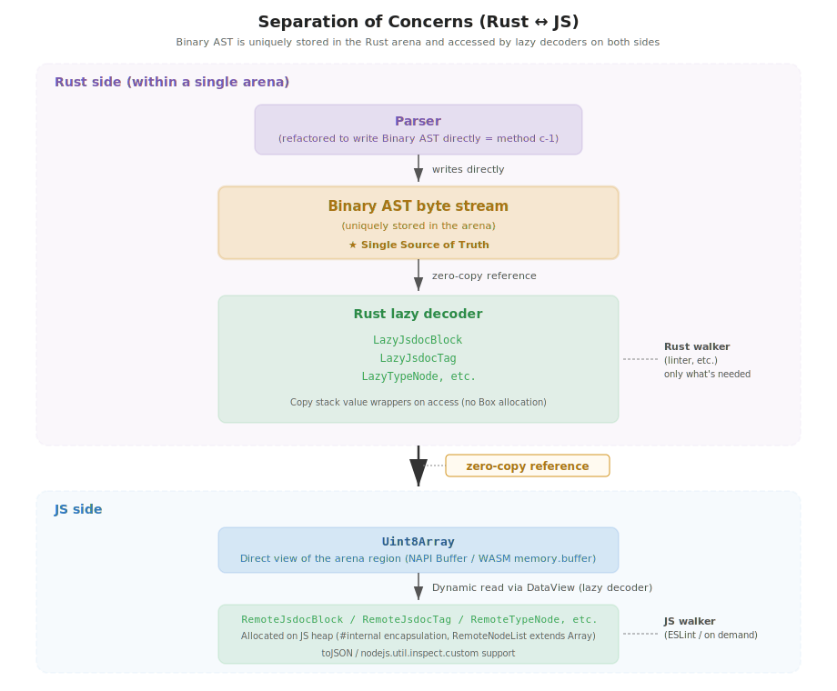
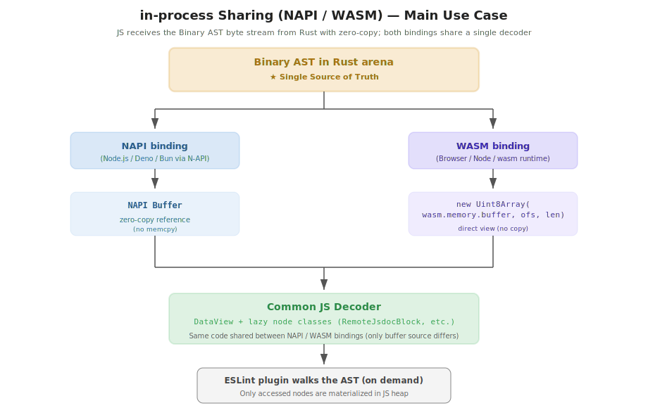
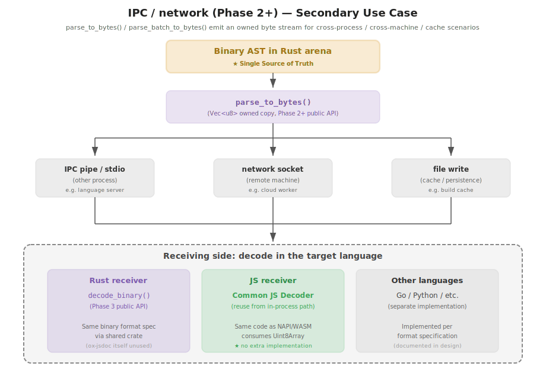

# Architecture (Background & Architecture)

## Design overview

The ox-jsdoc Binary AST architecture is designed with the top priority of
**eliminating JSON serialization overhead and passing data across the Rust ↔ JS
boundary with zero-copy**. It combines insights from the tsgo Binary AST and
the oxc Raw Transfer, while adopting a custom offset-based format to support
WASM.

Key decisions:

- **Philosophy B (offset-based format)**: oxc's "Rust struct memory layout =
  transfer format" (Raw Transfer) does not work in WASM or 32-bit environments,
  so it is not adopted. We use a tsgo-style **designed offset-based format** to
  support both WASM and NAPI
- **Approach c-1 (parser builds the Binary AST directly)**: instead of going
  through a typed AST struct, the parser writes Binary AST bytes directly into
  the arena. No encoder step (= parsing = encoding); eliminates memory
  duplication and unnecessary walk passes
- **Same lazy decoder pattern in both languages**: both Rust and JS operate
  under the same model of "lazily expanding the Binary AST in place". Code
  generation (Phase 4) produces both lazy decoders from a single schema
- **Zero-copy sharing**: the arena memory is viewed directly from JS through
  the NAPI Buffer / WASM `memory.buffer` (no memcpy)
- **Shared decoder package**: `@ox-jsdoc/decoder` is shared by both NAPI and
  WASM bindings. Since it does not depend on where the bytes come from, format
  changes propagate to both bindings simultaneously

This document is organized as **Background** (why Binary AST is needed) →
**Architecture** (separation of concerns / sharing strategy per environment /
public API) → **Key design decisions**.

## Background

### Problem

The ox-jsdoc Rust parser is extremely fast at the nanosecond level, but JSON
serialization and `JSON.parse` dominate the overall cost when delivering the
AST to the JavaScript side. As a result, the JS binding ends up at roughly the
same speed as comment-parser, and Rust's parsing advantage is lost at the
boundary.

Benchmark breakdown for `typescript-checker` (a large fixture):

| Phase                       |       Time | Share |
| --------------------------- | ---------: | ----: |
| Rust parser                 |     122 µs |   15% |
| Validation + JSON serialize |     375 µs |   45% |
| NAPI call + `JSON.parse`    |     333 µs |   40% |
| **JS binding total**        | **829 µs** |  100% |

> Source: benchmark measurements from early development. The fixture is
> `fixtures/perf/source/typescript-checker.ts` (3 MB / 54K lines / 226 JSDoc).
> See `tasks/benchmark/scripts/full-comparison.mjs` for the measurement script.
> Environment: Apple M1 Max, Node.js 24.x, Rust 1.92 (release build).
> See [`./refs/benchmark-results.md`](./refs/benchmark-results.md) for detailed figures.

### Goals

Replace JSON serialization with a compact binary format to achieve:

1. Remove the `serde_json` dependency on the Rust side
2. Remove `JSON.parse` on the JS side
3. Lazy node materialization (only accessed nodes become JS objects)
4. Run on a single JS decoder across all environments (NAPI / WASM / IPC)
5. Preserve the ESTree-compatible shape for lint rule authors
6. Transfer the complete AST including parseTypes (TypeNode, 45 kinds) in a single format

### Inspiration

We reference the tsgo Binary AST (`refers/typescript-go/internal/api/encoder/`)
and simplify it to match the scale of the ox-jsdoc AST. The oxc Raw Transfer is
a separate approach that shares the Rust memory layout directly, but it has the
following constraints, so we exclude it:

- **Requires 64-bit little-endian** (no 32-bit / BE)
- **Requires Node ≥ 22.0.0** or **Deno ≥ 2.0.0** (older versions do not support
  > 4 GiB ArrayBuffer)
- **Bun is not supported** (explicitly excluded in oxc's `supported.js`)
- **No WASM** (the wasm32 linear memory cannot be aligned to 4 GiB; oxc also
  falls back to the JSON path when going through WASM)

Since **WASM support is a key requirement** for ox-jsdoc (both NAPI and WASM
are primary use cases), Raw Transfer cannot be adopted. Adopting a tsgo-style
"designed offset-based format" allows the same Binary AST to work in both
bindings.

Reference notes:

- [`./refs/tsgo/tsgo-binary-ast.md`](./refs/tsgo/tsgo-binary-ast.md) — tsgo Binary AST details
- [`./refs/tsgo-vs-oxc-ast-transfer.md`](./refs/tsgo-vs-oxc-ast-transfer.md) — tsgo vs oxc approach comparison
- [`./refs/js-rust-transfer.md`](./refs/js-rust-transfer.md) — Selection process for JSON / Raw Transfer / Binary AST (background leading to Binary AST adoption)

---

## Architecture

### Separation of concerns



Design core:

- **The parser builds the Binary AST directly** (Approach c-1): the parser does
  not go through the current typed AST and writes Binary AST format bytes
  directly into the arena during parsing. No encoder step is required (parsing
  = encoding)
- **typed AST removed**: the Binary AST in the arena is the single source of
  truth. The Rust struct hierarchy (`JsdocBlock<'a>`, `TypeNode<'a>`, etc.) is
  replaced by records in the Binary AST
- **Rust-side walker also goes through the lazy decoder**: when walking the AST
  on the Rust side, access goes through thin wrappers like `LazyJsdocBlock`,
  using the same lazy decoder pattern as the JS side. These are allocated on
  the heap (separate from the arena) per traverse
- **Same pattern in both languages**: both Rust and JS operate under the same
  model of "lazily expanding the Binary AST on access". This avoids double
  memory on the arena and maximizes performance
- **No encoder step exists** (handoff to NAPI/WASM is zero-copy reference only)

### Sharing strategy per environment

#### in-process (NAPI / WASM) — Primary use case

Shares the Rust Binary AST from JS within the same process. Passed
**zero-copy**.



#### IPC / network — Secondary use case

Sends bytes to other processes, other machines, files, etc. The receiving side
decodes independently in its own language. The encoder entry points
(`parse_to_bytes` / `parse_batch_to_bytes`) are shipped today; the
cross-language **decoder** (`decode_binary`) is still planned (see
[rust-impl.md](./rust-impl.md#public-rust-api)).



| Layer           | Sharing strategy                                        | Details                                                                                                                                                                                                                                                       |
| --------------- | ------------------------------------------------------- | ------------------------------------------------------------------------------------------------------------------------------------------------------------------------------------------------------------------------------------------------------------- |
| **NAPI**        | zero-copy reference                                     | Bytes in the arena are passed directly to JS via NAPI Buffer. No memcpy                                                                                                                                                                                       |
| **WASM**        | wasm.memory.buffer view                                 | JS uses `new Uint8Array(wasm.memory.buffer, offset, length)` to view the arena directly                                                                                                                                                                       |
| **IPC/network** | owned via `parse_to_bytes()` / `parse_batch_to_bytes()` | Pass sourceText directly, produce a `Vec<u8>` (single comment) or `Vec<u8>` carrying N roots (batch), and send it. The receiving side reads it with its language's decoder (see [rust-impl.md "Public Rust API"](./rust-impl.md#public-rust-api) for details) |

A single format specification supports both in-process (NAPI/WASM) and
out-of-process (IPC/network/file). In-process uses the JS decoder; out-of-process
uses a decoder in the receiving language.

#### Buffer lifetime management (Phase 1.1d onward)

Reference from oxc raw transfer: it adopts a 2-tier buffer cache strategy
because it handles buffers far larger (6 GiB) than ox-jsdoc:

- **Tier 1 (strong reference)**: keeps recent buffers strongly referenced;
  demoted to Tier 2 after 10 seconds of idle
- **Tier 2 (WeakRef)**: GC-eligible, but reused as-is if a reuse opportunity arises
- **`FinalizationRegistry`**: returns the buffer to the cache when an AST
  wrapper is GC-collected

ox-jsdoc operates on WASM linear memory + NAPI Buffer (typically 1 KB to a few
MB), which is much smaller than oxc, but **buffer reuse optimization
opportunities exist** for batch processing or repeated parsing:

- NAPI: lifecycle managed via NAPI Buffer reference counting
- WASM: detached on `wasm.memory` grow; recreate the view or reset the arena
  to reuse
- Leave room for future buffer pool (`FinalizationRegistry`-based) introduction
  (an optimization candidate from Phase 1.1d onward; simple malloc/free is fine
  in the initial implementation)

#### JS decoder classes are shared between NAPI/WASM bindings

Lazy decoder classes such as `RemoteJsdocBlock`, `RemoteJsdocTag`, and
`RemoteTypeNode` share the **completely same implementation between the NAPI
binding and the WASM binding**:

- The decoder class input is only `Uint8Array` (and an index/offset)
- It does not depend on where the bytes come from (NAPI Buffer or
  wasm.memory.buffer view)
- Since the byte order (LE) and Binary AST format match in both bindings, the
  same decoding logic works as-is

The per-binding differences are confined to a **thin wrapper layer**:

| Item                 | NAPI                                   | WASM                                           |
| -------------------- | -------------------------------------- | ---------------------------------------------- |
| buffer acquisition   | NAPI Buffer                            | `new Uint8Array(wasm.memory.buffer, ofs, len)` |
| Initialization       | Synchronous (`require()` completes it) | Asynchronous (requires `await initWasm()`)     |
| Lifecycle management | NAPI Buffer reference counting         | Detach detection on wasm.memory grow           |
| Entry point          | Direct `parse()` call                  | `parse()` after `initWasm()`                   |

#### Package structure (consistent with phases.md)

The decoder classes are split into a separate shared package. Phase 1.0-1.2
keep new and old in coexistence, so the binary version is placed with the
`-binary` suffix (renamed at the Phase 1.3 cutover; see
[phases.md "crate / package layout"](./phases.md#crate--package-layout-coexistence--shared-decoder)):

```text
ox-jsdoc/
├── napi/
│   ├── ox-jsdoc/             ← Existing typed AST version (replaced with binary at Phase 1.3 cutover)
│   └── ox-jsdoc-binary/      ← New binary AST version (Phase 1.2b)
│       ├── src-rs/           (Rust)
│       └── src-js/           (binding-specific wrapper only, imports @ox-jsdoc/decoder)
│
├── wasm/
│   ├── ox-jsdoc/             ← Existing
│   └── ox-jsdoc-binary/      ← New (Phase 1.2c)
│       ├── src-rs/
│       └── src-js/           (binding-specific wrapper only, imports @ox-jsdoc/decoder)
│
└── npm/
    └── @ox-jsdoc/
        └── decoder/          ← Shared decoder (Phase 1.1d)
            └── src/
                ├── RemoteSourceFile.js   (decoder root, Header parsing)
                ├── nodes/
                │   ├── RemoteJsdocBlock.js
                │   ├── RemoteJsdocTag.js
                │   └── type-nodes/...
                ├── helpers.js            (extOffsetOf, childAtVisitorIndex, etc.)
                ├── kind-dispatch.js      (KIND_TABLE, code-generated at Phase 4)
                ├── visitor-keys.js
                └── protocol.js           (constants for Kind values, offsets, masks, etc.)
```

Benefits:

- **Single source of truth for the decoder**: bug fixes and format changes
  propagate to both bindings simultaneously
- **Easy to test**: decoder unit tests just need a Uint8Array (no binding
  required)
- **Aligned with code generation**: Phase 4 code generation only needs to emit
  to the decoder package to affect both bindings
- **Clear dependency direction**: NAPI/WASM packages → `@ox-jsdoc/decoder`
  (one-way)

### Layers of the Rust public API

```rust
// Main public API (provided from Phase 1)
let arena = Allocator::new();
let result = parse(&arena, source, options);
//     └─ result.binary_bytes: &[u8]         // Binary AST bytes (for NAPI/WASM sharing)
//        result.lazy_root: LazyJsdocBlock<'_>  // Lazy node for the Rust-side walker
//        result.diagnostics: ...

// Example Rust walker usage (linters, etc.)
let block = result.lazy_root;
for tag in block.tags() {  // ← Allocates LazyJsdocTag on the Rust heap on access
    println!("{}", tag.name());  // ← Reads the string on further access
}
// Once walking finishes and lazy nodes are dropped, the heap is freed too

// IPC / network use case (single comment)
let result: ParseBytesResult = parse_to_bytes(source_text, options);
let owned: Vec<u8> = result.binary_bytes;
//     ↑ Pass sourceText directly and return an independent owned byte buffer
//       (No API to encode from the typed AST. The Binary AST is always the source of truth.)

// IPC / network use case (batch)
let result: ParseBatchBytesResult = parse_batch_to_bytes(&items, options);
let owned: Vec<u8> = result.binary_bytes;
//     ↑ One buffer carries N roots; cross-comment string dedup applies.

// Reading from another language (Phase 3 onward, ox-jsdoc itself does not use this)
let decoded = decode_binary(&bytes)?;
```

### Key design decisions

- **Adopt Philosophy B**: the parser writes the Binary AST directly. Instead of
  the oxc raw transfer's "Rust struct memory layout = transfer format", we adopt
  the tsgo Binary AST style of "designed offset-based format" so it works on
  WASM
- **Adopt Approach c-1**: refactor the parser to build the Binary AST directly
  without going through the typed AST. Maximizes performance by eliminating
  memory duplication and unnecessary walk passes
- **typed AST removed**: since the Rust-side walker also uses the lazy decoder
  pattern, there is no need to keep the struct hierarchy. The Binary AST is the
  single source of truth
- **Same model for Rust and JS**: both languages operate under the same pattern
  of "lazily expanding from the Binary AST". Code generation (Phase 4) can
  produce both lazy decoders from a single schema simultaneously
