# Binary Format

## Conventions

The following conventions apply to all multi-byte numbers, strings, and bit representations:

### Byte order (endianness)

- **All multi-byte integers (u16, u32) are stored in little-endian (LE)**
- Reasons:
  - The WASM specification mandates LE, so this stays consistent with views into `wasm.memory.buffer`
  - The major NAPI platforms (x86_64, ARM64) are all LE
  - JS `DataView` defaults to big-endian, but this format always passes `true` (LE) as the second argument by convention
- When hosting on a BE platform (rare cases such as IBM z/Architecture):
  - The Rust encoder always writes LE (a byte swap occurs if the host is BE)
  - The JS decoder works as-is by reading `DataView` in LE mode
  - Same policy as tsgo (`encoder.go:69` "All integer values are little-endian")

### Character encoding

- **All strings are stored as UTF-8** byte sequences
- The String Data section is a concatenation of UTF-8 byte sequences
- Source text (`BatchItem.sourceText`) is also held as UTF-8
- When the JS side retrieves a string, it converts to the JS internal representation (UTF-16) via `TextDecoder('utf-8')`

### Position units (Pos / End)

- **Node `Pos` / `End` are UTF-16 code unit offsets** (relative to the root's sourceText)
- **Encoding-time UTF-8 → UTF-16 conversion** happens on the Rust side (same policy as tsgo / oxc raw transfer)
- Reasons:
  - JavaScript toolchains such as ESLint and the TypeScript LSP expect positions in UTF-16 code units, so converting once at encode time is more efficient than converting every time on the JS side
  - JSDoc comments have a high ASCII ratio, so building the conversion map can be skipped in the ASCII-only case (a similar optimization to tsgo's `containsNonASCII` flag)
- Absolute offset calculation: `baseOffset + pos` (performed on the JS decoder side; `baseOffset` is the value stored in the root index array, and follows the unit of the input `BatchItem.baseOffset` = it is natural for the JS side to use UTF-16 as well)

### Bit numbering

- **bit 0 = LSB (least significant bit)** convention
- Example: `Common Data bit0 = optional` means the least significant bit
- Bit ordering is independent of byte endianness (LE/BE-agnostic)

## Section structure

We simplify the tsgo structure into a 7-section layout that supports batch processing (N comments per buffer):

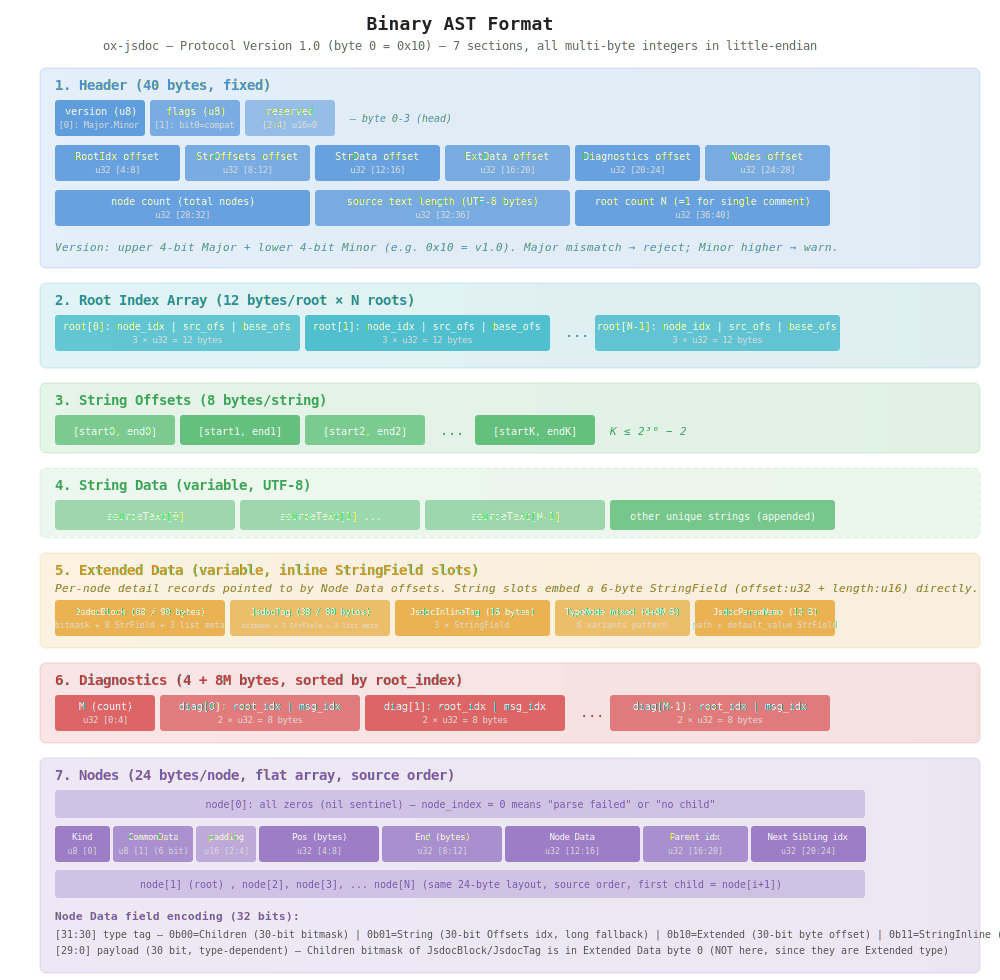

| Section          | Size           | Description                            |
| ---------------- | -------------- | -------------------------------------- |
| Header           | 40 bytes fixed | Version, section offsets               |
| Root Index Array | 12 bytes/root  | Metadata for N roots                   |
| String Offsets   | 8 bytes/string | (start, end) pairs                     |
| String Data      | variable       | UTF-8 string bytes                     |
| Extended Data    | variable       | Additional data for large struct nodes |
| Diagnostics      | 4 + 8M bytes   | M diagnostics (root_index order)       |
| Nodes            | 24 bytes/node  | Flat node array (source order)         |

Differences from tsgo:

- **Removed**: content hash, Structured Data section
- **Kept**: String Offsets / String Data / Extended Data
- **Added**: Root Index Array (stores multiple roots for batch support)
- **Added**: Diagnostics section (links parse errors etc. via root_index)
- **Added**: Total node count in the Header (tsgo derives it from the buffer length, but ox-jsdoc records it explicitly)

Batch processing: a single comment (N=1) is treated as a special case of the same format with minimal additional overhead (one 12-byte root array entry + 4 bytes of Diagnostic count). With a batch (N comments), String Data / Extended Data are shared, yielding dedup gains for tag names and the like. See [batch-processing.md](./batch-processing.md) for details.

## Header (40 bytes)

A **metadata-concentration region** placed at a fixed location in the first 40 bytes of the buffer. By aggregating version management, compatibility flags, the start offset of every section, and overall size information in one place, the decoder can read just the Header and immediately jump to any section.

### Design overview

Key design goals:

- **Fixed 40 bytes**: eliminates variable-length fields so the Header itself is always readable at the same offset (no decoder initialization loop required)
- **Aggregated section offsets**: the start of all 6 sections (root / string offsets / string data / extended data / diagnostics / nodes) is laid out as **u32 × 6**, allowing the entire layout to be reconstructed from the Header alone
- **Version information fixed at byte 0**: instead of tsgo's approach of packing it into the upper 8 bits of an LE u32, we write a **u8 directly into byte 0** (LE/BE-agnostic, debugging friendly)
- **Minimized batch metadata**: including the root count N, total node count P, and total source text length makes the decoder's pre-allocation of arrays / range checking direct

### Layout

| Offset | Type | Field                                                                    |
| ------ | ---- | ------------------------------------------------------------------------ |
| 0      | u8   | Protocol version (upper 4 bits = Major, lower 4 bits = Minor)            |
| 1      | u8   | Flags (bit0 = compat_mode, bits 1-7 = reserved)                          |
| 2-3    | -    | Reserved (zero-fill, for future capability flags or additional metadata) |
| 4-7    | u32  | Root Index Array start offset                                            |
| 8-11   | u32  | String Offsets section start offset                                      |
| 12-15  | u32  | String Data section start offset                                         |
| 16-19  | u32  | Extended Data section start offset                                       |
| 20-23  | u32  | Diagnostics section start offset                                         |
| 24-27  | u32  | Nodes section start offset                                               |
| 28-31  | u32  | Total node count                                                         |
| 32-35  | u32  | Total source text length (UTF-8 byte length)                             |
| 36-39  | u32  | Root count N                                                             |

Basic metadata:

- Section size: **fixed at 40 bytes** (independent of version)
- Starts at relative offset 0 from the buffer's head
- Each section offset is recorded as **u32 (4 bytes)** (buffer up to 4 GB)

### Protocol version (Major + Minor 4-bit pack)

Byte 0 is operated as **upper 4 bits = Major, lower 4 bits = Minor** (Semantic Versioning style):

```text
Byte 0 layout:
  bits[7:4]: Major version (0-15)
  bits[3:0]: Minor version (0-15)

Examples: 0x10 = Major 1, Minor 0 (initial release)
          0x11 = Major 1, Minor 1 (backward-compatible additions)
          0x20 = Major 2, Minor 0 (incompatible change)
```

**Compatibility rules**:

| Buffer version                            | Decoder version | Behavior                                                                         |
| ----------------------------------------- | --------------- | -------------------------------------------------------------------------------- |
| Different Major                           | -               | Error (format incompatible)                                                      |
| Same Major, buffer Minor <= decoder Minor | -               | OK (decoder supports all fields)                                                 |
| Same Major, buffer Minor > decoder Minor  | -               | Warning + continue (unknown fields are ignored, only known fields are processed) |

**Minor-bumping changes** (backward compatible):

- Add a new Kind value (existing numbers are unchanged)
- Assign meaning to a previously reserved bit (older versions treat it as 0)
- Append new fields to the end of Extended Data (older versions don't read them)
- Add a new section at a Header reserved offset

**Major-bumping changes** (incompatible):

- Header layout changes
- Node record size changes
- Existing Kind value semantics change
- Existing section format changes
- For Major bumps a separate migration tool is provided

**Initial release**: `0x10` (Major 1, Minor 0)

**Implementation example (Rust)**:

```rust
const SUPPORTED_MAJOR: u8 = 1;
const SUPPORTED_MINOR: u8 = 0;

fn check_version(buffer: &[u8]) -> Result<(), DecodeError> {
    let version_byte = buffer[0];
    let major = version_byte >> 4;
    let minor = version_byte & 0x0F;

    if major != SUPPORTED_MAJOR {
        return Err(DecodeError::IncompatibleMajor {
            buffer_major: major,
            decoder_major: SUPPORTED_MAJOR,
        });
    }
    if minor > SUPPORTED_MINOR {
        log::warn!("Buffer minor version {} > decoder minor {}", minor, SUPPORTED_MINOR);
    }
    Ok(())
}
```

**Implementation example (JS)**:

```javascript
const SUPPORTED_MAJOR = 1
const SUPPORTED_MINOR = 0

function checkVersion(buffer) {
  const versionByte = buffer[0]
  const major = versionByte >> 4
  const minor = versionByte & 0x0f
  if (major !== SUPPORTED_MAJOR) {
    throw new Error(`Incompatible major: ${major} (expected ${SUPPORTED_MAJOR})`)
  }
  if (minor > SUPPORTED_MINOR) {
    console.warn(`Buffer minor ${minor} > decoder ${SUPPORTED_MINOR}, unknown fields ignored`)
  }
}
```

**Rationale for this design**:

- ox-jsdoc is expected to change the binary format infrequently once stable
- 4-bit Major (0-15) supports up to 15 incompatible changes — sufficient in practice
- 4-bit Minor (0-15) supports additions within each Major — sufficient in practice
- Allows version management without changing the Header size

### Field details

#### Flags (u8) — byte 1

An **8-bit bitfield** that controls the decoder's interpretation mode.

| Bit       | Usage         | Description                                                                                                                                                                                                                               |
| --------- | ------------- | ----------------------------------------------------------------------------------------------------------------------------------------------------------------------------------------------------------------------------------------- |
| bit0      | `compat_mode` | jsdoccomment compatibility mode (see [encoding.md "Relationship with compat_mode"](./encoding.md#relationship-with-compat_mode) for details, [../005-jsdoccomment-compat/README.md](../005-jsdoccomment-compat/README.md) for background) |
| bits[7:1] | Reserved      | zero-fill, reserved for future capability flags                                                                                                                                                                                           |

When `compat_mode` is on:

- `JsdocDescriptionLine` / `JsdocTypeLine` are emitted as **Extended type** (in basic mode they are String type)
- The Extended Data of `JsdocBlock` adds **line indices + has flags** (see the "JsdocBlock Children bitmask" subsection for details)

#### Reserved (bytes 2-3)

Reserved for future use (zero-fill). Anticipated uses:

- u16 capability flags (express the presence/absence of new features)
- Future additional metadata (e.g., hash, checksum)

#### Six section start offsets (u32 × 6) — bytes 4-27

Each section's **byte offset from the head of the buffer**. By reading these values alone, the decoder can jump to any section in O(1).

| Field                  | Typical value range              | Notes                                   |
| ---------------------- | -------------------------------- | --------------------------------------- |
| Root Index Array start | `40` (immediately after Header)  | Always begins at a fixed position       |
| String Offsets start   | `40 + 12N` (Header + Root Array) | N = root count                          |
| String Data start      | After String Offsets             | Post-dedup string region                |
| Extended Data start    | After String Data                | 8-byte aligned                          |
| Diagnostics start      | After Extended Data              | 4 bytes are reserved even when M=0      |
| Nodes start            | After Diagnostics                | Begins from the sentinel node `node[0]` |

Sections are laid out contiguously **in the order defined in the Header** (= the order above). The decoder can compute each section's size from the difference between adjacent section offsets.

#### Total node count (u32) — bytes 28-31

The number of nodes P in the Nodes section (including the sentinel `node[0]`).

- Range: `1 ≤ total node count ≤ 2^32 - 1` (minimum 1 since a sentinel is always present)
- Usage: lets the JS decoder pre-allocate a proxy array via `new Array(nodeCount)`
- Computability: it can also be derived as Nodes section size ÷ 24, but stating it explicitly removes a branch from the decoder's initialization

#### Total source text length (u32) — bytes 32-35

The total length of all `sourceText` in the batch (UTF-8 byte length).

- Range: `0 ≤ length ≤ 2^32 - 1` (effectively 4 GB)
- Usage: estimating overall batch size, memory allocation hints, debug statistics
- For non-ASCII-only inputs: differs from the UTF-16 code unit length

#### Root count N (u32) — bytes 36-39

The number of entries N in the Root Index Array (= the number of comments batched).

- Range: `1 ≤ N ≤ 2^32 - 1` (for a batch, N=1 means a single comment)
- Usage: computing the root array size (`12 × N` bytes), pre-allocating the `asts[]` array
- Computability: it can also be derived as Root Index Array size ÷ 12, but stating it explicitly makes range checks direct

Note: total node count (28-31), total source text length (32-35), and root count (36-39) are computable from section sizes, but we keep them as explicit fields for the following reasons:

- The JS lazy decoder's `RemoteSourceFile` pre-allocates with `new Array(N)` / `new Array(P)`, so a computation branch is removed and initialization becomes more direct
- Leaves room for future extensions such as mixed-size nodes or multi-tree embedding
- The 12 bytes (4 × 3) of redundancy is negligible compared to the batch buffer size

### Decoder path from the Header

```javascript
class RemoteSourceFile {
  constructor(buffer) {
    const view = new DataView(buffer)
    // Read the Header (all 40 bytes, only once)
    this.version = view.getUint8(0)
    this.flags = view.getUint8(1)
    this.compatMode = (this.flags & 0x01) !== 0
    this.rootArrayOffset = view.getUint32(4, true)
    this.stringOffsetsOfs = view.getUint32(8, true)
    this.stringDataOfs = view.getUint32(12, true)
    this.extendedDataOfs = view.getUint32(16, true)
    this.diagnosticsOfs = view.getUint32(20, true)
    this.nodesOfs = view.getUint32(24, true)
    this.nodeCount = view.getUint32(28, true)
    this.sourceTextLength = view.getUint32(32, true)
    this.rootCount = view.getUint32(36, true)
    this.view = view
  }

  // Jump to any section in O(1)
  getNode(i) {
    return wrapNode(this.view, this.nodesOfs + 24 * i)
  }
}
```

### Size and extension headroom

| Item                 | Value                     | Notes                                                                                     |
| -------------------- | ------------------------- | ----------------------------------------------------------------------------------------- |
| Header fixed size    | 40 bytes                  | Independent of version (we recommend keeping it at 40 bytes even on a Major bump)         |
| Version region       | 1 byte (4 + 4 bits)       | Major has 16 variants, Minor 16 per Major                                                 |
| Flag region          | 1 byte (only bit0 in use) | 7 bits reserved                                                                           |
| Reserved region      | 2 bytes (bytes 2-3)       | Can be extended to a u16 capability flags etc.                                            |
| Section offset count | 6 (u32 × 6)               | Adding new sections requires use of the reserved region + Header size growth (Major bump) |
| Payload upper bound  | u32 (4 GB)                | The maximum size of a single buffer                                                       |

### Differences from tsgo

| Item                   | tsgo                                    | ox-jsdoc                                                       |
| ---------------------- | --------------------------------------- | -------------------------------------------------------------- |
| Header size            | Variable (around 16-32 bytes)           | **Fixed 40 bytes**                                             |
| Version location       | Upper 8 bits of an LE u32               | **u8 directly at byte 0** (LE/BE-agnostic, debugging friendly) |
| Version format         | Subfield within a u32                   | **Major + Minor 4-bit pack**                                   |
| compat_mode flag       | None                                    | **Present** (bit0, jsdoccomment compatibility)                 |
| Section count          | 4-5 (SourceFile / Strings / Extended)   | **6** (+ Root / Diagnostics)                                   |
| Total node count field | None (back-computed from buffer length) | **Explicit** (makes decoder initialization direct)             |
| Root count N           | 1 (fixed)                               | **N (batch support)**                                          |
| Diagnostic             | Separate channel                        | **Same buffer** (Diagnostics section)                          |

ox-jsdoc prioritizes **batch processing + lazy decoder + debuggability**, so the Header carries many explicit fields. The tsgo Header is a minimal design that requires decoder-side knowledge, whereas ox-jsdoc aims for a general-purpose API that handles parse results in many ways.

## Root Index Array (12N bytes)

When batch processing stores N comments in a single buffer, this array manages the metadata for each comment (= each root). Even with N=1 (a single comment) the layout is identical.

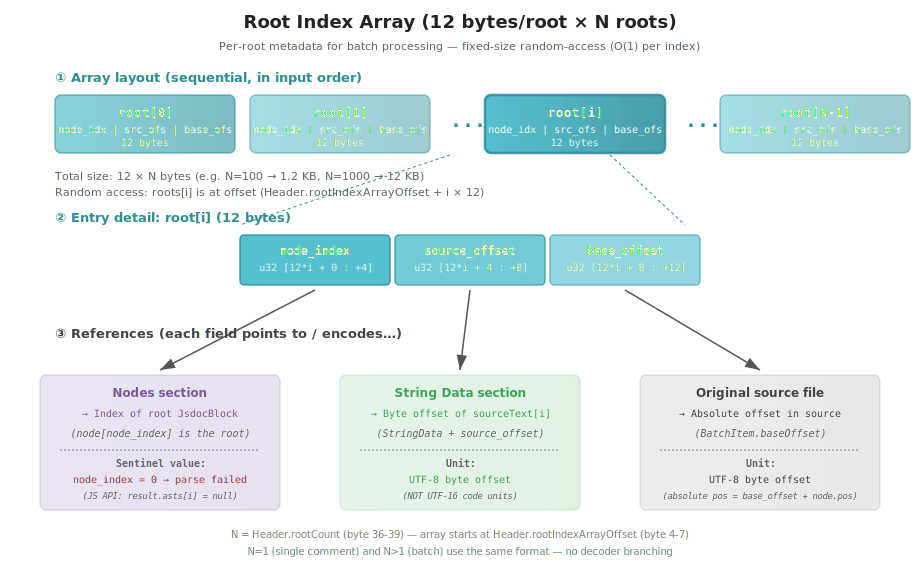

### Design overview

The Root Index Array is a fixed-size array that aggregates the **entry-point information** for each comment (= each root). It is the heart of the batch-processing mechanism that stores multiple comments per buffer, and it works with the same layout for N=1 (a single comment).

Key design goals:

- **Multi-root support**: makes N comments in one buffer indexable, allowing **O(1)** jumps to the root node corresponding to `result.asts[i]`
- **Sentinel for parse failure**: `node_index = 0` is the convention for "this comment failed to parse" (no separate null fields or auxiliary array required, the overall structure stays uniform)
- **Absolute offset reconstruction**: holds `base_offset` (the absolute position within the original file) so the decoder side can compute ESLint / LSP-compatible absolute positions via `base_offset + node.pos`
- **Source text sharing**: each root's sourceText is stored in String Data starting at `source_offset_in_data`, sharing the string region across the batch (also yielding dedup gains for repeated strings)
- **Input order preserved**: the array order matches the input `BatchItem[]` index (`items[i]` ↔ `roots[i]`), so the result-to-input correspondence is direct

### Layout

| Offset (relative) | Type | Field                                                                    |
| ----------------- | ---- | ------------------------------------------------------------------------ |
| 12\*i + 0         | u32  | root[i].node_index (root node index in the Nodes section)                |
| 12\*i + 4         | u32  | root[i].source_offset_in_data (sourceText start position in String Data) |
| 12\*i + 8         | u32  | root[i].base_offset (absolute offset in the original file)               |

Basic metadata:

- The array length is given by the Header's **root count N** (bytes 36-39)
- The array start offset is given by the Header's **Root Index Array start offset** (bytes 4-7)
- Array elements appear **in the same order as the input `BatchItem[]`** (`items[i]` ↔ `roots[i]`)
- Because the size is fixed (12 bytes/root), `roots[i]` supports **O(1) random access**

### Field details

#### `node_index` (u32)

The index of the root node (= the corresponding `JsdocBlock`) within the Nodes section.

- **When `= 0`**: indicates **parse failure** and points to the sentinel node (all zeros) at the head of the Nodes section. The JS API expresses this as `result.asts[i] === null`
- **When `> 0`**: parse succeeded. References the corresponding node in the Nodes section
- On parse success, multiple roots are placed contiguously in the Nodes section
  (e.g., `root[0]` points to `node[1]`, `node[2..k1]` are descendants of `root[0]`,
  `root[1]` points to `node[k1+1]`, …)
- By the convention that each root node has **`parent index = 0` (= sentinel)**, root detection is possible via `node.parent == 0`

#### `source_offset_in_data` (u32)

The **byte offset** that indicates where the corresponding sourceText is stored in the String Data section (relative to the start of the String Data section, in **UTF-8 bytes**).

- The head of the String Data section places each BatchItem's sourceText **concatenated in input order** (see the "String Table" section for details)
- Using this field, the source text for root [i] can be obtained from `String Data start + source_offset_in_data`
- String fields of nodes belonging to the root (tag names, type expressions, etc.) basically reference slices within this sourceText via string indices (zero-copy)
- Note that the unit is **UTF-8 bytes** (different from the UTF-16 code units used by Pos/End). This is because String Data is stored in UTF-8

#### `base_offset` (u32)

The absolute offset within the original file/module (the value the user passed as `BatchItem.baseOffset`). Used for ESLint and other lint/IDE integrations.

- **The unit is UTF-16 code units** (the same as the relative Pos/End on a node, which is the natural unit on the JS side)
- The absolute position of each node is computed on the **JS decoder side as `baseOffset + node.pos`** (see the "Nodes section (24 bytes/node)" section for details)
- If the input omits `baseOffset`, `0` is stored
- Each root has an independent value, so it is theoretically possible to **mix comments from multiple files into one buffer** (ox-jsdoc itself assumes a single file, but the format permits this in general)

### Concrete example (N=2 batch, 24 bytes total)

Input:

```typescript
parseBatch([
  { sourceText: '/** @param x */', baseOffset: 100 }, // items[0], length 15 bytes
  { sourceText: '/** @returns y */', baseOffset: 200 } // items[1], length 17 bytes
])
```

Contents of the Root Index Array (LE u32 representation, size 24 bytes):

| Offset | u32 value    | Meaning                                                                                  |
| ------ | ------------ | ---------------------------------------------------------------------------------------- |
| 0-3    | `0x00000001` | `root[0].node_index = 1` (first `JsdocBlock` in Nodes)                                   |
| 4-7    | `0x00000000` | `root[0].source_offset_in_data = 0` (start of String Data)                               |
| 8-11   | `0x00000064` | `root[0].base_offset = 100`                                                              |
| 12-15  | `0x00000005` | `root[1].node_index = 5` (descendants of root[0] are `node[1..4]`, root[1] is `node[5]`) |
| 16-19  | `0x0000000F` | `root[1].source_offset_in_data = 15` (after the byte length of sourceText[0])            |
| 20-23  | `0x000000C8` | `root[1].base_offset = 200`                                                              |

In the String Data section, `"/** @param x */"` (15 bytes) + `"/** @returns y */"` (17 bytes) are concatenated at the head (32 bytes total, followed by unique strings).

### Behavior on parse failure

The Root Index Array when `items[1]` fails to parse:

```text
roots = [
  { node_index: 1, source_offset_in_data: 0,  base_offset: 100 },  // i=0 OK (not the sentinel)
  { node_index: 0, source_offset_in_data: 15, base_offset: 200 },  // i=1 NG (sentinel = 0)
]
```

- `node_index = 0` points to the sentinel → the JS API expresses this as `result.asts[1] === null`
- `source_offset_in_data` and `base_offset` **retain valid values even on failure** (for source position recovery)
  - The location of the failed comment can be reconstructed as `[base_offset, base_offset + sourceText.length]`
- Failure details come from the Diagnostics section entry with `root_index = 1`
  (see [Diagnostics section](#diagnostics-section-4--8m-bytes) for details)
- **On failure, at least one diagnostic with the corresponding root_index is required** by convention

### Lazy decoder implementation sketch

```javascript
class RemoteSourceFile {
  #rootIndexArrayOffset // From Header bytes 4-7
  #rootCount // From Header bytes 36-39 (N)

  // Get root [i] metadata in O(1)
  getRootNodeIndex(i) {
    return this.view.getUint32(this.#rootIndexArrayOffset + i * 12 + 0, true)
  }

  getRootSourceOffset(i) {
    return this.view.getUint32(this.#rootIndexArrayOffset + i * 12 + 4, true)
  }

  getRootBaseOffset(i) {
    return this.view.getUint32(this.#rootIndexArrayOffset + i * 12 + 8, true)
  }

  // Lazily get the JsdocBlock for root [i]
  getRoot(i) {
    const nodeIdx = this.getRootNodeIndex(i)
    if (nodeIdx === 0) return null // parse failure → null in JS API
    return new RemoteJsdocBlock(this.view, nodeIdx, this, /* rootIndex */ i)
  }
}

// Build the parseBatch return value
function buildBatchResult(sourceFile) {
  const N = sourceFile.rootCount
  return {
    asts: Array.from({ length: N }, (_, i) => sourceFile.getRoot(i)),
    diagnostics: sourceFile.getAllDiagnostics()
  }
}
```

### Size and performance characteristics

| N (roots)          | Array size | Use case                                  |
| ------------------ | ---------: | ----------------------------------------- |
| 1 (single comment) |   12 bytes | Internal representation of `parse(text)`  |
| 10                 |  120 bytes | Small batch                               |
| 100                |     1.2 KB | Typical oxlint single-file batch          |
| 1000               |      12 KB | Large batch (typescript-checker.ts class) |
| 100,000            |     1.2 MB | All comments in a huge monorepo           |

Design advantages:

- **Fixed 12 bytes/root**: random access `roots[i]` is **O(1)** (only multiplication + offset addition)
- **Contiguous memory layout**: CPU prefetch friendly, high cache locality
- **Small overhead relative to the entire batch**: 1.2 KB for 100 roots vs hundreds of KB to several MB total
- **No specialization needed for N=1**: the same decoder code runs for both `parse(text)` and `parseBatch(items)`

### Special handling for N=1 (single comment)

The `parse(text)` API is also internally processed as `parseBatch([{sourceText: text}])`. In this case:

- N = 1, the Root Array is 12 bytes (minimal overhead)
- `roots[0].base_offset = 0` (default)
- On parse success, `roots[0].node_index = 1` typically
- Because there is no format difference between single/batch, **the decoder needs no mode branching**

### Differences from tsgo

The tsgo Binary AST has no corresponding section (tsgo always sends **a single SourceFile** per buffer, so a root array is unnecessary). Since ox-jsdoc treats batch processing as a primary use case, it introduces the Root Index Array (see [batch-processing.md](./batch-processing.md) for details).

## String table

The string table consists of two sections, **String Offsets** and **String Data**, reusing the zero-copy design of the tsgo Binary AST.

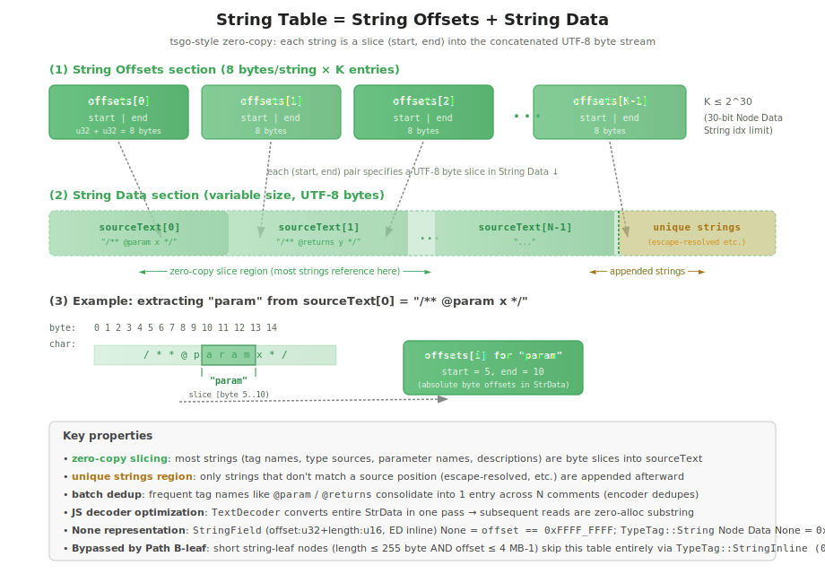

### Design overview

Basic policy:

- Each BatchItem's `sourceText` is **concatenated at the head of the String Data section**
- String fields on AST nodes (tag names, type expressions, parameter names, descriptions, etc.) are held as **byte slice references** into the concatenated sourceText (zero-copy)
- Only strings that do not match a source position (escape-resolved, etc.) are **appended to the tail** of String Data (unique strings region)
- **String Offsets** points to each string as a `(start: u32, end: u32)` byte range pair

This design lets most strings simply reference the source buffer, minimizing memory copies on both the encoder and decoder sides.

### String Offsets section (8 bytes/string × K)

#### Layout

| Offset (relative) | Type | Field                                                          |
| ----------------- | ---- | -------------------------------------------------------------- |
| 8\*i + 0          | u32  | `offsets[i].start` (byte start position in String Data)        |
| 8\*i + 4          | u32  | `offsets[i].end` (byte end position in String Data, exclusive) |

- Each entry is **fixed at 8 bytes** (2 × u32)
- The array start offset is given by the Header's **String Offsets section start offset** (bytes 8-11)
- The entry count K is not stated explicitly in the Header (computable as `(StrData start - StrOffsets start) / 8`)
- The string is obtained as `String Data[start..end]` (Rust slice syntax)
- The unit is **UTF-8 bytes** (not UTF-16 code units)

#### Limits

- K ≤ **65,535** (because string indices in Extended Data are u16)
- If exceeded, the encoder returns a `STRING_TABLE_OVERFLOW` error
  (see "string indices are u16" / "Behavior on overflow" below for details)

### String Data section (variable, UTF-8)

#### Internal structure

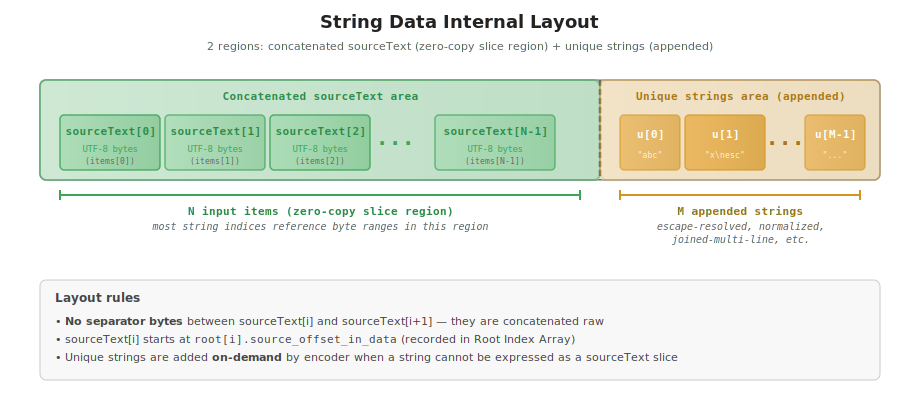

- Head region: each BatchItem's sourceText is **concatenated in input order** (no delimiter)
- Tail region: strings that do not match a source position are appended in order (unique strings)
- The whole region is stored as a **UTF-8 byte sequence**
  - Since the Rust-side sourceText is already UTF-8 (`&str`), there is no conversion cost
  - On the JS side, retrieval converts to UTF-16 in a single pass via `TextDecoder('utf-8')`

#### Zero-copy slicing mechanism

String fields inside JSDoc comments (e.g., "param", "name", "desc" in `@param name desc`) are all byte ranges of the original sourceText. The encoder **does not copy new bytes**; it simply records the `(start, end)` pair within the sourceText region into String Offsets:

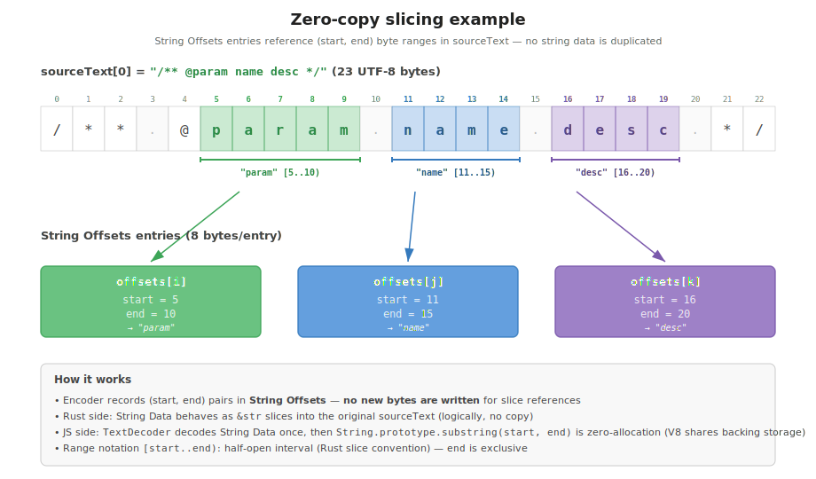

Notes:

- The Rust-side String Data can be represented as **slices of the original `&str`** (in implementation it is a `Vec<u8>`, but logically a reference range into sourceText)
- The JS side similarly only calls `substring` on the string converted in one pass by `TextDecoder` (engines like V8 share backing storage internally, so it is zero-allocation)

#### Unique strings (appended) region

Only strings that cannot be expressed by source positions are appended to the unique strings region. Concrete examples:

| Case                          | Example                                                                                     |
| ----------------------------- | ------------------------------------------------------------------------------------------- |
| Escape-sequence-resolved      | Interpret the source string `"hello\nworld"` and store the resolved `"hello<newline>world"` |
| Joined multi-line description | The result of joining a description that spans line breaks under compat_mode                |
| Normalized values             | Trimmed, case-folded, etc.                                                                  |

In ox-jsdoc's current typed AST, **most strings are source slices**, so the unique strings region is expected to **stay small** (typically < 10% overhead).

### How string references are encoded

There are **three** on-wire encodings for a string reference, picked at write time
based on storage location and string size. All three resolve to a slice of the
String Data section; the encoding determines whether an extra String Offsets
table lookup is required.

| Storage location                                | Encoding                               | Width  | None sentinel                        | Usage                                                                                                                                      |
| ----------------------------------------------- | -------------------------------------- | ------ | ------------------------------------ | ------------------------------------------------------------------------------------------------------------------------------------------ |
| **Node Data payload — `StringInline` (`0b11`)** | Packed `(offset:u22, length:u8)`       | 30-bit | (never None)                         | Short string-leaf nodes (length ≤ 255 byte and offset ≤ 4 MB-1) — most JSDoc tag names, type names, etc.                                   |
| **Node Data payload — `String` (`0b01`)**       | String Offsets table index             | 30-bit | `0x3FFFFFFF`                         | String-leaf nodes whose value is too long (≥ 256 byte) or whose String Data offset exceeds 4 MB; also used for diagnostics `message_index` |
| **Extended Data slot — `StringField` (inline)** | Inline `(offset:u32, length:u16)` pair | 6-byte | `(offset = 0xFFFF_FFFF, length = 0)` | All ED string slots in JsdocBlock, JsdocTag, JsdocDescriptionLine compat tail, etc.                                                        |

Selection rules at write time:

- **String-leaf nodes**: encoder tries `StringInline` first; falls back to `String + StringIndex` when `value.len() > 255` OR the resulting String Data offset exceeds 22 bits (4 MB-1). `StringInline` skips the String Offsets table indirection — readers slice String Data directly.
- **ED string slots**: always inline `StringField`; no String Offsets indirection at all.
- **Diagnostics `message_index`**: 4-byte `u32` index into the String Offsets table (long messages are common).

The dual-tag string-leaf path is **Path B-leaf** — see `tasks/benchmark/results/2026-04-23-binary-ast-phase-3-format-change-and-micro-opts.md` for the rationale and per-fixture impact (-10.5 % `parse_batch_to_bytes`).

### Encoder dedup behavior

The encoder uses a **HashMap (string → index)** to detect duplicate strings on insertion and reuse existing entries:

```rust
fn add_string(&mut self, s: &str) -> Result<u16, EncodeError> {
    if let Some(&idx) = self.dedup_map.get(s) {
        return Ok(idx);  // Reuse the existing entry
    }
    if self.offsets.len() >= u16::MAX as usize {
        return Err(EncodeError::StringTableOverflow {
            limit: u16::MAX as usize,
            current: self.offsets.len(),
        });
    }
    let idx = self.offsets.len() as u16;
    self.offsets.push((start, end));
    self.dedup_map.insert(s, idx);
    Ok(idx)
}
```

Dedup applies to all strings referenced by string indices. It works for both zero-copy slices and unique strings (no two distinct string indices point to the same byte range).

### Quantitative example of batch effect

In a batch (N comments), the same string appears repeatedly, so the dedup gain is large:

| String                 | Frequency (typical 100 comments) |  After dedup |
| ---------------------- | -------------------------------: | -----------: |
| `"@param"`             |               80-200 occurrences |  **1 entry** |
| `"@returns"`           |                30-50 occurrences |  **1 entry** |
| `"@throws"`            |                10-20 occurrences |  **1 entry** |
| `"@example"`           |                 5-15 occurrences |  **1 entry** |
| Other common tag names |                         1-5 each | 1 entry each |

Estimated savings for a 100-comment batch:

```text
Without dedup (theoretical max):
   ~600 entries × 8 bytes = 4.8 KB (String Offsets)
   + duplicated String Data

With dedup (estimated actual):
   ~310 entries × 8 bytes = 2.5 KB (String Offsets)
   + zero-copy also shrinks String Data

→ String Offsets section reduced by ~50% + String Data dedup effects
```

### JS decoder implementation sketch

```javascript
class RemoteSourceFile {
  #stringOffsetsOffset // Header bytes 8-11
  #stringDataOffset // Header bytes 12-15
  #stringDataView // Uint8Array view of String Data section
  #stringDataAsString // Single-pass converted string (lazy initialization)
  #stringCache = new Map() // index → string (lazily built)

  // Convert the entire String Data to a JS string in one pass (lazy)
  get #stringData() {
    if (!this.#stringDataAsString) {
      this.#stringDataAsString = new TextDecoder('utf-8').decode(this.#stringDataView)
    }
    return this.#stringDataAsString
  }

  // Get a string from a 30-bit String Offsets table index (the
  // `TypeTag::String` long-string fallback path).
  getString(idx) {
    if (idx === 0x3fffffff) return null // None sentinel in Node Data
    if (this.#stringCache.has(idx)) return this.#stringCache.get(idx)

    const ofs = this.#stringOffsetsOffset + idx * 8
    const start = this.view.getUint32(ofs, true)
    const end = this.view.getUint32(ofs + 4, true)
    const s = this.#stringData.substring(start, end) // zero-allocation

    this.#stringCache.set(idx, s)
    return s
  }

  // Get a string from an inline (offset, length) pair. Used by both
  // `TypeTag::StringInline` (Node Data) and `StringField` (Extended Data).
  // Always returns a real string — neither tag uses None sentinels.
  getStringByOffsetAndLength(offset, length) {
    const start = this.#stringDataOffset + offset
    const end = start + length
    const bytes = new Uint8Array(this.view.buffer, start, length)
    return new TextDecoder('utf-8').decode(bytes)
  }
}
```

Key points:

- **Call `TextDecoder` on the entire String Data only once** (lazy initialization), or per-call decode for inline-path slices that bypass the cache
- Individual string retrieval uses `String.prototype.substring` for **zero-allocation** (V8 internally shares the backing storage)
- A string index → string cache reduces cost on repeat access for the offsets-table path
- **Check the None sentinel (`0x3FFFFFFF`) first** in `getString`; the inline `StringField` and `StringInline` paths never carry that sentinel (the encoder always emits a real `(offset, length)` pair when present)

### Differences from tsgo

| Item                      | tsgo                               | ox-jsdoc                                                                                                                                                                                                                           |
| ------------------------- | ---------------------------------- | ---------------------------------------------------------------------------------------------------------------------------------------------------------------------------------------------------------------------------------- |
| String Offsets entry size | 8 bytes (u32 start + u32 end)      | **8 bytes (same)**, used only by long string-leaf nodes + diagnostics                                                                                                                                                              |
| String Data structure     | Single sourceText + unique strings | **Multiple sourceText concatenated + unique strings** (batch support)                                                                                                                                                              |
| String reference encoding | u32 index everywhere               | **`StringInline` (22-bit offset + 8-bit length)** for short string-leaf nodes / **`String` (30-bit index)** for long string-leaf nodes / **`StringField` (32-bit offset + 16-bit length, inline 6-byte slot)** for ED string slots |
| Dedup                     | Encoder uses a HashMap             | Same (still applies to all paths)                                                                                                                                                                                                  |
| String upper bound        | u32 max (~4G)                      | **String Data 4 GB** (limited by `StringField.offset` u32) / **String Offsets table 2³⁰ entries** for long-leaf path / **inline-leaf path 4 MB-1 offset × 255 byte length**                                                        |

ox-jsdoc primarily targets **batch processing**, hence multiple sourceText are concatenated. Compared to tsgo's single u32 index, ox-jsdoc has three separate encodings tuned for different sizes/locations, eliminating the offsets-table indirection on the hot path.

## Extended Data section

Stores additional data that does not fit in the fixed node record. Same use as tsgo's `SourceFile` (48 bytes) and `TemplateHead` (12 bytes).

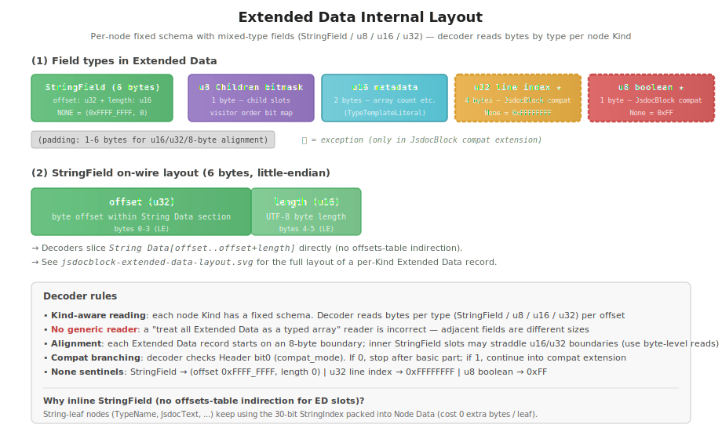

### Design overview

Extended Data is a **variable-length section** that holds the additional fields each node needs:

- Holds information that does not fit in the node record (24 bytes/node)
- When the type tag of Node Data (32-bit) is `Extended (0b10)`, the payload (30-bit) points to a **byte offset** within the Extended Data section
- A **fixed type layout** is defined per node kind (the decoder looks up the layout by Kind)
- The maximum size of the entire section is **1 GiB** (the 30-bit upper bound of the Node Data payload)

Examples of stored information:

- String index for string fields (tag name, type expression, parameter name, description, etc.)
- Children bitmask for child nodes
  (since the bitmask cannot be placed in the payload of an Extended-type Node Data, it goes at byte 0 of the Extended Data)
- Additional metadata for compat_mode (line indices, boolean flags)
- Structural data specific to TypeNode (e.g., literal count of `TypeTemplateLiteral`)

### List of stored types

Data stored in Extended Data is composed of **5 field types + padding**:

| Type                           | Size      | Usage                                                                      | Applies to                                      | None sentinel                        |
| ------------------------------ | --------- | -------------------------------------------------------------------------- | ----------------------------------------------- | ------------------------------------ |
| **`StringField`**              | 6 bytes   | Inline `(offset: u32, length: u16)` reference into the String Data section | Almost all Extended Data nodes                  | `(offset = 0xFFFF_FFFF, length = 0)` |
| **u8 Children bitmask**        | 1 byte    | Bitmask for child node presence (visitor order)                            | `JsdocBlock`, `JsdocTag`, `JsdocGenericTagBody` | -                                    |
| **u16 metadata**               | 2 bytes   | Element counts etc.                                                        | `TypeTemplateLiteral` (literal count)           | -                                    |
| **u32 line index** ★exception  | 4 bytes   | Line number in the original file                                           | `JsdocBlock` (**compat only**)                  | `0xFFFFFFFF`                         |
| **u8 boolean flag** ★exception | 1 byte    | `bool` or `Option<u8>`                                                     | `JsdocBlock` (**compat only**)                  | `0xFF`                               |
| (padding)                      | 1-6 bytes | Type-boundary alignment (u16 / u32 / 8-byte record boundary)               | Many                                            | -                                    |

**The main role is the `StringField`**; the others are auxiliary or exceptional. In particular, **the use of u32 / u8 is localized to the compat extension portion of `JsdocBlock`**.

A `StringField` carries `(offset, length)` directly so the reader slices
String Data without going through the offsets table — see the
`### Extended Data StringField slot (6 bytes)` subsection below for the
on-wire encoding. String-leaf nodes (Comment AST `JsdocText` / `JsdocTagName`
/ … and TypeNode Pattern 1 `TypeName` / `TypeNumber` / …) keep using a
30-bit `StringIndex` packed into Node Data and do **not** allocate an
Extended Data record at all.

### Critical decoder conventions

#### Fix the type layout per node kind

A decoder reading Extended Data **must hold a layout schema per node kind (Kind)**. There is **no generic reader** that "reads the entire Extended Data as a typed array":

```rust
// Correct implementation (Kind-aware, JsdocBlock-specific decoder)
impl<'a> LazyJsdocBlock<'a> {
    pub fn description(&self) -> Option<&'a str> {
        let ext = self.ext_offset();
        // Read 6-byte StringField at bytes 2-7 (offset: u32, length: u16)
        let field = read_string_field(self.bytes, ext + 2);
        self.source_file.get_string_by_field(field)
    }

    pub fn end_line(&self) -> Option<u32> {
        if !self.source_file.compat_mode() { return None; }
        let ext = self.ext_offset();
        let v = self.bytes.read_u32_le(ext + 52);    // compat u32 at byte 52
        if v == 0xFFFFFFFF { None } else { Some(v) }
    }

    pub fn has_preterminal_description(&self) -> u8 {
        let ext = self.ext_offset();
        self.bytes.read_u8(ext + 68)                  // compat u8 at byte 68
    }
}

// Incorrect implementation (generic reader, never write this)
fn bad_read_extended_data_as_array(ext_data: &[u8]) -> Vec<u16> {
    // This implementation cannot distinguish a StringField (6 bytes) from
    // adjacent u8/u32 fields, nor handle the JsdocBlock compat u32 line
    // indices.
    ext_data.chunks(2).map(|c| u16::from_le_bytes([c[0], c[1]])).collect()
}
```

Reasons:

- **The Node Data type tag (`0b10 = Extended`) only says "this references Extended Data"** (it does not convey the specific field types)
- The node kind is identified by the **Node Record byte 0 (Kind)**
- The decoder **holds a Kind ↔ schema mapping** and reads in byte-offset units according to it
- The compat flag (Header bit0) also affects the layout (presence/absence of the compat extension)

#### Size calculation = base portion + compat extension portion

When `compat_mode = ON`, some nodes get an extra portion appended to their Extended Data:

| Node                   |    basic |                                        compat extension | compat total |
| ---------------------- | -------: | ------------------------------------------------------: | -----------: |
| `JsdocBlock`           | 68 bytes |                     + 22 bytes (u32×4 + u8×2 + padding) |     90 bytes |
| `JsdocTag`             | 38 bytes |                + 42 bytes (StringField×7 = 7 × 6 bytes) |     80 bytes |
| `JsdocDescriptionLine` |  0 bytes | (switches to Extended type, + 24 bytes = 4×StringField) |     24 bytes |
| `JsdocTypeLine`        |  0 bytes | (switches to Extended type, + 24 bytes = 4×StringField) |     24 bytes |

The basic JsdocBlock / JsdocTag sizes include 6 bytes of inline list
metadata (`head_index: u32` + `count: u16`) per variable-length child list:
JsdocBlock has 3 lists (descriptionLines / tags / inlineTags) at bytes
50-67, JsdocTag has 3 lists (typeLines / descriptionLines / inlineTags) at
bytes 20-37. See "List metadata in Extended Data" later in this document.

The decoder reads Header bit0 to branch (each node references it via a `compat` getter through the sourceFile).

### Alignment conventions

Each Extended Data field is **aligned to a byte boundary appropriate for its type**:

| Type | Boundary               | Reason                                                            |
| ---- | ---------------------- | ----------------------------------------------------------------- |
| u8   | 1-byte (no constraint) | Any position OK                                                   |
| u16  | **2-byte boundary**    | Required by `DataView.getUint16`                                  |
| u32  | **4-byte boundary**    | Required by `DataView.getUint32`; avoids CPU misalignment penalty |

To meet boundaries, **insert padding (zero-fill) as needed**.

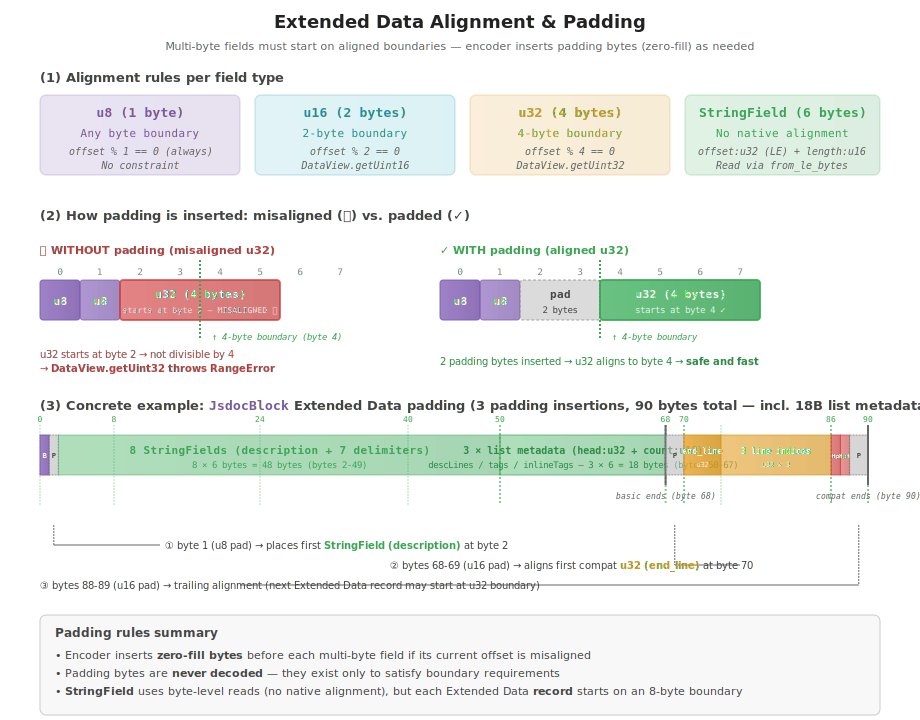

Concrete example (text format):

```text
JsdocBlock compat boundary adjustment (basic 68 bytes → compat 90 bytes)

[Basic portion, u8 bitmask + 8 × StringField + 3 × list metadata]
byte 0     : Children bitmask  (u8, retained for the visitor framework)
byte 1     : padding            (u8)         ← Pads to byte 2 (StringField start)
byte 2-7   : description        (StringField, 6 B = u32 offset + u16 length)
byte 8-13  : delimiter          (StringField)
byte 14-19 : post_delimiter     (StringField)
byte 20-25 : terminal           (StringField)
byte 26-31 : line_end           (StringField)
byte 32-37 : initial            (StringField)
byte 38-43 : delimiter_line_break       (StringField)
byte 44-49 : preterminal_line_break     (StringField)
byte 50-55 : descriptionLines list metadata (head_index: u32 + count: u16)
byte 56-61 : tags                 list metadata (ditto)
byte 62-67 : inlineTags           list metadata (ditto)
                                              ← End of basic (byte 68)
[Compat extension; u32s mixed in, so alignment padding is needed]
byte 68-69 : padding            (u16 = 2 B)  ← Aligns byte 70 to u32 boundary
byte 70-73 : end_line                (u32)   ← u32 starts here
byte 74-77 : description_start_line  (u32)
byte 78-81 : description_end_line    (u32)
byte 82-85 : last_description_line   (u32)
byte 86    : has_preterminal_description     (u8)
byte 87    : has_preterminal_tag_description (u8)
byte 88-89 : padding (u16 = 2 B)             ← trailing alignment
                                              ← End of compat (byte 90)
```

See the tables and subsections that follow for the concrete layout of each node.

### Extended Data StringField slot (6 bytes)

Every string reference inside Extended Data is stored as a **6-byte
`StringField`** holding `(offset: u32, length: u16)` directly. Readers
slice String Data without going through the offsets table, so the per-slot
read collapses to a single `from_le_bytes` plus one bounded `Uint8Array`
view.

```text
StringField (6 bytes, little-endian, NOT naturally aligned)

  byte 0-3 : offset (u32)   ← byte offset within String Data
  byte 4-5 : length (u16)   ← UTF-8 byte length
```

Reasons:

- **One hop instead of two**: Extended Data slots used to store a u16
  index that the decoder dereferenced through the String Offsets table
  (`(start, end)` pair) and then sliced String Data. The `StringField`
  encoding fuses the two reads into one.
- **No offsets-table churn for ED-only strings**: when a string never
  appears as a string-leaf node, its `(start, end)` pair is never
  written to the offsets table at all (the encoder allocates an offsets
  entry lazily on first leaf use).
- **`Uint32Array[idx] + Uint16Array[idx]` decode pattern in the JS
  decoder still wins over `DataView.getUint16` thanks to the surrounding
  Extended Data 8-byte alignment of the record start.**

**Limits**:

- `offset` is u32 → up to **4 GiB** of String Data (well above the
  30-bit Extended Data offset cap of ~1 GiB).
- `length` is u16 → up to **65,535 bytes** per individual string
  (covers any realistic JSDoc description / tag-name / type source).

**None sentinel**: `(offset = 0xFFFF_FFFF, length = 0)` (`StringField::NONE`).
The combined comparison never collides with any valid empty-string slot
because real `(0, 0)` references the leading prelude entry (the empty
string itself).

Nodes that hold Extended Data within the comment AST (the 6 TypeNode
Extended Data variants are covered in the next section "TypeNode
Extended Data layout (pattern 3 details)"):

| Node                   | Size                          | Data content                                                                                                                                                                                                                                                                                                                                                                                                                                                                                                                                                                                                                                                                    |
| ---------------------- | ----------------------------- | ------------------------------------------------------------------------------------------------------------------------------------------------------------------------------------------------------------------------------------------------------------------------------------------------------------------------------------------------------------------------------------------------------------------------------------------------------------------------------------------------------------------------------------------------------------------------------------------------------------------------------------------------------------------------------- |
| `JsdocBlock`           | 68 bytes (90 bytes in compat) | Basic portion: Children bitmask (u8) + reserved (u8, alignment) + `description` `StringField` (6) + 7 delimiters (`StringField`×7 = 42) + 3 list metadata slots (3 × 6 = 18 bytes for `descriptionLines` / `tags` / `inlineTags`) = **68 bytes**. In `compat_mode`, the following is appended **after** the basic portion: reserved 2 bytes (u32 alignment) + `end_line` (u32) + `description_start_line` (u32, `0xFFFFFFFF` for None) + `description_end_line` (u32, ditto) + `last_description_line` (u32, ditto) + `has_preterminal_description` (u8) + `has_preterminal_tag_description` (u8, `0xFF` for None) + reserved 2 bytes (trailing alignment) = **22 bytes** added |
| `JsdocTag`             | 38 bytes (80 bytes in compat) | Basic portion: Children bitmask (u8) + reserved (u8) + `default_value` `StringField` (6) + `description` `StringField` (6) + `raw_body` `StringField` (6) + 3 list metadata slots (3 × 6 = 18 bytes for `typeLines` / `descriptionLines` / `inlineTags`) = **38 bytes**. `tag` (JsdocTagName), `raw_type` (JsdocTypeSource), `name` (JsdocTagNameValue), `parsed_type` (TypeNode), and `body` (JsdocTagBody) are **placed as child nodes** (since they are span-bearing structs). `optional` is stored in Common Data bit0. In compat, 7 delimiters (`StringField`×7 = 42 bytes) are appended after                                                                             |
| `JsdocInlineTag`       | 18 bytes                      | `namepath_or_url` `StringField` (6) + `text` `StringField` (6) + `raw_body` `StringField` (6) = **18 bytes**. `tag` is placed as a child node (`JsdocTagName`); each Optional uses `StringField::NONE` as the absent marker                                                                                                                                                                                                                                                                                                                                                                                                                                                     |
| `JsdocParameterName`   | 12 bytes                      | `path` `StringField` (6, required) + `default_value` `StringField` (6, `StringField::NONE` = None). `optional` is stored in Common Data bit0                                                                                                                                                                                                                                                                                                                                                                                                                                                                                                                                    |
| `JsdocGenericTagBody`  | 8 bytes                       | Children bitmask (u8, bit0=typeSource, bit1=value) + reserved (u8, alignment) + `description` `StringField` (6, `StringField::NONE` = None) = **8 bytes**. `type_source` (JsdocTypeSource) and `value` (JsdocTagValue) are **placed as child nodes** (since they are span-bearing structs). `separator` is stored in Common Data bit0 (has_dash_separator)                                                                                                                                                                                                                                                                                                                      |
| `JsdocDescriptionLine` | 24 bytes (compat only)        | `description` `StringField` (6, required) + 3 delimiters (`delimiter`, `post_delimiter`, `initial`) `StringField`×3 = 4 × `StringField` = **24 bytes**. **No Extended Data outside compat** (Node Data is set to String type 0b01 and `description` is stored directly in the 30-bit string index). In compat, Node Data switches to Extended type 0b10 and the 4 string fields including `description` move to Extended Data                                                                                                                                                                                                                                                   |
| `JsdocTypeLine`        | 24 bytes (compat only)        | `raw_type` `StringField` (6, required) + 3 delimiters (`delimiter`, `post_delimiter`, `initial`) `StringField`×3 = 4 × `StringField` = **24 bytes**. **No Extended Data outside compat** (Node Data is set to String type 0b01 and `raw_type` is stored directly in the 30-bit string index). In compat, Node Data switches to Extended type 0b10 and the 4 string fields including `raw_type` move to Extended Data                                                                                                                                                                                                                                                            |

The decoder branches on the `compat_mode` flag (Header bit0) per node kind because the size differs.

### JsdocTag Children bitmask (Extended Data byte 0)

Because JsdocTag uses Extended-type Node Data, the Children bitmask is placed at the **first 1 byte** of Extended Data (since the bitmask cannot be put in Node Data):

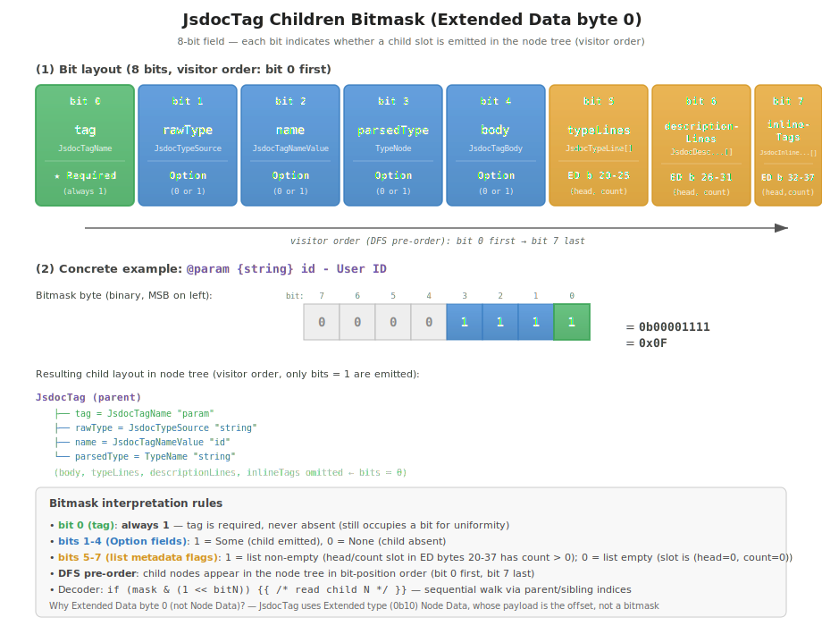

Bit definitions (text format):

```text
JsdocTag Extended Data byte 0 (Children bitmask, 8 bits):
  bit0 = tag (JsdocTagName, mandatory so always 1)
  bit1 = rawType (JsdocTypeSource, Option)
  bit2 = name (JsdocTagNameValue, Option)
  bit3 = parsedType (TypeNode, Option)
  bit4 = body (JsdocTagBody, Option)
  bit5 = typeLines (set when the typeLines list metadata is non-empty)
  bit6 = descriptionLines (ditto)
  bit7 = inlineTags (ditto)
```

Bits 5-7 do **not** correspond to a child slot in the next_sibling chain;
the actual list head/count for each list lives in the per-list metadata
slots placed at bytes 20-37 of the Extended Data block (see byte-level
layout below). The bits are kept for the visitor framework so a fast
`if (bitmask & X) != 0` check can decide whether to walk the list at all.

Child nodes are written in DFS pre-order: the fixed children (`tag`,
`rawType`, `name`, `parsedType`, `body`) come first as direct siblings
under the parent, then each list's elements follow in `typeLines →
descriptionLines → inlineTags` order, also as direct siblings.

### JsdocBlock Children bitmask (Extended Data byte 0)

Since JsdocBlock also uses Extended-type Node Data, in the same pattern as JsdocTag the Children bitmask is placed at the **first 1 byte** of Extended Data:

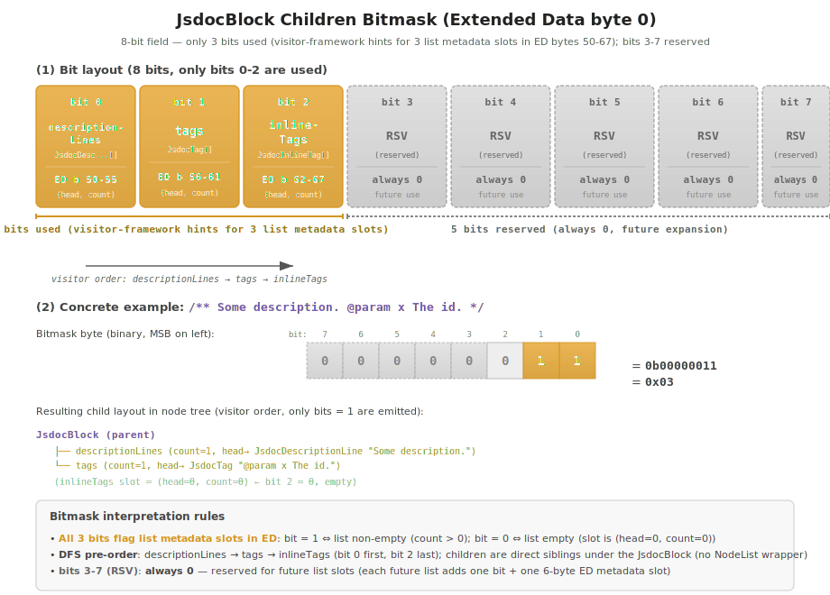

Bit definitions (text format):

```text
JsdocBlock Extended Data byte 0 (Children bitmask, 3 bits used):
  bit0 = descriptionLines (set when the descriptionLines list is non-empty)
  bit1 = tags (ditto)
  bit2 = inlineTags (ditto)
  bit3-7 = reserved (0)
```

The bits do **not** correspond to a child slot in the next_sibling chain;
each list's actual head/count lives in the per-list metadata slots placed
at bytes 50-67 of the Extended Data block (see byte-level layout below).
They are retained for the visitor framework so a fast
`if (bitmask & X) != 0` check can decide whether to walk the list at all.

Child nodes are written in DFS pre-order, list-by-list, as direct siblings
under the JsdocBlock (`descriptionLines → tags → inlineTags`). The
continued layout of `JsdocBlock` Extended Data:

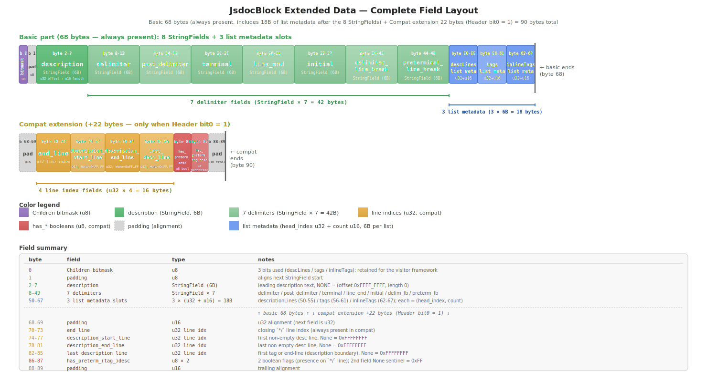

Byte-level layout (text format):

```text
byte 0:    Children bitmask (u8, retained for the visitor framework)
byte 1:    reserved (u8, for StringField start at byte 2)
byte 2-7:  description           (StringField, 6 bytes)
byte 8-13: delimiter             (StringField)
byte 14-19: post_delimiter       (StringField)
byte 20-25: terminal             (StringField)
byte 26-31: line_end             (StringField)
byte 32-37: initial              (StringField)
byte 38-43: delimiter_line_break (StringField)
byte 44-49: preterminal_line_break (StringField)
byte 50-55: descriptionLines list metadata (head_index: u32, count: u16)
byte 56-61: tags                 list metadata (ditto)
byte 62-67: inlineTags           list metadata (ditto)
                                    ← End of basic (68 bytes)

[Continues only when compat_mode = ON]
byte 68-69: reserved (u16, for u32 alignment)
byte 70-73: end_line (u32)
byte 74-77: description_start_line (u32, 0xFFFFFFFF for None)
byte 78-81: description_end_line (u32, ditto)
byte 82-85: last_description_line (u32, ditto)
byte 86:    has_preterminal_description (u8)
byte 87:    has_preterminal_tag_description (u8, 0xFF for None)
byte 88-89: reserved (u16, trailing alignment)
                                    ← End of compat (90 bytes total)
```

### JsdocTag complete byte-level layout (basic 38 + compat 42 = 80 bytes)

The compat tail of `JsdocTag` is 7 consecutive `StringField` slots
preserving the source-level whitespace around the tag header (matching
jsdoccomment's per-tag delimiter fields). All slots are required (the
compat mode by design always emits them), so `StringField::NONE` is not
used here — empty source whitespace is interned as a 0-length slice into
the COMMON_STRINGS prelude entry for `""`.

Byte-level layout (text format):

```text
byte 0:    Children bitmask (u8, retained for the visitor framework)
byte 1:    reserved (u8, for StringField start at byte 2)
byte 2-7:  default_value (StringField, NONE if absent)
byte 8-13: description   (StringField, NONE if absent)
byte 14-19: raw_body     (StringField, NONE if absent)
byte 20-25: typeLines       list metadata (head_index: u32, count: u16)
byte 26-31: descriptionLines list metadata (ditto)
byte 32-37: inlineTags      list metadata (ditto)
                                    ← End of basic (38 bytes)

[Continues only when compat_mode = ON]
byte 38-43: delimiter      (StringField)
byte 44-49: post_delimiter (StringField)
byte 50-55: post_tag       (StringField)
byte 56-61: post_type      (StringField)
byte 62-67: post_name      (StringField)
byte 68-73: initial        (StringField)
byte 74-79: line_end       (StringField)
                                    ← End of compat (80 bytes total)
```

### Pos/End and Extended Data offset stay u32

- Pos/End: u32 (UTF-16 code units, relative to the root's sourceText)
- Parent / Next sibling: u32 (supports up to 4G nodes)
- Extended Data offset (in Node Data payload): 30-bit (per Node Data spec, supports a section size up to 1 G)

Only the string index is downgraded to u16; the rest stay u32 / 30-bit, retaining a safety margin.

### Behavior on overflow (encoder)

```rust
const MAX_STRING_INDICES: usize = u16::MAX as usize; // 65,535

fn add_string(&mut self, s: &str) -> Result<u16, EncodeError> {
    if self.offsets.len() >= MAX_STRING_INDICES {
        return Err(EncodeError::StringTableOverflow {
            limit: MAX_STRING_INDICES,
            current: self.offsets.len(),
        });
    }
    // ...
}
```

From the caller (JS):

```typescript
try {
  const result = parseBatch(items)
} catch (e) {
  if (e.code === 'STRING_TABLE_OVERFLOW') {
    // Split the batch and retry
    const half = Math.floor(items.length / 2)
    const r1 = parseBatch(items.slice(0, half))
    const r2 = parseBatch(items.slice(half))
    // Merge results (Diagnostics rootIndex needs to be renumbered)
  }
}
```

In practice this does not occur in most cases (per-file batches in oxlint); even at the typescript-checker.ts class of largest files it stays around 2.8% of the u16 limit.

The string and child node configurations of TypeNode are classified into the following 3 patterns by variant:

1. **"String only" type** — only `value: &str`, no children
   → Set the node's own Node Data to **`StringInline` (`0b11`)** when the value fits the inline-leaf encoding (length ≤ 255 byte AND offset ≤ 4 MB-1) — packs `(offset:u22, length:u8)` into the 30-bit payload directly. Falls back to **`String` (`0b01`)** + 30-bit String Offsets index for longer values. No child nodes (saves 24 bytes/node overhead).
   - Applies to: `TypeName`, `TypeNumber`, `TypeStringValue`, `TypeProperty`, `TypeSpecialNamePath`
   - Auxiliary information (quote, special_type, etc.) is stored in Common Data

2. **"Children only" type** — no string fields, has fixed-arity child nodes
   → Set Node Data to **Children type (0b00)** and store a 30-bit bitmask
   - Applies to: `TypeFunction`, `TypeParenthesis`, `TypeNullable`, `TypeNotNullable`, `TypeOptional`, `TypeVariadic`, `TypeConditional`, `TypeInfer`, `TypeKeyOf`, `TypeTypeOf`, `TypeImport`, `TypePredicate`, `TypeAsserts`, `TypeAssertsPlain`, `TypeReadonlyArray`, `TypeNamePath`, `TypeObjectField`, `TypeJsdocObjectField`, `TypeIndexedAccessIndex`, `TypeCallSignature`, `TypeConstructorSignature`, `TypeReadonlyProperty`
   - Booleans / small enums (constructor, arrow, parenthesis, brackets, dot, etc.) are stored in Common Data

3. **"String + children" mixed / special structure / variable child list** — has both strings and children, or carries a variable-length child list whose `(head_index, count)` lives in Extended Data
   → Set Node Data to **Extended type (0b10)** and store an offset into Extended Data. See the "TypeNode Extended Data layout" table below for detailed layouts.
   - **Mixed string + 0/1 child** (Extended Data starts with a `StringField` slot): `TypeKeyValue`, `TypeIndexSignature`, `TypeMappedType`, `TypeMethodSignature`, `TypeTemplateLiteral`, `TypeSymbol`
   - **Variable child list** (Extended Data starts with a `(head:u32, count:u16)` list metadata slot at byte 0; list children are direct siblings under the parent, walked `count` times): `TypeUnion`, `TypeIntersection`, `TypeGeneric`, `TypeObject`, `TypeTuple`, `TypeTypeParameter`, `TypeParameterList`. (Migrated from "Children only" to Pattern 3 in the NodeList-wrapper-elimination format change — see `tasks/benchmark/results/2026-04-23-…`.)
   - `TypeSymbol` has a structure of `value: &str + element: Option<TypeNode>`; whether `element` is present or not, it always uses Extended Data (consistency-first; consumes 2 bytes even when `element` is absent)

Note: The `JsdocText` node is restricted to **only the variant 1 use of `JsdocTagValue::Raw`** (it is not used for storing TypeNode strings). Semantic purification of type === 'JsdocText'.

## TypeNode Extended Data layout (pattern 3 details)

The 6 kinds among TypeNodes that have "mixed string + child / special structure" are represented in **Extended type (0b10)** and place small auxiliary data in the Extended Data region. This section defines the Extended Data layout for each node kind.

### Design overview

Most TypeNodes can be expressed as either **"a single string (literal/identifier)"** or **"children only (compositional)"**, so they complete in either Node Data's **String type (0b01)** or **Children type (0b00)**.

However, the following 6 kinds have **"strings + child nodes" or "special array structures"**, so they cannot be represented by Node Data alone, and we split auxiliary information out into Extended Data:

| Node kind             | Structure                                                                  | Typical source examples                   |
| --------------------- | -------------------------------------------------------------------------- | ----------------------------------------- |
| `TypeKeyValue`        | String (key) + Option<TypeNode> (value) + boolean × 2                      | `{ a: string, b?: number, ...c: string }` |
| `TypeIndexSignature`  | String (key) + TypeNode (right)                                            | `{[K]: string}`                           |
| `TypeMappedType`      | String (key) + TypeNode (right)                                            | `{[K in T]: U}` style                     |
| `TypeMethodSignature` | String (name) + 3 children (params/return/typeParams) + 2 booleans + quote | Method definitions in `(...) => T` form   |
| `TypeTemplateLiteral` | Variable-length string array + interpolations as direct children           | `text${e1}middle${e2}tail`                |
| `TypeSymbol`          | String (value) + Option<TypeNode> (element)                                | `Symbol(MyClass)`, `MyClass(2)`           |

Key design goals:

- **Maintain minimum size**: `TypeKeyValue` through `TypeSymbol` are **fixed at 2 bytes of Extended Data** (just one string index). Variable length applies only to `TypeTemplateLiteral`
- **Division of responsibility with Common Data**: booleans / small enums (`optional`, `quote`, `has_*`) are stored in **Common Data (byte 1)** rather than Extended Data
- **Children follow the same convention as Children type**: even in Extended type, children appear in DFS pre-order in the Nodes array and are reconstructed by `parent` / `next_sibling` (no dedicated link table)
- **Maintain 8-byte alignment**: Extended Data of 2 bytes is padded before/after to align to an 8-byte boundary (see "Alignment conventions")

### Common conventions

All the string slots below are **6-byte `StringField`** (per the
convention in the `### Extended Data StringField slot (6 bytes)`
subsection of the prior `### Extended Data section`). Metadata such as
literal counts is unified as **u16** (no measured case exceeds the u16
limit: of 226 JSDoc comments in typescript-checker.ts,
`TypeTemplateLiteral` count is 0, and a JSDoc template literal with
65K segments is physically impossible).

### `TypeKeyValue` (Extended Data 6 bytes)

```text
Extended Data:
  byte 0-5: key StringField (offset u32 + length u16)

Common Data:
  bit0 = optional
  bit1 = variadic

Children: 1 (TypeNode) only when right is Some
  → Presence is reconstructed via the parent index (a child exists if node[i+1].parent == i)
```

### `TypeIndexSignature` (Extended Data 6 bytes)

```text
Extended Data:
  byte 0-5: key StringField

Children: right (TypeNode, mandatory) 1
```

### `TypeMappedType` (Extended Data 6 bytes)

```text
Extended Data:
  byte 0-5: key StringField

Children: right (TypeNode, mandatory) 1
```

### `TypeMethodSignature` (Extended Data 6 bytes)

```text
Extended Data:
  byte 0-5: name StringField

Common Data (6 bits):
  bits[0:1] = quote (3-state: 0=None / 1=Single / 2=Double)
  bit2 = has_parameters (a TypeParameterList child is emitted when set)
  bit3 = has_type_parameters (ditto)
  bit4-5 = reserved (0)

Children:
  When bit2 = 1, a TypeParameterList child holding the parameters list
    metadata in its own ED is at the front
  return_type is mandatory, so always present (no bit needed)
  When bit3 = 1, a TypeParameterList child for the type parameters is
    at the end

Order: parameters TypeParameterList (if any) → return_type → type_parameters
TypeParameterList (if any). Each TypeParameterList owns an inline list
metadata slot in its own Extended Data block (see TypeParameterList row in
the Pattern 3 catalog).

Note: Instead of holding a separate bitmask in Extended Data, we consolidate
in the remaining 4 bits of Common Data. This keeps Extended Data at 6 bytes
(no extra metadata slot beyond the StringField).
```

### `TypeTemplateLiteral` (Extended Data 2 + 6N bytes)

```text
Extended Data:
  byte 0-1: literal count N (u16)
  byte 2-7: literal[0] StringField (6 bytes)
  byte 8-13: literal[1] StringField
  ...
  byte (2 + 6*(N-1)) – (2 + 6N - 1): literal[N-1] StringField

Children: interpolations (Vec<TypeNode>) emitted as direct children of
TypeTemplateLiteral in order. No dedicated count slot is reserved in
Extended Data — `interpolations.len() == max(0, N - 1)` so the decoder
derives the count from `literal_count`.

Example: `text${e1}middle${e2}tail`
  → literals = ["text", "middle", "tail"] (N=3)
  → interpolations = [e1, e2] (2 direct children of TypeTemplateLiteral)
  → Extended Data: 2 + 6×3 = 20 bytes
```

### `TypeSymbol` (Extended Data 6 bytes)

A call-style type expression like `Symbol(MyClass)` or `MyClass(2)`. Structure of `value: &str` (function-name-equivalent) + `element: Option<TypeNode>` (argument-equivalent):

```text
Extended Data:
  byte 0-5: value StringField

Common Data:
  bit0 = has_element (Some/None for Option<TypeNode>)

Children:
  When bit0 = 1, 1 element (TypeNode)
  When bit0 = 0, no children

Examples:
  `Symbol(MyClass)` → value="Symbol", element=TypeNode("MyClass"), has_element=1
  `MyClass(2)`      → value="MyClass", element=TypeNode("2"), has_element=1
  `Symbol`          → value="Symbol", element=None, has_element=0 (no children)
```

### Size comparison table

| Node kind             |               Extended Data |      Common Data (used bits) | Child count                                  |
| --------------------- | --------------------------: | ---------------------------: | -------------------------------------------- |
| `TypeKeyValue`        |                 **6 bytes** |  2 bits (optional, variadic) | 0 or 1 (TypeNode)                            |
| `TypeIndexSignature`  |                 **6 bytes** |                       0 bits | 1 (TypeNode required)                        |
| `TypeMappedType`      |                 **6 bytes** |                       0 bits | 1 (TypeNode required)                        |
| `TypeMethodSignature` |                 **6 bytes** | 4 bits (quote + has\_\* × 2) | 1-3 (params/return/typeParams)               |
| `TypeTemplateLiteral` | **2 + 6N bytes** (variable) |                       0 bits | Variable (interpolations as direct children) |
| `TypeSymbol`          |                 **6 bytes** |          1 bit (has_element) | 0 or 1 (TypeNode)                            |

**Design highlights**:

- **5/6 are fixed at 6 bytes**: each carries a single inline `StringField`, no offsets-table indirection
- **Only `TypeTemplateLiteral` is variable** (2 + 6N): because string segments form an array
- **Booleans / enums offloaded to Common Data**: not stuffed into Extended Data, consolidated into byte 1

### Implementation notes for encoder/decoder

#### encoder

```rust
fn write_type_keyvalue(buf: &mut Vec<u8>, n: &TypeKeyValue) -> u32 {
    // Position to write into Extended Data (8-byte aligned)
    let offset = align8(buf.len()) as u32;
    buf.resize(offset as usize, 0);  // padding

    // 6 bytes: key StringField (offset u32 + length u16)
    let key_field = intern_string_field(&n.key);
    key_field.write_le(&mut buf[offset as usize..offset as usize + 6]);

    // The remaining 2 bytes are padding for the next record (alignment)
    let pad = align8(buf.len()) as usize - buf.len();
    buf.resize(buf.len() + pad, 0);

    offset  // Stored in the Node Data Extended payload
}
```

#### decoder

```javascript
function decodeTypeKeyValue(view, extendedOffset, commonData) {
  // Read 6-byte StringField inline (offset u32 at +0, length u16 at +4)
  const offset = view.getUint32(extendedOffset, true)
  const length = view.getUint16(extendedOffset + 4, true)
  const key = getStringByField(offset, length)
  const optional = (commonData & 0b0000_0001) !== 0
  const variadic = (commonData & 0b0000_0010) !== 0
  // The child node (Option<right>) is reconstructed by the parent index
  const right = getFirstChild() // null or TypeNode
  return { key, right, optional, variadic }
}
```

### Differences from tsgo

| Item                     | tsgo                                  | ox-jsdoc                                                                                   |
| ------------------------ | ------------------------------------- | ------------------------------------------------------------------------------------------ |
| Target                   | TypeScript types like `TypeReference` | **JSDoc-extended types** (TypeKeyValue, TypeMappedType, etc.)                              |
| Extended Data unit       | Variable (per struct)                 | **6 bytes / 2+6N bytes** (minimum unit, one inline StringField)                            |
| String reference width   | u32 index → offsets table             | **`StringField` (u32 offset + u16 length, 6 bytes)** inline (no offsets-table indirection) |
| Child reconstruction     | parent index + order                  | **Same** (convention reused)                                                               |
| Boolean / enum placement | NodeFlags or directly in Node Data    | **Consolidated in 6 bits of Common Data**                                                  |

ox-jsdoc must support **JSDoc-extended types (originating from Closure
Compiler)**, so it adds 6 kinds of structures not present in TypeScript's
standard TypeNodes (TypeKeyValue, TypeSymbol, etc.). Each of these nodes
is expressed as 24 bytes fixed + 6 bytes Extended (just one inline
`StringField`) = 30 bytes total (effective).

## Diagnostics section (4 + 8M bytes)

Stores parse errors/warnings emitted for each comment. Linked to the corresponding root by `root_index`.

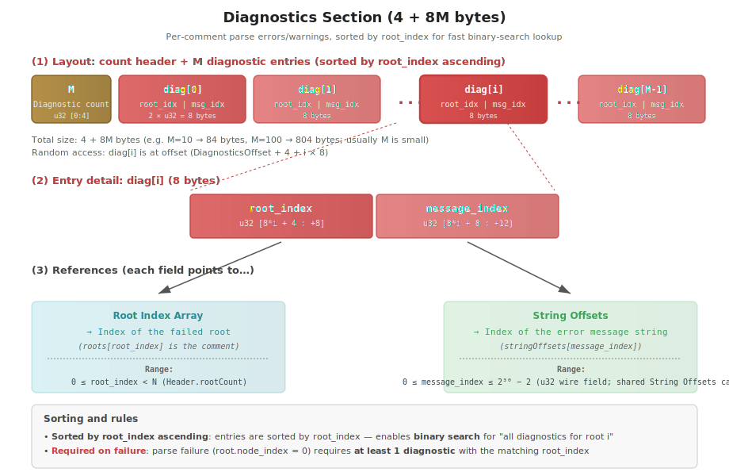

### Design overview

In batch processing (N comments per buffer), parse errors/warnings emitted per comment are **gathered into a single concentration section**. Each entry is linked to its corresponding root by the `root_index` field.

Key design goals:

- **Preserve batch advantages**: avoid object construction across the NAPI boundary (V8 overhead) by transferring Diagnostics as part of the Binary AST
- **Faster lookup**: with `root_index` ascending sort, "the diagnostic list for a specific root" can be retrieved by binary search
- **Express parse failure**: failure at the root level is expressed by the convention "`root.node_index = 0` (sentinel) + a diagnostic with the corresponding root_index is required"

### Layout

| Offset (relative) | Type | Field                                              |
| ----------------- | ---- | -------------------------------------------------- |
| 0-3               | u32  | Diagnostic count M                                 |
| 8\*i + 4          | u32  | diagnostic[i].root_index (root_index ascending)    |
| 8\*i + 8          | u32  | diagnostic[i].message_index (String Offsets index) |

Basic metadata:

- Total section size: **4 + 8M bytes** (count + M entries)
- The array start offset is given by the Header's **Diagnostics section start offset** (bytes 20-23)
- Each entry is **fixed at 8 bytes** (2 × u32)
- When M=0 (no errors), it is **just 4 bytes** (a u32 indicating M=0)

### Field details

#### Diagnostic count M (u32) — first 4 bytes

The total number of Diagnostic entries in the section.

- When `M = 0`: no parse errors/warnings (the section ends in 4 bytes)
- When `M > 0`: M entries of 8 bytes each follow
- Upper bound: u32 max (~4G, practically unreachable)

#### `root_index` (u32) — first 4 bytes of each entry

The **index within the Root Index Array** that identifies which root this diagnostic is associated with.

- Range: `0 ≤ root_index < N` (N indicated by Header.rootCount)
- **Ascending sort convention**: entries are ordered overall by `root_index` ascending (multiple diagnostics for the same root are contiguous)
- A single root can have **multiple diagnostics** (multi-error case)
- The decoder side can use binary search to fetch the diagnostic range for a specific root

#### `message_index` (u32) — second 4 bytes of each entry

A **String Offsets section index** pointing to the error/warning message string.

- Range: `0 ≤ message_index ≤ 65,535` (consistent with the Extended Data string index limit)
- The message body is obtained as `String Data[stringOffsets[message_index].start..end]`
- Error messages do not usually exist within sourceText (the encoder generates them anew), so they are **appended to the unique strings region of String Data**

### Concrete example (M=2, total 20 bytes)

Input:

```typescript
parseBatch([
  { sourceText: '/** @param x */', baseOffset: 100 }, // items[0], OK
  { sourceText: '/** @param */', baseOffset: 200 }, // items[1], missing name NG
  { sourceText: '/* not jsdoc */', baseOffset: 300 } // items[2], parse failure NG
])
```

Contents of the Diagnostics section (LE u32 representation, size 4 + 16 = 20 bytes):

| Offset | u32 value    | Meaning                                           |
| ------ | ------------ | ------------------------------------------------- |
| 0-3    | `0x00000002` | M = 2 (Diagnostic count)                          |
| 4-7    | `0x00000001` | diag[0].root_index = 1 (linked to items[1])       |
| 8-11   | `0x00000017` | diag[0].message_index = 23 (String Offsets index) |
| 12-15  | `0x00000002` | diag[1].root_index = 2 (linked to items[2])       |
| 16-19  | `0x00000018` | diag[1].message_index = 24 (String Offsets index) |

Decoded:

```typescript
result.asts[0] // RemoteJsdocBlock (items[0] OK)
result.asts[1] // RemoteJsdocBlock (items[1] missing name but parsed)
result.asts[2] // null (items[2] parse failed → root.node_index = 0)

result.diagnostics[0] // { rootIndex: 1, message: "missing parameter name after @param" }
result.diagnostics[1] // { rootIndex: 2, message: "expected JSDoc /** start" }
```

### Behavior on parse failure

Per-root parse failure is expressed by **`root.node_index = 0` (sentinel)** (see [Root Index Array](#root-index-array-12n-bytes) for details). The following conventions then apply:

| Item                         | Convention                                                                                                         |
| ---------------------------- | ------------------------------------------------------------------------------------------------------------------ |
| Sentinel root detection      | `roots[i].node_index == 0`                                                                                         |
| Diagnostic required          | **On failure, at least one diagnostic with `root_index = i` must exist**                                           |
| Failure position             | Not included in Diagnostics. The JS side reconstructs it from the input `BatchItem.baseOffset + sourceText.length` |
| Minimum diagnostic condition | The parser must always attach at least a "parse failed"-equivalent message                                         |

This enables reliable error handling on the JS API side:

```typescript
// Detect parse failure
if (result.asts[i] === null) {
  const errors = result.diagnostics.filter(d => d.rootIndex === i)
  console.assert(errors.length >= 1) // At least one always exists (convention)
  console.log(errors[0].message) // Failure reason
}
```

### root_index ascending sort and binary search

#### Why ascending sort

To enable fast retrieval of the diagnostic list linked to a specific root. The decoder uses binary search to identify the range in **O(log M)** and then reads diagnostics linearly:

```rust
fn get_diagnostics_for_root(diagnostics: &[Diagnostic], root_idx: u32) -> &[Diagnostic] {
    // Binary search for the first entry with root_idx or greater (lower bound)
    let start = diagnostics.partition_point(|d| d.root_index < root_idx);
    // Binary search for the last entry with root_idx or less (upper bound)
    let end = diagnostics.partition_point(|d| d.root_index <= root_idx);
    &diagnostics[start..end]
}
// Complexity: O(log M); the return value is a contiguous slice
```

A linear scan is O(M), so this wins when M is large (e.g., 50 errors out of 100 comments). It is effective in scenarios like ESLint's **"display only errors for a specific AST node"**.

#### Lookup example

```text
diagnostics array (root_index ascending):
  [
    { root_index: 0, msg: ... },  // index 0
    { root_index: 0, msg: ... },  // index 1
    { root_index: 1, msg: ... },  // index 2
    { root_index: 3, msg: ... },  // index 3
    { root_index: 3, msg: ... },  // index 4
    { root_index: 5, msg: ... },  // index 5
  ]

get_diagnostics_for_root(diagnostics, 3)
  → start = 3, end = 5
  → returns [diag[3], diag[4]]  (2 entries for root 3)

get_diagnostics_for_root(diagnostics, 2)
  → start = 3, end = 3 (no entries for root 2)
  → returns []  (empty slice)
```

### Lazy decoder implementation sketch

```javascript
class RemoteSourceFile {
  #diagnosticsOffset // Header bytes 20-23
  #diagnosticCount // Read from the u32 at the section head (lazy initialization)
  #diagnosticCache = null // Lazy array of all diagnostics

  get diagnosticCount() {
    if (this.#diagnosticCount === undefined) {
      this.#diagnosticCount = this.view.getUint32(this.#diagnosticsOffset, true)
    }
    return this.#diagnosticCount
  }

  // Get all diagnostics
  getAllDiagnostics() {
    if (this.#diagnosticCache) return this.#diagnosticCache

    const M = this.diagnosticCount
    const result = new Array(M)
    for (let i = 0; i < M; i++) {
      const ofs = this.#diagnosticsOffset + 4 + i * 8
      const rootIdx = this.view.getUint32(ofs, true)
      const msgIdx = this.view.getUint32(ofs + 4, true)
      result[i] = {
        rootIndex: rootIdx,
        message: this.getString(msgIdx)
      }
    }
    this.#diagnosticCache = result
    return result
  }

  // Get only diagnostics for a specific root (binary search, O(log M))
  getDiagnosticsForRoot(rootIndex) {
    const all = this.getAllDiagnostics()
    const start = lowerBound(all, d => d.rootIndex < rootIndex)
    const end = lowerBound(all, d => d.rootIndex <= rootIndex)
    return all.slice(start, end)
  }
}
```

### Minimum-fields policy of the Diagnostic structure

The path to the **8-byte fixed** structure of `Diagnostic { root_index, message_index }`. Initially we considered fields like `severity`, `source_range`, and `code` based on tsgo and TypeScript Diagnostics, but investigation showed they are **unnecessary**.

#### eslint-plugin-jsdoc investigation results

A full source survey of `refers/eslint-plugin-jsdoc/` revealed the following (see [batch-processing.md](./batch-processing.md#point-1-where-to-store-the-diagnostic-array) for details):

| Considered field       | Necessary    | Reason                                                                        |
| ---------------------- | ------------ | ----------------------------------------------------------------------------- |
| `message` (string)     | **Required** | Used in `validTypes.js:253-258` (1 site only)                                 |
| `code` (string)        | Not needed   | Comes from comment-parser, never used by eslint-plugin-jsdoc                  |
| `line` (u32)           | Not needed   | Same as above                                                                 |
| `critical` (bool)      | Not needed   | Same as above                                                                 |
| `severity` (enum)      | Not needed   | **Decided by ESLint rule configuration** (cannot be determined by the parser) |
| `source_range` (Span)  | Not needed   | **Reconstructable from the AST node span** (`iterateJsdoc.js:1916-1918`)      |
| Per-block `problems[]` | Not needed   | Never read at all                                                             |

→ **`{ root_index, message_index }`** suffices in the Binary AST. Fixed at 8 bytes to minimize transfer cost and layout complexity.

#### Effect of minimization

| Item                        | Reduction                                 |
| --------------------------- | ----------------------------------------- |
| Per Diagnostic              | 8 bytes (vs tens of bytes in tsgo)        |
| 100 entries batch (typical) | ~800 bytes (vs ~ several KB)              |
| Design simplification       | Zero management cost for severity / range |

### Size and performance characteristics

| M (diagnostic count) | Section size | Use case                                  |
| -------------------- | -----------: | ----------------------------------------- |
| 0 (no errors)        |      4 bytes | All roots parse successfully              |
| 1                    |     12 bytes | Single error                              |
| 10                   |     84 bytes | Sporadic minor errors                     |
| 100                  |    804 bytes | Many errors (rare even for large batches) |
| 10,000               |        80 KB | Anomalous case (M exceeding batch size)   |

In practice, M ≤ a few dozen is the norm, and the section size is **negligible** relative to the entire buffer.

### Special handling for M=0 (no Diagnostic)

When all roots parse successfully:

- Section size = 4 bytes (M=0 only)
- The decoder, on seeing M=0, skips reading the entry array
- `getAllDiagnostics()` returns an empty array `[]`
- No extra fields or sentinels needed

### Differences from tsgo

| Item                 | tsgo                                                              | ox-jsdoc                                             |
| -------------------- | ----------------------------------------------------------------- | ---------------------------------------------------- |
| Diagnostics section  | **None** (assumes single SourceFile, errors via separate channel) | **Present** (required for batch support)             |
| Diagnostic structure | TypeScript's `Diagnostic` interface                               | `{ root_index, message_index }` 8 bytes              |
| Linkage              | Per SourceFile                                                    | Per root (each comment in the batch)                 |
| Sort                 | Unspecified                                                       | **`root_index` ascending** for binary search support |
| severity             | Yes                                                               | No (decided by ESLint)                               |

ox-jsdoc primarily targets **batch processing + ESLint integration**, so Diagnostics are designed to be efficiently transferred as part of the Binary AST. We refer to tsgo's Diagnostic structure but optimize for ESLint use cases.

## Nodes section (24 bytes/node)

The Nodes section stores the bodies of all comment AST / TypeNode AST nodes as a flat array of **fixed 24-byte records**, and is the **data-density core** of the Binary AST.

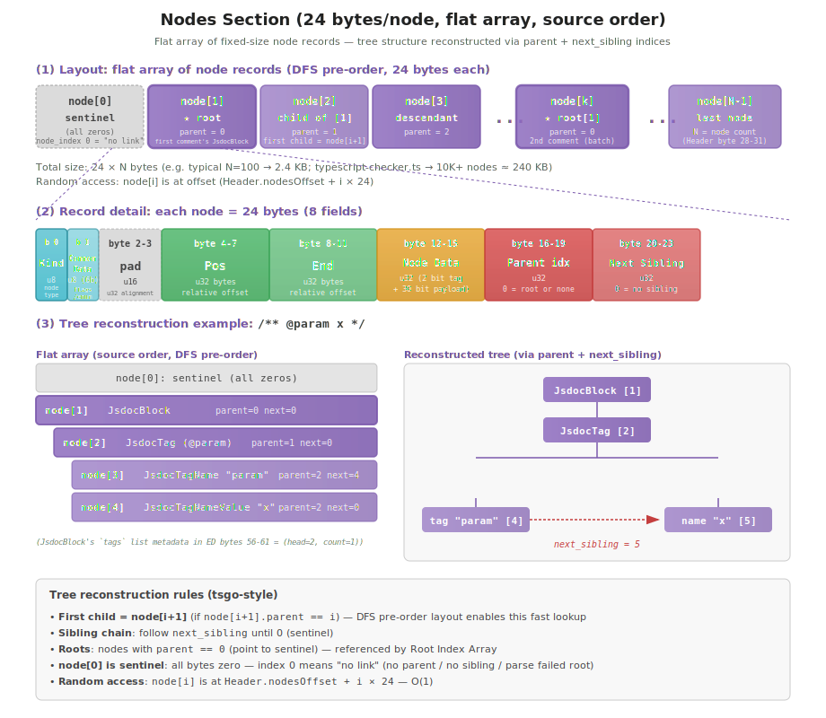

### Design overview

By laying out all nodes in the same fixed 24-byte format, **random access by index** (`buffer[24 * i]`) becomes possible. Tree structure is reconstructed via in-array links (parent / next_sibling).

Key design goals:

- **Maximize lazy decoder efficiency**: nodes can be accessed by index like a Vec, so "wrap only specific nodes as JS proxies" and "visit child nodes only when needed" come at zero cost
- **Data locality**: all nodes are placed contiguously, so cache misses during traversal are minimized
- **Encoder simplicity**: the writer only appends (writes 24 bytes, increments index by 1)
- **Tree shape decided in advance**: like tsgo, structure is resolved by index, so the encoder does not struggle with forward references

### Layout

| Offset | Type | Field                                                               |
| ------ | ---- | ------------------------------------------------------------------- |
| 0      | u8   | Kind (node kind, max 255 variants)                                  |
| 1      | u8   | Common Data (lower 6 bits used, upper 2 bits reserved)              |
| 2-3    | u16  | (reserved / alignment)                                              |
| 4-7    | u32  | Pos (relative UTF-16 code unit offset within the root's sourceText) |
| 8-11   | u32  | End (relative UTF-16 code unit offset within the root's sourceText) |
| 12-15  | u32  | Node Data (type tag 2-bit + payload 30-bit)                         |
| 16-19  | u32  | Parent index (0 = root or none)                                     |
| 20-23  | u32  | Next sibling index (0 = no sibling)                                 |

Basic metadata:

- Record size: **24 bytes fixed** (same for all node kinds)
- Total section size: **24 × (P+1)** bytes (P = total node count, +1 for the sentinel)
- The array start offset is given by the Header's **Nodes section start offset** (bytes 24-27)
- Nodes are arranged in **DFS pre-order** (the order the encoder emits), so the convention `first_child = node[i+1]` holds

### Field details

#### Kind (u8) — byte 0

A **1-byte enum value** indicating the node kind (see "Node catalog matrix" for details).

- Range: `0 ≤ Kind ≤ 255` (ox-jsdoc currently has 63 variants, plenty of room)
- `Kind == 0` is the **sentinel** (unused, for `node[0]`, see below)
- The decoder switches on this value to decide how to interpret Common Data / Node Data

#### Common Data (u8) — byte 1

Stores small fixed data per node kind (booleans / small enums) in the lower 6 bits (see "Common Data (6-bit) usage" for details).

- bits[5:0]: usage differs per Kind (e.g., `JsdocTag` uses bit0 = optional)
- bits[7:6]: reserved (zero-fill)
- The upper 2 bits are unused, leaving room for future expansion

#### padding (u16) — bytes 2-3

Alignment region to align `Pos` to a **u32 boundary (byte 4)**. Always zero. To minimize change cost, future use is treated as a **backward-incompatible change**.

#### Pos / End (u32 × 2) — bytes 4-11

The range a node occupies in the source, expressed as **"relative UTF-16 code unit offsets from the start of the root's sourceText"** (same policy as tsgo / oxc raw transfer).

- Range: `0 ≤ pos ≤ end ≤ root.sourceText.length` (UTF-16 code units)
- The **absolute position** is computed by the JS decoder as `roots[r].base_offset + pos` (adding the root array's `base_offset`)
- For ASCII-only sourceText, UTF-8 byte offsets and UTF-16 code unit offsets coincide, so the encoder can apply a **`containsNonASCII` flag** to skip conversion
- The unit usable directly with ESLint / TypeScript LSP (`Node.range` / `Range.start` compatible)

#### Node Data (u32) — bytes 12-15

The payload body. Type tag 2-bit + payload 30-bit (see "Node Data bit packing (32 bit)" for details).

| Type Tag            | Meaning                   | Payload interpretation                                                                    |
| ------------------- | ------------------------- | ----------------------------------------------------------------------------------------- |
| `0b00` Children     | Child node bitmask        | bit n = has the n-th child in visitor order                                               |
| `0b01` String       | String Offsets index      | 30-bit index → String Offsets table (long-string fallback for string-leaf nodes)          |
| `0b10` Extended     | Extended Data offset      | 30-bit byte offset → Extended Data section                                                |
| `0b11` StringInline | Inline `(offset, length)` | Packed `(offset:u22, length:u8)` → direct slice into String Data (short-string fast path) |

#### Parent index (u32) — bytes 16-19

The index (in the Nodes array) of the parent node that has this node as a child. Required to **judge whether `node[i+1]` is your child** (same policy as the tsgo lazy decoder).

- Range: `0 ≤ parent < P+1` (`0` = root node or sentinel itself)
- Root nodes have `parent = 0` (pointing to the sentinel = "no parent")
- The decoder can verify "child nodes follow contiguously" by checking `node[i+1].parent == i`

#### Next sibling index (u32) — bytes 20-23

The index of the next sibling node having the same parent.

- Range: `0 ≤ next_sibling < P+1` (`0` = no sibling, last child)
- To find the first child: `parent.first_child = parent_index + 1`; subsequent siblings are followed via `current.next_sibling`
- The next_sibling chain handles variable-length child lists; the parent's
  Extended Data block stores `(head_index, count)` per list so the decoder
  knows where each list starts and how many siblings to consume

### Tree reconstruction algorithm

Tree DFS pre-order can be reconstructed from the two links `parent` + `next_sibling`.

```rust
// Get the first child of parent node i
fn first_child(nodes: &[NodeRecord], i: u32) -> Option<u32> {
    let candidate = i + 1;
    if (candidate as usize) < nodes.len() && nodes[candidate as usize].parent == i {
        Some(candidate)
    } else {
        None  // No children
    }
}

// Walk the child chain (visitor pattern)
fn visit_children(nodes: &[NodeRecord], parent: u32, mut f: impl FnMut(u32)) {
    let mut child = first_child(nodes, parent);
    while let Some(c) = child {
        f(c);
        let next = nodes[c as usize].next_sibling;
        child = if next == 0 { None } else { Some(next) };
    }
}
```

Concrete example (`/** @param x */`):

```text
node[0]: sentinel (Kind=0, all zeros)
node[1]: JsdocBlock     (parent=0, next_sibling=0) ← root
node[2]: JsdocTag       (parent=1, next_sibling=0)
node[3]: JsdocTagName   (parent=2, next_sibling=4) ← "@param"
node[4]: JsdocTagValue  (parent=2, next_sibling=0)
node[5]: JsdocParameterName (parent=4, next_sibling=0) ← "x"

node[1].first_child = node[2]  (node[2].parent == 1 ✓)
node[2].first_child = node[3]  (node[3].parent == 2 ✓)
node[3].next_sibling = 4       (node[4] is also a child of parent 2)
node[4].first_child = node[5]  (node[5].parent == 4 ✓)
```

### Treatment of node[0] sentinel

`node[0]` is placed as a **dummy record of all zeros** (Kind = 0, parent = 0, next_sibling = 0, Pos/End = 0, Node Data = 0).

- Role: uses `parent == 0` or `next_sibling == 0` to mean **"no link"** (compresses `Option<u32>` into u32 + 0 sentinel)
- Root: root nodes always start at `node[1]` (always at index 1 or higher)
- The Root Index Array's `node_index = 0` likewise serves as the **"parse failure sentinel"**

### Pos / End units and conversion to absolute positions

#### Why UTF-16

JavaScript's string APIs (`String.length`, `slice`, `Range.start`) are all based on UTF-16 code units, so we make ESLint / LSP integration **conversion-free**.

#### Conversion to absolute position (JS decoder)

```typescript
// Convert relative → absolute (using base_offset from the root array)
function getAbsoluteRange(rootIdx: number, node: NodeRecord) {
  const baseOffset = roots[rootIdx].baseOffset
  return {
    start: baseOffset + node.pos,
    end: baseOffset + node.end
  }
}
```

#### ASCII-only optimization

When sourceText is ASCII-only, UTF-8 byte offsets equal UTF-16 code unit offsets, so the encoder can skip building the conversion map by **not setting the `containsNonASCII` flag** (in practice most JSDoc comments are ASCII).

### Lazy decoder implementation sketch

```javascript
class RemoteJsdocBlock {
  #nodes // Uint8Array view (the entire Nodes section)
  #nodeIndex // The own node index

  get kind() {
    return this.#nodes[24 * this.#nodeIndex] // byte 0
  }

  get pos() {
    return this.view.getUint32(24 * this.#nodeIndex + 4, true)
  }

  get end() {
    return this.view.getUint32(24 * this.#nodeIndex + 8, true)
  }

  // Lazily build child nodes when needed
  *children() {
    const candidate = this.#nodeIndex + 1
    if (this.view.getUint32(24 * candidate + 16, true) !== this.#nodeIndex) {
      return // No children
    }
    let child = candidate
    while (child !== 0) {
      yield wrapNode(child) // Build proxy
      child = this.view.getUint32(24 * child + 20, true) // next_sibling
    }
  }
}
```

The decoder builds a proxy **only for nodes accessed**, so even huge batches incur zero cost for object construction of unvisited nodes.

### Size and performance characteristics

|                Node count P | Section size | Use case                                |
| --------------------------: | -----------: | --------------------------------------- |
|        5 (1 comment, small) |    144 bytes | Around `/** @param x */`                |
|      30 (1 comment, medium) |    744 bytes | Includes a few typedefs                 |
|      200 (1 comment, large) |       4.8 KB | Includes complex type definitions       |
|   5,000 (100-comment batch) |       120 KB | Common large batch                      |
| 50,000 (1000-comment batch) |       1.2 MB | Initial batch on TypeScript LSP startup |

The fixed size of **24 bytes/node** is **25% more compact** than tsgo's Node Layout (32 bytes/node) (thanks to dropping NodeFlags + Kind u8 + reduced alignment).

### Differences from tsgo

| Item               | tsgo                         | ox-jsdoc                                     |
| ------------------ | ---------------------------- | -------------------------------------------- |
| Record size        | 32 bytes                     | **24 bytes**                                 |
| Kind               | u32 (4 bytes)                | **u8 (1 byte)** (63 variants)                |
| Common Data        | None (folded into NodeFlags) | **6-bit dedicated field** (within byte 1)    |
| NodeFlags          | Yes (32-bit)                 | **None** (no semantic analysis required)     |
| Node Data payload  | 24-bit                       | **30-bit** (after splitting out Common Data) |
| Parent index       | u32                          | **u32** (same)                               |
| Next sibling index | u32                          | **u32** (same)                               |
| Pos / End          | u32 (UTF-16 relative)        | **u32 (UTF-16 relative)** (same)             |
| node[0] sentinel   | Yes                          | **Yes** (same)                               |
| Roots              | Single SourceFile            | **N (batch, managed by Root Array)**         |

Since ox-jsdoc is **specialized for JSDoc comments** with no semantic analysis, the record size is trimmed and a layout optimized for batch processing (in concert with the Root Array) is adopted.

## Node Data bit packing (32 bit)

The 32-bit bit packing for the **type tag + payload** stored at bytes 12-15 (4 bytes) of the node record. It uniformly represents reference paths to different per-node-kind data (child nodes / strings / Extended Data) within just 4 bytes.


### Design overview

We adopt tsgo's **2-bit type-tag scheme**, but separate Common Data into byte 1, so Node Data itself becomes a simple structure of just **type tag (2-bit) + payload (30-bit)**.

Key design goals:

- **Minimal dispatch cost**: place the type tag in the high bits so it can be checked immediately with `(node_data >> 30) & 0b11` (jump to one of 4 branch destinations)
- **Secure 30-bit payload**: by moving Common Data to a separate field, the payload expands from 24-bit (tsgo) → 30-bit. Can express up to **1G** entries / offsets
- **Capacity for batch support**: avoids cases where the Extended Data section exceeds 16 MB (24-bit limit) when a single buffer holds a large number of comments in oxlint scenarios
- **Uniform interpretation**: with a single-step lookup of type tag → payload interpretation, processing can be branched on Node Data alone without consulting the node kind (Kind)

### Layout

```text
[31:30]  Type tag (2 bit) — 0b00=Children / 0b01=String / 0b10=Extended / 0b11=StringInline
[29:0]   Payload (30 bit, meaning depends on type tag)
```

Extraction masks:

```rust
const TYPE_TAG_SHIFT: u32 = 30;
const PAYLOAD_MASK: u32   = 0x3FFF_FFFF;  // Lower 30 bits

let type_tag = (node_data >> TYPE_TAG_SHIFT) & 0b11;
let payload  = node_data & PAYLOAD_MASK;
```

### Meaning per type tag

#### Children type (0b00) — payload = child property bitmask

The payload is the **child property bitmask** in visitor order (bit=1: present). With 30 bits it can express up to 30 child properties.

- Child nodes are placed **contiguously** in the Nodes array (DFS pre-order)
- The decoder starts at `node[i+1]` and follows `next_sibling` links for each visitor slot whose bit is 1
- Applies to: `TypeFunction`, `TypeUnion`, `TypeIntersection`, `TypeApplication`, `TypeTuple`, `TypeArray`, `TypeKey`, `TypeOf`, `TypePredicate`, `TypeAsserts`, etc. (see "Node catalog matrix")

Example: child properties of `TypeFunction`:

- bit0 = parameters, bit1 = return_type, bit2 = type_parameters
- mask `0b111` → all 3 present
- Common Data (byte 1) stores the 3 booleans `constructor`, `arrow`, `parenthesis`

Note: nodes that have Extended Data such as `JsdocBlock` / `JsdocTag` use **Extended type** (0b10) instead of Children type, so the Children bitmask is placed at **byte 0 of Extended Data** (see the previous "JsdocTag Children bitmask" / "JsdocBlock Children bitmask" subsections).

#### String type (0b01) — payload = String Offsets index (long-string fallback)

The payload is a **30-bit index** into the String Offsets section. Used **only** for the long-string fallback path of string-leaf nodes (when `value.len() ≥ 256` or its String Data offset exceeds 4 MB-1) and for the diagnostics `message_index`.

- Range: `0 ≤ index < 2^30` (about 1 billion entries)
- The string body is obtained as `String Data[stringOffsets[index].start..end]` (zero-copy slice via the offsets table — 2-hop)
- Leaf-node-only (no child nodes)
- Applies to: same kinds as `StringInline` (JsdocText, JsdocTagName, TypeName, TypeNumber, TypeStringValue, …) — encoder picks `String` only when the value does not fit the inline path

Example: long description (~512 byte) emitted as `JsdocDescriptionLine` → `node_data = 0x4000_0017` (type tag 0b01 + index 23)

#### Extended type (0b10) — payload = Extended Data byte offset

The payload is a **30-bit byte offset** (8-byte aligned) into the Extended Data section.

- Range: `0 ≤ offset < 2^30` (about 1 GB) — due to 8-byte alignment, the effective limit is 1 GB ÷ 8 = 128 M records
- The decoder reads `Extended Data[offset..]` and interprets it as the struct corresponding to the node kind (Kind)
- Applies to: `JsdocBlock`, `JsdocTag`, `JsdocInlineTag`, `JsdocParameterName`, in compat mode also `JsdocDescriptionLine` / `JsdocTypeLine`, plus the TypeNode mixed kinds (`TypeKeyValue`, `TypeIndexSignature`, `TypeMappedType`, `TypeMethodSignature`, `TypeTemplateLiteral`, `TypeSymbol`) **and the variable-list TypeNode parents (`TypeUnion`, `TypeIntersection`, `TypeGeneric`, `TypeObject`, `TypeTuple`, `TypeTypeParameter`, `TypeParameterList`)** whose ED block holds the inline `(head_index, count)` list metadata at byte 0

Example: Node Data of `JsdocBlock` → `node_data = 0x8000_0040` (type tag 0b10 + offset 64)

#### StringInline (0b11) — payload = packed `(offset:u22, length:u8)` (short-string fast path)

The payload is a **packed pair `(offset, length)`** that points directly into the String Data section, **bypassing the String Offsets table entirely** (1-hop instead of 2). Used for the dominant short-string case in string-leaf nodes (~99 % of `typescript-checker.ts` — see `tasks/benchmark/results/2026-04-23-…`).

```text
[29:8]  offset  (22-bit, 0 .. 4_194_303 = 4 MB-1)
[7:0]   length  (8-bit,  0 .. 255 byte)
```

- The string body is obtained as `String Data[offset..offset+length]` directly (1 memory reference)
- **Always non-None** — the encoder only emits `StringInline` for present, in-range values; absent strings stay on the `Extended` (`StringField::NONE`) path or the `String` path with the `0x3FFF_FFFF` sentinel
- Encoder selection rule:
  ```text
  if value.len() ≤ 255 && data_buffer_offset(value) ≤ 4_194_303:
      → emit TypeTag::StringInline + pack_string_inline(offset, length as u8)
  else:
      → emit TypeTag::String + StringIndex (legacy fallback)
  ```
- Applies to the **same** Kinds as `String` (encoder picks one of the two per emit based on size); see `crates/ox_jsdoc_binary/src/format/node_record.rs::pack_string_inline` / `unpack_string_inline`

Example: `TypeName "Foo"` (length 3, offset 24 in String Data) → `node_data = 0xC000_1803` (type tag 0b11 + offset 24 ≪ 8 + length 3)

### Reference targets per type tag

|      Type tag       | Payload                   | Reference target                                           | Range (decoder)                         |
| :-----------------: | ------------------------- | ---------------------------------------------------------- | --------------------------------------- |
|   `0b00` Children   | bitmask 30-bit            | Nodes array (contiguous children + next_sibling)           | bit n = the n-th child in visitor order |
|    `0b01` String    | index 30-bit              | String Offsets → String Data (long-string fallback, 2-hop) | 1 string                                |
|   `0b10` Extended   | offset 30-bit             | Extended Data                                              | 1 struct (size determined by node kind) |
| `0b11` StringInline | `(offset:u22, length:u8)` | String Data direct slice (short-string fast path, 1-hop)   | 1 string, length ≤ 255, offset ≤ 4 MB-1 |

### Per-node-kind type tag determination rules

The encoder determines the Node Data type tag from the node kind by the following rules:

| Node kind structure                                              | Type tag(s)                                               | Examples                                                                               |
| ---------------------------------------------------------------- | :-------------------------------------------------------- | -------------------------------------------------------------------------------------- |
| Single string only (literal / identifier)                        | `0b11` StringInline (≤ 255 byte) / `0b01` String (longer) | `JsdocText`, `JsdocTagName`, `TypeName`, `TypeNumber` — encoder picks per-emit by size |
| Children only (compositional, fixed-arity)                       | `0b00` Children                                           | `TypeFunction`, `TypeApplication`                                                      |
| Mixed string + children / variable list / Extended Data required | `0b10` Extended                                           | `JsdocBlock`, `JsdocTag`, `TypeKeyValue`, `TypeUnion`, `TypeObject`                    |

See "Node catalog matrix" for detailed per-node-kind assignments.

### Lazy decoder implementation sketch

```javascript
function decodeNode(view, nodeIndex) {
  const nd = view.getUint32(24 * nodeIndex + 12, true)
  const typeTag = (nd >>> 30) & 0b11
  const payload = nd & 0x3fff_ffff

  switch (typeTag) {
    case 0b00: // Children
      return new ChildrenIterator(view, nodeIndex, payload)
    case 0b01: // String — long-string fallback via Offsets table
      return getString(payload) // String Offsets[payload] → String Data slice
    case 0b10: // Extended
      return new ExtendedView(view, payload) // Struct from Extended Data[payload]
    case 0b11: // StringInline — short-string fast path, direct slice
      const offset = payload >>> 8 // upper 22 bits
      const length = payload & 0xff // lower 8 bits
      return getStringByOffsetAndLength(offset, length)
  }
}
```

In implementation, the decoder pays the dispatch cost **only for nodes accessed** (lazy).

### Size and performance characteristics

| Item                             | Value                   | Notes                                                                  |
| -------------------------------- | ----------------------- | ---------------------------------------------------------------------- |
| Node Data field size             | Fixed 4 bytes (u32)     | Node record bytes 12-15                                                |
| Type tag                         | 2 bit                   | All 4 states are now in use                                            |
| Payload                          | 30 bit                  | Up to 1G entries / 1GB-equivalent offsets / 4 MB × 255 byte for inline |
| Dispatch cost                    | shift + mask + branch   | Branch-predictor friendly                                              |
| Retrieval cost (`String` type)   | 1 + 2 memory references | NodeData → Offset → Data                                               |
| Retrieval cost (`StringInline`)  | 1 + 1 memory reference  | NodeData → Data (Offsets-table hop eliminated)                         |
| Retrieval cost (`Extended` type) | 1 + 1 memory reference  | NodeData → Extended Data                                               |

### Differences from tsgo

| Item                 | tsgo                        | ox-jsdoc                                                                                             |
| -------------------- | --------------------------- | ---------------------------------------------------------------------------------------------------- |
| Type tag location    | Upper 2 bits                | **Same** (compatible)                                                                                |
| Type tag values      | 0b00 / 0b01 / 0b10 / 0b11   | **Same encoding, different meaning for 0b11** (StringInline vs Reserved)                             |
| Common Data location | Inside Node Data (low bits) | **Separated to byte 1**                                                                              |
| Payload bit count    | 24-bit (with Common in)     | **30-bit** (freed by separating Common)                                                              |
| Limits               | ~16M entries / 16MB offset  | **~1G / 1GB** for `String`/`Extended`; 4 MB × 255 byte for `StringInline`                            |
| Use of 0b11          | Reserved (decoder error)    | **`StringInline`** — short string-leaf payload `(offset:u22, length:u8)` packed inline (Path B-leaf) |

By the policy shift of **separating Common Data + expanding payload**, ox-jsdoc raises the batch-processing capacity ceiling 64x (16 MB → 1 GB). The unused `0b11` slot was later reclaimed for `StringInline` (Path B-leaf), eliminating the String Offsets table hop on the dominant short-string-leaf path.

## Common Data (6-bit) usage

The lower 6 bits of byte 1 in the node record store **small fixed data** (boolean flags, small enums) assigned per node kind. Completely independent of the Node Data payload, the decoder dispatches directly from the node kind (byte 0) and reads it.

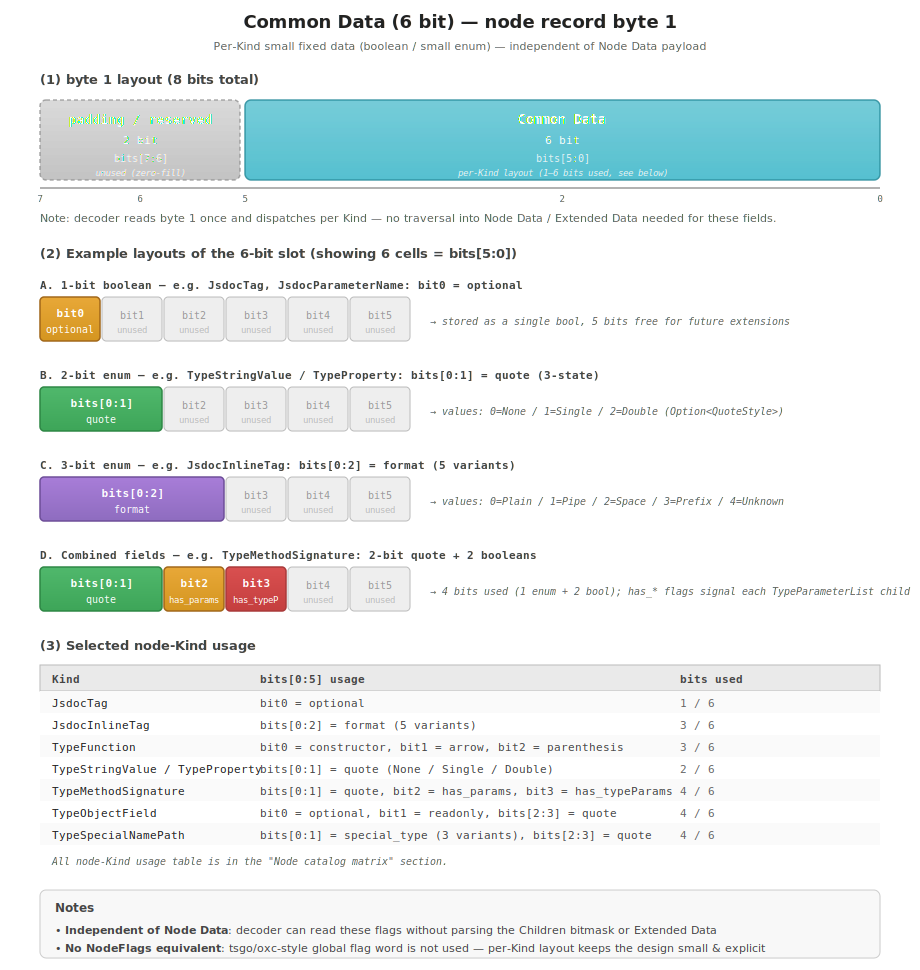

### Design overview

The **small per-node-kind fixed data** attached to each node (structures: enum values, booleans) is separated into a **dedicated field (byte 1)** rather than packed into Node Data or Extended Data.

Key design goals:

- **Simplified decoder path**: many flags can be obtained by reading byte 0 (Kind) → byte 1 (Common Data) linearly, with no branch into Node Data or Extended Data
- **Maximize Node Data payload**: by moving flag bits out of Node Data, the payload expands to **30-bit** (1G entries)
- **Separation of concerns**: Common Data = "fixed data whose meaning is determined by node kind"; Node Data = "payload that varies per node kind"; Extended Data = "auxiliary information with variable structure" — clear role separation
- **A by-product of fixing the node record at 24 bytes**: the 2-byte "Kind + meta" slot (bytes 0/1) is natural in terms of alignment and is usable at no extra cost

### Layout

Composition within byte 1 (8 bits):

| Bits      | Usage                                      |
| --------- | ------------------------------------------ |
| bits[7:6] | Reserved (zero-fill, for future extension) |
| bits[5:0] | Common Data (usage differs per node kind)  |

- Multiple fields are bit-packed within 6 bits (= 64 states)
- Since the upper 2 bits are reserved, there is room to extend to 7-8 bits in the future
- For `Kind == 0` (sentinel node), Common Data is also always 0

### Usage patterns of the 6-bit slot

Classified into 4 patterns by node kind (see the node-kind table for details):

| Pattern                                | Bits used | Examples                                                  |
| -------------------------------------- | --------: | --------------------------------------------------------- |
| A. 1-bit boolean                       |         1 | `JsdocTag.optional`, `JsdocParameterName.optional`        |
| B. 2-bit enum (3-4 states)             |         2 | `TypeStringValue.quote` (None/Single/Double)              |
| C. 3-bit enum (5-8 states)             |         3 | `JsdocInlineTag.format` (Plain/Pipe/Space/Prefix/Unknown) |
| D. Compound field (boolean × N + enum) |       3-4 | `TypeMethodSignature` (2-bit quote + 2 booleans)          |

The maximum bits used is **4 / 6** (`TypeMethodSignature`, `TypeObjectField`, `TypeSpecialNamePath`). The remaining 2 bits are reserved for future extension.

### Per-node-kind usage

| Node kind                                           | Usage                                                                                                                                                                                                                                                            |
| --------------------------------------------------- | ---------------------------------------------------------------------------------------------------------------------------------------------------------------------------------------------------------------------------------------------------------------- |
| `JsdocTag`                                          | bit0 = optional                                                                                                                                                                                                                                                  |
| `JsdocInlineTag`                                    | bits[0:2] = format (5 variants: Plain/Pipe/Space/Prefix/Unknown)                                                                                                                                                                                                 |
| `JsdocGenericTagBody`                               | bit0 = has_dash_separator (compresses presence/absence of `Option<JsdocSeparator>`)                                                                                                                                                                              |
| `JsdocParameterName`                                | bit0 = optional                                                                                                                                                                                                                                                  |
| `TypeNullable` / `TypeNotNullable` / `TypeOptional` | bit0 = position (Prefix/Suffix)                                                                                                                                                                                                                                  |
| `TypeVariadic`                                      | bit0 = position, bit1 = square_brackets                                                                                                                                                                                                                          |
| `TypeGeneric`                                       | bit0 = brackets (Angle/Square), bit1 = dot                                                                                                                                                                                                                       |
| `TypeFunction`                                      | bit0 = constructor, bit1 = arrow, bit2 = parenthesis                                                                                                                                                                                                             |
| `TypeObject`                                        | bits[0:2] = separator (5 variants + None)                                                                                                                                                                                                                        |
| `TypeStringValue` / `TypeProperty`                  | bits[0:1] = quote (3-state: 0=None / 1=Single / 2=Double). Note: `TypeStringValue.quote` is `QuoteStyle` (Required), so the encoder always writes 1 or 2 (the `0=None` state is unused). `TypeProperty.quote` is `Option<QuoteStyle>`, so all 3 states are valid |
| `TypeMethodSignature`                               | bits[0:1] = quote (3-state: 0=None / 1=Single / 2=Double), bit2 = has_parameters (a TypeParameterList child is emitted when set), bit3 = has_type_parameters (ditto)                                                                                             |
| `TypeNamePath`                                      | bits[0:1] = path_type (4 variants)                                                                                                                                                                                                                               |
| `TypeSpecialNamePath`                               | bits[0:1] = special_type (3 variants) + bits[2:3] = quote (3-state)                                                                                                                                                                                              |
| `TypeObjectField`                                   | bit0 = optional, bit1 = readonly, bits[2:3] = quote (3-state)                                                                                                                                                                                                    |
| `TypeKeyValue`                                      | bit0 = optional, bit1 = variadic                                                                                                                                                                                                                                 |
| `TypeSymbol`                                        | bit0 = has_element (Some/None for Option<TypeNode>)                                                                                                                                                                                                              |

For node kinds other than these (`JsdocBlock`, `JsdocText`, `TypeName`, etc.), Common Data is unused (always 0).

### Read/write implementation sketch

#### Encoder (Rust)

```rust
// Example writing a JsdocTag
fn write_jsdoc_tag(buf: &mut Vec<u8>, tag: &JsdocTag) {
    buf.push(Kind::JsdocTag as u8);  // byte 0
    let mut common = 0u8;
    if tag.optional {
        common |= 0b0000_0001;  // bit0
    }
    buf.push(common);  // byte 1
    // ... remaining 22 bytes (padding + Pos/End + Node Data + parent + next_sibling)
}

// Example writing a TypeMethodSignature
fn write_type_method_signature(buf: &mut Vec<u8>, n: &TypeMethodSignature) {
    buf.push(Kind::TypeMethodSignature as u8);
    let mut common = 0u8;
    common |= encode_quote(n.quote);                   // bits[0:1]
    if !n.parameters.is_empty()      { common |= 0b0000_0100; }  // bit2
    if !n.type_parameters.is_empty() { common |= 0b0000_1000; }  // bit3
    buf.push(common);
    // ...
}
```

#### Decoder (JS)

```javascript
// Get Common Data from any node
function getCommonData(view, nodeIndex) {
  return view[24 * nodeIndex + 1] & 0b0011_1111 // Mask off the upper 2 bits
}

// Read JsdocTag.optional
function getJsdocTagOptional(view, nodeIndex) {
  return (getCommonData(view, nodeIndex) & 0b0000_0001) !== 0
}

// Read has_parameters of TypeMethodSignature
function getMethodSignatureHasParameters(view, nodeIndex) {
  return (getCommonData(view, nodeIndex) & 0b0000_0100) !== 0
}
```

### Why we do not adopt NodeFlags (tsgo)

tsgo holds a separate **32-bit `NodeFlags`** field on the node record (a group of semantic-analysis flags such as Ambient, HasImplicitReturn, HasExplicitReturn, etc.). ox-jsdoc does not adopt this:

| Aspect           | tsgo                                                                           | ox-jsdoc                                       |
| ---------------- | ------------------------------------------------------------------------------ | ---------------------------------------------- |
| Flag region      | 32-bit `NodeFlags` (common to all nodes)                                       | 6-bit Common Data (usage varies per node kind) |
| Usage            | Intermediate state of semantic analysis (Ambient, NamespaceAugmentation, etc.) | Small syntactic flags (optional, quote, etc.)  |
| Necessity        | Required for the TypeScript checker                                            | Unnecessary for parser-only                    |
| Node record size | 32 bytes                                                                       | **24 bytes** (NodeFlags removed + Kind u8)     |

ox-jsdoc is a **parser-only implementation with no semantic analysis**, so flags equivalent to NodeFlags do not exist. 6 bits of Common Data adequately covers per-node-kind syntactic flags.

### Size and extension headroom

- **Cost**: 1 byte (byte 1) common to all nodes, but this is also alignment padding so there is no extra cost
- **Usage limit**: 6 bits = 64 states, allocated per node kind
- **Future extension**: by freeing the upper 2 bits (bits[7:6]), it can be extended to 8 bits (256 states) (a Major version bump is required)
- **Adding new node kinds**: handled by simply assigning a new Kind value + Common Data usage (Minor version bump suffices)

## Node catalog matrix

All 60 variants + 1 sentinel + 1 reserved-only discriminant (`NodeList`, kept for legacy buffer compatibility but **never emitted by the encoder** — child lists are now expressed via inline `(head_index, count)` metadata in the parent's Extended Data block) = **62 discriminants**, listed by Node Data type / Common Data usage / Extended Data size (for use when implementing the decoder).

For the detailed layout of the Kind number space (0x00 = Sentinel, 0x01-0x0F = comment AST, 0x7F = NodeList (reserved-only, never emitted), 0x80-0xFF = TypeNode), see [ast-nodes.md](./ast-nodes.md#kind-number-space).

### Special nodes (2 discriminants)

| Kind | Node name  | Node Data type                        | Common Data | Extended Data |
| ---- | ---------- | ------------------------------------- | ----------- | ------------- |
| 0x00 | `Sentinel` | (all zeros, no interpretation)        | (unused)    | -             |
| 0x7F | `NodeList` | (reserved boundary slot, not emitted) | (unused)    | -             |

- **`Sentinel` (0x00)**: `node[0]` only. Placed to use `parent_index = 0` / `next_sibling = 0` as the sentinel for "no link" (see "Treatment of node[0] sentinel" in the "Nodes section" for details)
- **`NodeList` (0x7F)**: reserved discriminant on the boundary between the globally reserved range and TypeNode (see [ast-nodes.md](./ast-nodes.md#kind-number-space)). Variable-length child lists are stored inline as `(head_index, count)` metadata in the parent's Extended Data block (see "List metadata in Extended Data" below); no wrapper node is emitted at this Kind.

### List metadata in Extended Data

Variable-length child lists are now stored as direct children of the parent. Each list is described by an inline 6-byte slot in the parent's Extended Data block:

```text
byte 0-3: head_index (u32) — node index of the list's first element (0 if empty)
byte 4-5: count      (u16) — number of elements in the list
```

Decoders read `(head, count)` from the slot and walk `next_sibling` exactly `count` times. Parents with multiple lists (e.g. `JsdocBlock` has 3) lay their slots back-to-back in a per-Kind region of the ED block. The slot offsets for each parent Kind are documented in the per-Kind "byte-level layout" sections (e.g. JsdocBlock byte 50-67, JsdocTag byte 20-37).

### Comment AST (15 kinds)

| Kind | Node name              | Node Data type                | Common Data             | Extended Data (basic / compat) |
| ---- | ---------------------- | ----------------------------- | ----------------------- | ------------------------------ |
| 0x01 | `JsdocBlock`           | Extended                      | (unused)                | 68 / 90 bytes                  |
| 0x02 | `JsdocDescriptionLine` | String / Extended (in compat) | (unused)                | 0 / 24 bytes                   |
| 0x03 | `JsdocTag`             | Extended                      | bit0=optional           | 38 / 80 bytes                  |
| 0x04 | `JsdocTagName`         | String                        | (unused)                | -                              |
| 0x05 | `JsdocTagNameValue`    | String                        | (unused)                | -                              |
| 0x06 | `JsdocTypeSource`      | String                        | (unused)                | -                              |
| 0x07 | `JsdocTypeLine`        | String / Extended (in compat) | (unused)                | 0 / 24 bytes                   |
| 0x08 | `JsdocInlineTag`       | Extended                      | bits[0:2]=format        | 18 bytes                       |
| 0x09 | `JsdocGenericTagBody`  | Extended                      | bit0=has_dash_separator | 8 bytes                        |
| 0x0A | `JsdocBorrowsTagBody`  | Children                      | (unused)                | -                              |
| 0x0B | `JsdocRawTagBody`      | String                        | (unused)                | -                              |
| 0x0C | `JsdocParameterName`   | Extended                      | bit0=optional           | 12 bytes                       |
| 0x0D | `JsdocNamepathSource`  | String                        | (unused)                | -                              |
| 0x0E | `JsdocIdentifier`      | String                        | (unused)                | -                              |
| 0x0F | `JsdocText`            | String                        | (unused)                | -                              |

### TypeNode (45 kinds)

Classified per "TypeNode string/child configuration is split into 3 patterns by variant" (above):

#### Pattern 1: String only (String type 0b01, 5 kinds)

| Kind | Node name             | Common Data                                                         |
| ---- | --------------------- | ------------------------------------------------------------------- |
| 0x80 | `TypeName`            | (unused)                                                            |
| 0x81 | `TypeNumber`          | (unused)                                                            |
| 0x82 | `TypeStringValue`     | bits[0:1] = quote (3-state)                                         |
| -    | `TypeProperty`        | bits[0:1] = quote (3-state)                                         |
| -    | `TypeSpecialNamePath` | bits[0:1] = special_type (3 variants) + bits[2:3] = quote (3-state) |

#### Pattern 2: Children only (Children type 0b00, 22 kinds)

The bitmask is stored in the 30-bit payload of Node Data. Visitor order of children follows the visitor keys.

| Node name                                           | Common Data                                             | Child count                          |
| --------------------------------------------------- | ------------------------------------------------------- | ------------------------------------ |
| `TypeFunction`                                      | bit0=constructor, bit1=arrow, bit2=parenthesis          | 3 (parameters/return/typeParameters) |
| `TypeParenthesis`                                   | (unused)                                                | 1                                    |
| `TypeNullable` / `TypeNotNullable` / `TypeOptional` | bit0=position                                           | 1                                    |
| `TypeVariadic`                                      | bit0=position, bit1=square_brackets                     | 1                                    |
| `TypeConditional`                                   | (unused)                                                | 4                                    |
| `TypeInfer` / `TypeKeyOf` / `TypeTypeOf`            | (unused)                                                | 1                                    |
| `TypeImport`                                        | (unused)                                                | 1 (element)                          |
| `TypePredicate`                                     | (unused)                                                | 2 (left + right)                     |
| `TypeAsserts`                                       | (unused)                                                | 2 (left + right)                     |
| `TypeAssertsPlain`                                  | (unused)                                                | 1 (element)                          |
| `TypeReadonlyArray`                                 | (unused)                                                | 1                                    |
| `TypeNamePath`                                      | bits[0:1] = path_type                                   | 2 (left + right)                     |
| `TypeObjectField`                                   | bit0=optional, bit1=readonly, bits[2:3]=quote (3-state) | 1-2 (key required + right Option)    |
| `TypeJsdocObjectField`                              | (unused)                                                | 2                                    |
| `TypeIndexedAccessIndex`                            | (unused)                                                | 1                                    |
| `TypeCallSignature` / `TypeConstructorSignature`    | (unused)                                                | 3 (parameters/return/typeParameters) |
| `TypeReadonlyProperty`                              | (unused)                                                | 1                                    |

#### Pattern 3: Mixed string + children (Extended type 0b10, 13 kinds)

The 7 kinds in the first half of the table (Union, Intersection, Generic, Object, Tuple, TypeParameter, ParameterList) own an 8-byte ED block that consists of one inline list metadata slot (head_index: u32 + count: u16, padded to 8 bytes). `TypeGeneric.left` is the parent's first direct child (no Children bitmask).

| Node name             | Common Data                                                    | Extended Data                                | Child count                                  |
| --------------------- | -------------------------------------------------------------- | -------------------------------------------- | -------------------------------------------- |
| `TypeUnion`           | (unused)                                                       | 8 bytes (elements list metadata)             | Variable (elements)                          |
| `TypeIntersection`    | (unused)                                                       | 8 bytes (elements list metadata)             | Variable (elements)                          |
| `TypeGeneric`         | bit0=brackets, bit1=dot                                        | 8 bytes (elements list metadata)             | 1 left + Variable (elements)                 |
| `TypeObject`          | bits[0:2] = separator                                          | 8 bytes (elements list metadata)             | Variable (elements)                          |
| `TypeTuple`           | (unused)                                                       | 8 bytes (elements list metadata)             | Variable (elements)                          |
| `TypeTypeParameter`   | (unused)                                                       | 8 bytes (elements list metadata)             | Variable                                     |
| `TypeParameterList`   | (unused)                                                       | 8 bytes (elements list metadata)             | Variable (elements)                          |
| `TypeKeyValue`        | bit0=optional, bit1=variadic                                   | 6 bytes (key StringField)                    | 0 or 1                                       |
| `TypeIndexSignature`  | (unused)                                                       | 6 bytes (key StringField)                    | 1 (right)                                    |
| `TypeMappedType`      | (unused)                                                       | 6 bytes (key StringField)                    | 1 (right)                                    |
| `TypeMethodSignature` | bits[0:1]=quote, bit2=has_parameters, bit3=has_type_parameters | 6 bytes (name StringField)                   | 1-3 (parameters?/return/typeParameters?)     |
| `TypeTemplateLiteral` | (unused)                                                       | 2+6N bytes (literal count + N × StringField) | Variable (interpolations as direct children) |
| `TypeSymbol`          | bit0=has_element                                               | 6 bytes (value StringField)                  | 0 or 1 (element)                             |

#### Others

| Node name                                                | Usage                                                                          |
| -------------------------------------------------------- | ------------------------------------------------------------------------------ |
| `TypeNull` / `TypeUndefined` / `TypeAny` / `TypeUnknown` | Leaf (no Common Data, no Extended Data, Node Data payload also has no meaning) |
| `TypeUniqueSymbol`                                       | Leaf (same as above)                                                           |

Note: Pattern 1 (String type) nodes store the string index directly in the Node Data payload, so they do not use Extended Data. Common Data is also unused for the most part.
