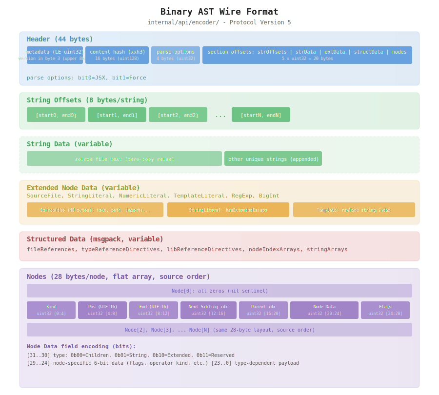
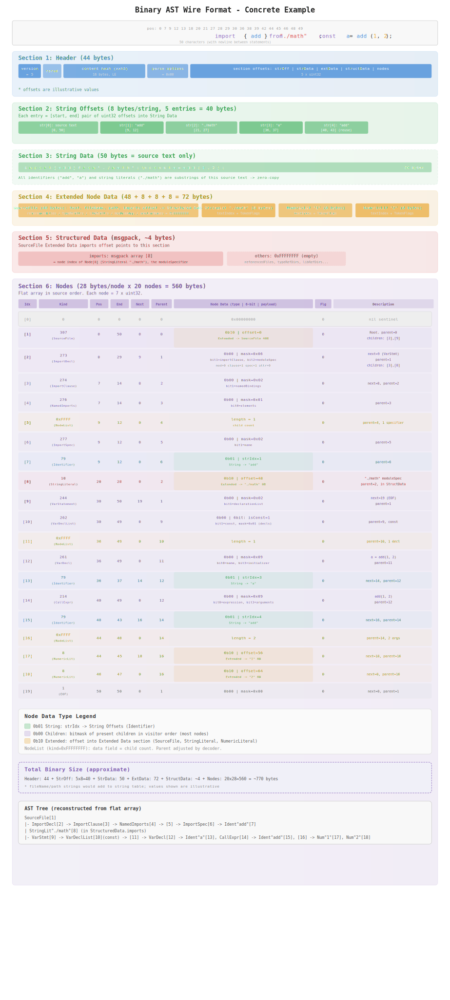
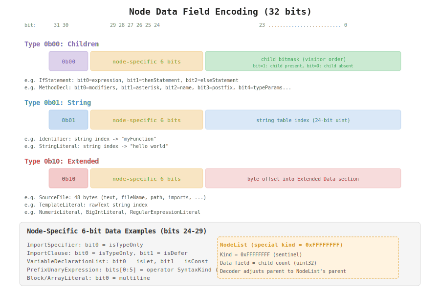
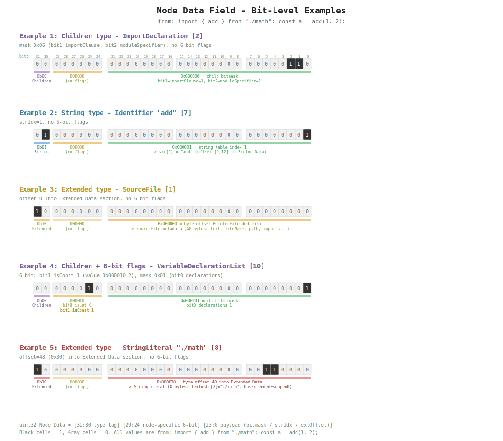
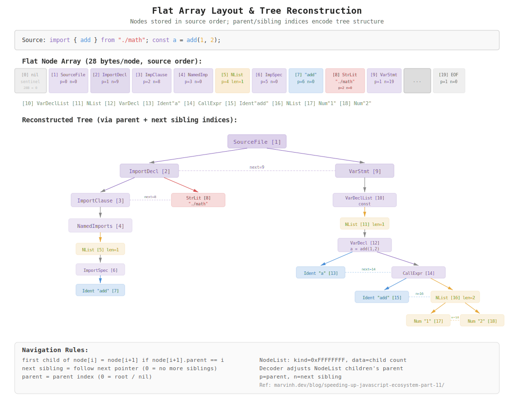
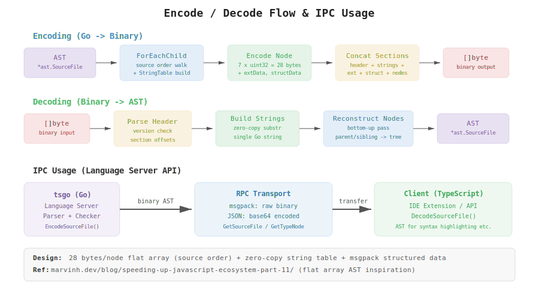

# TSGo Binary AST Investigation Report

Investigation date: 2026-04-12

---

## Overview

TSGo provides a mechanism to serialize the AST in a binary format. It is used for IPC (between Go and the TypeScript client) in the Language Server API, achieving compact and fast AST transfer.

Implementation: `internal/api/encoder/`

---

## 1. Package Structure

| File                                  | Role                                                |
| ------------------------------------- | --------------------------------------------------- |
| `encoder.go` (~734 lines)             | Main encoder + wire format specification (comments) |
| `decoder.go` (~382 lines)             | Decoder implementation                              |
| `encoder_generated.go` (~35KB)        | Auto-generated: encode functions for all node types |
| `decoder_generated.go` (~49KB)        | Auto-generated: decode functions for all node types |
| `stringtable.go` (~69 lines)          | String table (deduplication, zero-copy)             |
| `encoder_test.go` / `decoder_test.go` | Test suite                                          |
| `_scripts/generate-encoder.ts`        | Code generator                                      |

---

## 2. Wire Format Specification (Protocol Version 5)

### Overall Wire Format Structure



The Binary AST consists of 7 sections (including the Header):

```
+------------------+-------------------+----------------------------------+
| Section          | Size              | Description                      |
+------------------+-------------------+----------------------------------+
| Header           | 44 bytes (fixed)  | Hash, parse options, offsets     |
| String Offsets   | 8 bytes/string    | (start, end) pairs into string table |
| String Data      | variable          | UTF-8 string data                |
| Extended Data    | variable          | Additional data for special nodes |
| Structured Data  | variable          | msgpack-encoded metadata         |
| Nodes            | 28 bytes/node     | Flat node array (source order)   |
+------------------+-------------------+----------------------------------+
```

### 2.1 Header (44 bytes)

The "table of contents" and "fingerprint" of the entire binary. The decoder first reads the Header, verifies protocol version compatibility, determines whether a cached AST can be reused via the content hash, and uses the offsets to each section for random access to subsequent data.

| Offset | Type    | Field                                                                                                             |
| ------ | ------- | ----------------------------------------------------------------------------------------------------------------- |
| 0-3    | uint32  | Metadata (LE uint32; the protocol version is the upper 8 bits = `(metadata >> 24) & 0xff`, i.e. stored at byte 3) |
| 4-19   | uint128 | Content hash (xxh3, little-endian)                                                                                |
| 20-23  | uint32  | Parse options (bit0=JSX, bit1=Force)                                                                              |
| 24-27  | uint32  | Offset to String Offsets section                                                                                  |
| 28-31  | uint32  | Offset to String Data section                                                                                     |
| 32-35  | uint32  | Offset to Extended Data section                                                                                   |
| 36-39  | uint32  | Offset to Structured Data section                                                                                 |
| 40-43  | uint32  | Offset to Nodes section                                                                                           |

Note: The documentation comment in `encoder.go` states "Offset 0 = uint8 protocol version", but the implementation writes `metadata := uint32(ProtocolVersion) << 24` in little-endian, and the decoder reads it via `data[HeaderOffsetMetadata+3]` (`encoder.go:479`, `decoder.go:57`). The TS client side (`encoder.ts:373`) likewise writes `PROTOCOL_VERSION << 24`. In practice, the version ends up at byte 3.

### 2.2 String Offsets & String Data

Two subsections that store strings such as identifiers and literal values from the AST. String Offsets is the index of "which string is where", while String Data holds the actual UTF-8 byte sequences.

- **String Offsets**: 8 bytes per string (a uint32 pair of start offset + end offset). The Nth string points to the range from `offsets[N*2]` to `offsets[N*2+1]` within the String Data section.
- **String Data**: Typically the entire source file text is stored at the beginning as-is. A string such as the identifier `"add"` is just referenced as a slice of the corresponding location in the source text (**zero-copy**). Only strings that do not match the source text — such as literals containing escape sequences — are appended after the source text.
- **Decode-time optimization**: The decoder converts the entire String Data into a single Go string, and each string is obtained via a substring operation on it. Because Go strings share the backing array, no per-string allocations occur.

### 2.3 Extended Node Data

A section dedicated to node kinds with additional properties that do not fit into the fixed 28-byte node record. Most nodes can be expressed with just Kind + child node references + 6-bit flags, but nodes such as SourceFile, which holds file paths and import information, or template literals, which need to separately hold `rawText`, store variable-length data here. They are referenced from the Node Data field of the node record (type tag `0b10`) by a byte offset into this section.

Only the following node kinds carry additional data:

| Node Kind                     | Size     | Data Content                                                                |
| ----------------------------- | -------- | --------------------------------------------------------------------------- |
| SourceFile                    | 48 bytes | Metadata such as text, fileName, path, languageVariant, scriptKind, imports |
| StringLiteral                 | 8 bytes  | text string index (uint32) + TokenFlags (uint32)                            |
| NumericLiteral                | 8 bytes  | text string index (uint32) + TokenFlags (uint32)                            |
| BigIntLiteral                 | 8 bytes  | text string index (uint32) + TokenFlags (uint32)                            |
| RegularExpressionLiteral      | 8 bytes  | text string index (uint32) + TokenFlags (uint32)                            |
| TemplateHead/Middle/Tail      | 12 bytes | text string index + rawText string index + TemplateFlags                    |
| NoSubstitutionTemplateLiteral | 12 bytes | text string index + rawText string index + TemplateFlags                    |

Note: StringLiteral/NumericLiteral/BigIntLiteral/RegularExpressionLiteral were originally of String type (0b01), but because TokenFlags do not fit into 6 bits they were moved to Extended type (0b10) (see the hand-written comment at `encoder.go:702-703`). TokenFlags is a collection of multiple bit flags including `hasExtendedEscapeSequence`.

### 2.4 Structured Data (msgpack)

A section that stores variable-length array data among the SourceFile metadata that is hard to express with fixed length. It is encoded in msgpack format and is referenced from offsets within the SourceFile entry of Extended Data. It is used for data whose element count is not known in advance, such as file references and import lists.

- **File reference array**: A tuple form `[pos: uint, end: uint, fileName: string, resolutionMode: uint, preserve: bool]`. Corresponds to directives such as `/// <reference path="..." />`.
- **Node index array**: A list of node indices for import statements and moduleAugmentations. Indices into the Nodes section are stored as uint.
- **String array**: A list of strings such as ambientModuleNames.
- An offset of `0xFFFFFFFF` = no data (a sentinel value representing an empty array).

### 2.5 Nodes (28 bytes/node)

The core section of the Binary AST. The tree structure of the AST is represented not by pointers but by a **flat array**. Nodes are arranged in their order of appearance in the source code, and parent/child and sibling relationships are expressed as index references. Because the size is fixed at 28 bytes/node, any node can be randomly accessed in O(1). The design is inspired by [marvinh.dev/blog/speeding-up-javascript-ecosystem-part-11/](https://marvinh.dev/blog/speeding-up-javascript-ecosystem-part-11/).

Each node consists of seven uint32 fields:

| Offset | Type   | Field        | Description                                                                                     |
| ------ | ------ | ------------ | ----------------------------------------------------------------------------------------------- |
| 0-3    | uint32 | Kind         | SyntaxKind value. Identifies the kind of node.                                                  |
| 4-7    | uint32 | Pos          | Start position (UTF-16 code units)                                                              |
| 8-11   | uint32 | End          | End position (UTF-16 code units)                                                                |
| 12-15  | uint32 | Next Sibling | Index of the next sibling node. 0 = no sibling.                                                 |
| 16-19  | uint32 | Parent       | Index of the parent node. 0 = root or none.                                                     |
| 20-23  | uint32 | Node Data    | Type tag (2 bits) + node-specific data (6 bits) + payload (24 bits). See Section 3 for details. |
| 24-27  | uint32 | Flags        | NodeFlags (HasImplicitReturn, HasExplicitReturn, etc.)                                          |

**Important design points**:

- **nil sentinel**: `Node[0]` is a sentinel with all fields set to 0. Parent=0 or Next=0 means "none", representing the null-pointer equivalent at index 0.
- **NodeList**: Encoded as a special node with `Kind = 0xFFFFFFFF`. The Data field stores the number of child nodes. The decoder reattaches the parent of the NodeList's children to the NodeList's parent to reconstruct the AST.
- **UTF-16 positions**: For compatibility with the TypeScript LSP protocol, positions are in UTF-16 code units. The encoder performs UTF-8 → UTF-16 conversion, and the decoder performs the reverse.
- **Tree reconstruction rule**: The first child of `node[i]` is `node[i+1]` (provided `node[i+1].parent == i`). Subsequent children are followed via Next Sibling.

### Example

```ts
import { add } from './math'
const a = add(1, 2)
```

The diagram below shows how the above code is laid out across the sections of the Wire Format. Because the example contains an import statement, concrete data is stored in all six sections.



- **String Data**: The source text (50 bytes) is stored as-is, and identifiers `"add"`, `"a"` and the literal `"./math"` are referenced as slices of it (zero-copy).
- **Extended Data**: In addition to SourceFile (48 bytes), additional data for StringLiteral `"./math"` (8 bytes) and NumericLiteral `"1"`, `"2"` (8 bytes each).
- **Structured Data**: The imports field of SourceFile references this section. It stores the node index of the StringLiteral `"./math"` as a msgpack array `[8]`.
- **Nodes**: A flat array of 20 nodes x 28 bytes. The children bitmask of ImportDeclaration / VariableStatement / CallExpression, etc., expresses which child properties exist for each node.
- The 6-bit data of **VariableDeclarationList** stores `isConst=1`, encoding the fact that it is a `const` declaration directly within the Node Data field.

---

## 3. Encoding of the Node Data Field

### Bit-Level Encoding of Node Data



The 32-bit Node Data field stored at bytes 20-23 of each node record is the central mechanism for fitting the "contents" of a node into the 28-byte fixed record.

#### Why It Is Split Into Three Types

AST nodes hold data of significantly different natures depending on their kind:

- **Most nodes** (IfStatement, ImportDeclaration, etc.) can express their structure purely via combinations of child nodes. However, distinguishing which child properties are present and which are nil on a flat array requires a bitmask.
- **Identifiers and JSX text** (Identifier, JsxText, etc.) have no child nodes; instead they hold a single string value (`"add"`, `"./math"`, etc.). This string is stored in the String Data section, so holding its index suffices.
- **A small number of special nodes** (SourceFile, StringLiteral, NumericLiteral, template literals, etc.) hold composite metadata that cannot be expressed by child nodes and a string alone. These store variable-length data in the Extended Data section and hold the offset to it.

To uniformly encode these three patterns into a single 32-bit field, the design uses the leading 2 bits as a type tag and interprets the remaining bits with different meanings depending on the type.

#### Field Structure

```
[31:30]  Type tag (2 bit)  — 0b00=Children, 0b01=String, 0b10=Extended, 0b11=Reserved
[29:24]  Node-specific data (6 bit) — directly stores boolean flags or operator kinds
[23:0]   Payload (24 bit) — interpretation depends on the type tag
```

The **6-bit node-specific data** is a region available across all types. By embedding small values that represent node properties (`isConst`, `isTypeOnly`, operator kind, etc.) directly into the node record without going through the Extended Data section, additional memory accesses at decode time are avoided.

### 3.1 Children Type (`0b00`)

```
[31:30] = 0b00  (type)
[29:24] = node-specific 6-bit data
[23:0]  = child bitmask (visitor order, bit=1: present)
```

**Targets**: The vast majority of nodes such as IfStatement, ImportDeclaration, FunctionDeclaration, CallExpression.

The presence/absence of child nodes is expressed as a bitmask. Each node type has a fixed list of child properties (visitor order), and one bit per property records which of them actually exist. The decoder examines this mask to determine which property the next child node on the flat array corresponds to.

Example: Child properties of `ImportDeclaration`:

- bit0=modifiers, bit1=importClause, bit2=moduleSpecifier, bit3=attributes
- `import { add } from "./math";` → modifiers=none, importClause=present, moduleSpecifier=present, attributes=none → mask=`0b0110`

Leaf nodes that have no children (NumberKeyword, etc.) also use this type, with mask=0x00.

### 3.2 String Type (`0b01`)

```
[31:30] = 0b01  (type)
[29:24] = node-specific 6-bit data
[23:0]  = string table index (24-bit)
```

**Targets**: Identifier, PrivateIdentifier, JsxText, JSDocText, JSDocLink, JSDocLinkPlain, JSDocLinkCode (see `getNodeDataType` at `encoder_generated.go:13-19`).

For nodes that have no child nodes and hold only a single string value (the `text` property). The 24-bit payload is an index into the String Offsets section, from which the start/end offsets of the string are obtained to reference the actual data in the String Data section. 24 bits can reference up to about 16 million entries, which is more than sufficient in practice.

### 3.3 Extended Type (`0b10`)

```
[31:30] = 0b10  (type)
[29:24] = node-specific 6-bit data
[23:0]  = byte offset into Extended Data section
```

**Targets**: SourceFile, StringLiteral, NumericLiteral, BigIntLiteral, RegularExpressionLiteral, TemplateHead/Middle/Tail, NoSubstitutionTemplateLiteral.

For nodes that hold both child nodes and strings, or composite data that does not fit in a 28-byte record. The 24-bit payload points to a byte offset within the Extended Data section. A fixed-length data structure is defined per node type (SourceFile: 48 bytes, StringLiteral: 8 bytes, template family: 12 bytes).

Reason why StringLiteral uses Extended type rather than Children type: StringLiteral has no child nodes, but the `text` property (the escape-resolved string) may differ from the text at the source position, and it also requires the `hasExtendedEscapeSequence` flag, so the simple string index of the String type is insufficient.

### 3.4 Examples of Node-Specific 6-bit Data

| Node Kind               | Bit Usage                         |
| ----------------------- | --------------------------------- |
| ImportSpecifier         | bit0 = isTypeOnly                 |
| ImportClause            | bit0 = isTypeOnly, bit1 = isDefer |
| VariableDeclarationList | bit0 = isLet, bit1 = isConst      |
| PrefixUnaryExpression   | bits[0:5] = operator SyntaxKind   |
| Block/ArrayLiteral      | bit0 = multiline                  |

### 3.5 Example: Actual Bit Values

The diagram below shows the 32 bits of the Node Data field for each node in `import { add } from "./math"; const a = add(1, 2);` with actual 0/1 values.



---

## 4. Memory Layout and Tree Reconstruction

### Flat Array Layout and Tree Reconstruction



### Flat Layout Design

Nodes are **stored in a flat array in source order** rather than as a pointer-based tree.
Design inspiration: [Speeding up the JavaScript ecosystem - Part 11](https://marvinh.dev/blog/speeding-up-javascript-ecosystem-part-11/)

```
Memory: [nil][SourceFile][FuncDecl][Ident"add"][ParamList][Param_a][Ident"a"][Param_b][...]
Index:   0      1           2         3           4         5        6       7
```

### Tree Reconstruction Rules

1. **First child**: The first child of `node[i]` is `node[i+1]` (provided `node[i+1].parent == i`).
2. **Sibling**: Follow the `next sibling` field (0 = no sibling).
3. **Parent**: The `parent` field (0 = root or nil).

### Zero-Copy String Decoding

```go
// Convert all string data to a single Go string
allStrings := string(data[strDataOffset:extDataOffset])
// Each string is obtained by slicing (sharing the backing array)
func getString(idx int) string {
    start := readUint32(strOffsetsBase + idx*8)
    end := readUint32(strOffsetsBase + idx*8 + 4)
    return allStrings[start:end]  // zero-copy!
}
```

### Character Encoding Handling: UTF-8 / UTF-16 Conversion

tsgo's internal representation uses Go UTF-8 strings, but TypeScript/JavaScript uses UTF-16, and the LSP protocol also expresses positions in UTF-16 code units. The Binary AST resolves this discrepancy in two layers.

#### Node Positions: UTF-8 → UTF-16 Conversion at Encode Time

When writing out the Pos/End of each node, the encoder converts them via `PositionMap.UTF8ToUTF16()`:

```go
// encoder.go:330-332
utf16 := func(pos int) uint32 {
    return uint32(positionMap.UTF8ToUTF16(pos))
}
// Applied to Pos/End of all nodes
nodes = appendUint32s(nodes, uint32(node.Kind), utf16(node.Pos()), utf16(node.End()), ...)
```

`PositionMap` (`internal/ast/positionmap.go`) records the positions of multi-byte characters and the cumulative delta (the difference between the UTF-8 offset and the UTF-16 offset) in a table, and performs the conversion via **O(log n) binary search**. The conversion rules per Unicode code point:

| Code Point Range                   | UTF-8 Bytes | UTF-16 Code Units | Delta |
| ---------------------------------- | ----------- | ----------------- | ----- |
| U+0000..U+007F (ASCII)             | 1           | 1                 | 0     |
| U+0080..U+07FF                     | 2           | 1                 | +1    |
| U+0800..U+FFFF                     | 3           | 1                 | +2    |
| U+10000..U+10FFFF (surrogate pair) | 4           | 2                 | +2    |

The reverse conversion `UTF16ToUTF8()` is also available on the decoder side. Pos/End in the file references of the Structured Data section are likewise converted to UTF-16.

#### String Data: Stored As-Is in UTF-8

Strings in the String Data section are stored as-is as UTF-8 byte sequences. A hybrid design that converts only positions to UTF-16 while keeping string data as UTF-8:

- **Go side**: Native UTF-8, so no conversion is required.
- **TypeScript client side**: Converts from UTF-8 to JS internal strings via `TextDecoder`.
- **LSP protocol**: Compatible because node positions are recorded in UTF-16 code units.

#### Lazy Computation and Optimization

`PositionMap` is lazily initialized via `sync.Once` in `SourceFile.GetPositionMap()`. Thanks to the `ContainsNonASCII` flag set by the parser, **for ASCII-only files (the majority of source code), the construction of the conversion table itself is skipped**:

```go
func (file *SourceFile) GetPositionMap() *PositionMap {
    file.positionMapOnce.Do(func() {
        if !file.ContainsNonASCII {
            file.positionMap = &PositionMap{asciiOnly: true}  // table not needed
        } else {
            file.positionMap = ComputePositionMap(file.Text())
        }
    })
    return file.positionMap
}
```

In the ASCII-only case, `UTF8ToUTF16()` becomes an identity function that returns the input value as-is, so the conversion cost is zero.

---

## 5. Encoding Process Flow

### Encode/Decode Flow and IPC Usage



```
AST (*ast.SourceFile)
  → ForEachChild (source order walk)
    → Encode each node into 28 bytes
    → Build StringTable (reusing slices of the source text)
    → Accumulate Extended/Structured Data
  → Concatenate sections: Header + StringOffsets + StringData + ExtData + StructData + Nodes
  → []byte output
```

### Main Encoder API

```go
// Encode an entire SourceFile
func EncodeSourceFile(sourceFile *ast.SourceFile) ([]byte, error)

// Encode an arbitrary subtree (e.g., type nodes)
func EncodeNode(node *ast.Node, sourceFile *ast.SourceFile) ([]byte, error)
```

---

## 6. Decoding Process Flow

```
[]byte (binary input)
  → Header parse (version check = 5)
  → Section offset reads + monotonicity validation
  → Convert all string data into a single Go string (foundation for zero-copy substringing)
  → Pre-allocate Node/NodeList slices
  → Bottom-up pass (process in child → parent order)
    → Reconstruct AST via NodeFactory based on Kind/Data Type
  → *ast.SourceFile output
```

### Main Decoder API

```go
func DecodeSourceFile(data []byte) (*ast.SourceFile, error)
func DecodeNodes(data []byte) (*ast.Node, error)
```

---

## 7. IPC Usage (Language Server API)

The Binary AST is used for RPC communication between the Go language server and the TypeScript client:

```go
// session.go: GetSourceFile RPC handler
data, err := encoder.EncodeSourceFile(sourceFile)
if s.useBinaryResponses {
    return RawBinary(data), nil          // msgpack transport → raw binary
}
return &SourceFileResponse{
    Data: base64.StdEncoding.EncodeToString(data),  // JSON transport → base64
}
```

### RPC Methods

- **GetSourceFile**: Returns the binary AST of an entire SourceFile.
- **GetTypeNode**: Returns the binary AST of an arbitrary type node.

### Transports

- **msgpack**: Transferred as raw binary (fast).
- **JSON**: Transferred as base64-encoded text (compatibility).

---

## 8. Code Generation

The encoder/decoder are auto-generated from `_scripts/generate-encoder.ts`:

- Processes all node types from the AST schema (`_scripts/schema.ts`).
- Determines the data encoding strategy for each node kind.
- Generates both encoder and decoder functions.
- Serialization is automatically updated when the schema changes.

Generated function families:

- `getNodeDataType()` — Determines Children/String/Extended.
- `getChildrenPropertyMask()` — Generates the bitmask for optional child nodes.
- `recordExtendedData_*()` — Encodes Extended data per node kind.
- `getNodeCommonData_*()` — Packs the 6-bit node-specific data.
- `createStringNode()` / `createExtendedNode()` / `createChildrenNode()` — Factories for decoding.

---

## 9. Summary of Design Characteristics

| Characteristic         | Details                                                           |
| ---------------------- | ----------------------------------------------------------------- |
| **Fixed-size nodes**   | 28 bytes/node → O(1) random access, predictable memory            |
| **Flat array**         | No pointer chasing, cache friendly                                |
| **Zero-copy strings**  | Reuse of source text slices + Go string substringing              |
| **Compact**            | About 1/2 to 1/4 the size of the JSON representation              |
| **UTF-16 positions**   | TypeScript LSP compatible                                         |
| **Protocol version**   | Supports future format changes                                    |
| **Auto-generated**     | Encoder/decoder are automatically updated when the schema changes |
| **Arbitrary subtrees** | Nodes other than SourceFile can also be encoded                   |

---

## Reference Files

- `internal/api/encoder/encoder.go` — Wire format specification + encoder
- `internal/api/encoder/decoder.go` — Decoder
- `internal/api/encoder/stringtable.go` — String table
- `internal/api/encoder/encoder_generated.go` — Generated encode functions
- `internal/api/encoder/decoder_generated.go` — Generated decode functions
- `internal/api/session.go` — RPC integration (GetSourceFile, etc.)
- `_scripts/generate-encoder.ts` — Code generator
- Inspiration: marvinh.dev/blog/speeding-up-javascript-ecosystem-part-11/
