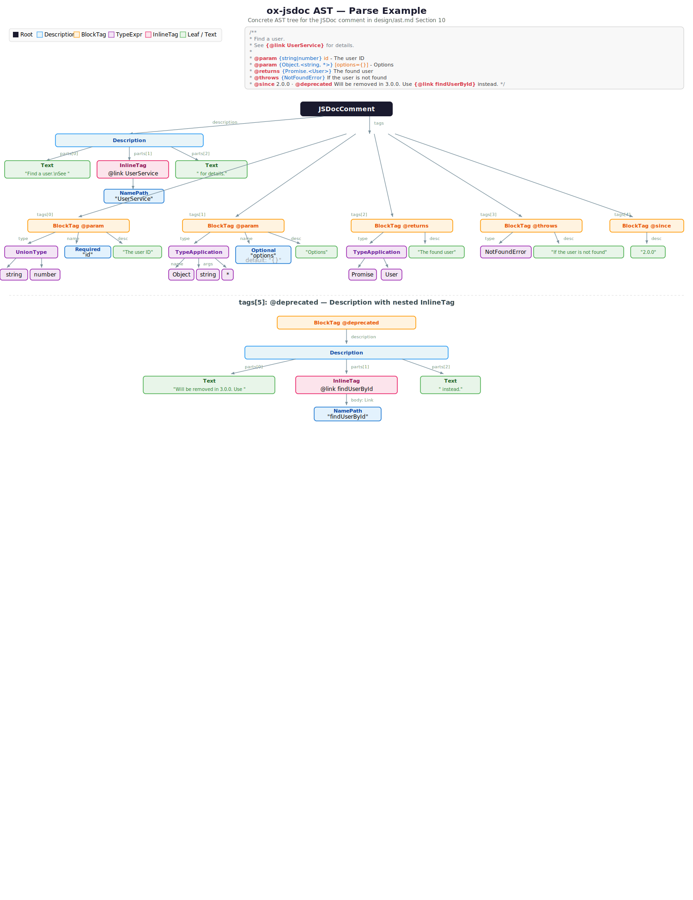

# ox-jsdoc AST Definition

AST definition for JSDoc comments based on the EBNF grammar (`design/syntax.ebnf`).
Follows oxc's arena allocation design (`Box<'a, T>`, `Vec<'a, T>`, `Span`).

> The definitions below serve as a design document for the Rust implementation
> and may differ in notation from the actual code.
> `'a` represents the arena allocator lifetime.

---

## Design Principles

1. **Preserve tree structure** — Represent comment structure as a tree, not a flat Doclet like jsdoc
2. **Preserve type expression AST** — Retain the type expression tree instead of discarding it after parsing like Catharsis
3. **Span on every node** — Track source positions for diagnostics and linter integration
4. **oxc style** — Arena allocation, `#[repr(C)]`, uniform-size enums, visitor pattern support
5. **Custom tag support** — Unknown tags are represented generically in the AST
6. **Lossless-enough syntax layer** — Preserve raw syntactic structure where tag-specific semantics cannot be decided during parsing
7. **Semantic distinctions are explicit** — Keep syntax-sharing nodes separate when they play different semantic roles
8. **Keep the core AST lean** — Semantic attachment metadata lives outside the JSDoc AST unless parsing/traversal needs it

---

## 1. Top Level: JSDocComment

EBNF: `JSDocComment = "/**" Body "*/" ;`

```rust
/// Root node representing an entire JSDoc comment.
/// The result of parsing a BlockComment (`/** ... */`) detected by oxc-parser.
#[repr(C)]
pub struct JSDocComment<'a> {
    pub span: Span,
    /// Description text at the beginning of the comment body (before any tags)
    pub description: Option<Box<'a, Description<'a>>>,
    /// List of block tags (`@param`, `@returns`, etc.)
    pub tags: Vec<'a, BlockTag<'a>>,
}
```

---

## 2. Description Text: Description

EBNF: `Description = DescriptionText { InlineTag DescriptionText } ;`

Description text is represented as an interleaved sequence of plain text and inline tags.

```rust
/// Description text. An interleaved sequence of plain text and inline tags.
/// Example: `"This is a {@link Foo} description"`
///   → [Text("This is a "), InlineTag({@link Foo}), Text(" description")]
#[repr(C)]
pub struct Description<'a> {
    pub span: Span,
    /// Interleaved sequence of text and inline tags
    pub parts: Vec<'a, DescriptionPart<'a>>,
}

/// A component of description text
#[repr(C, u8)]
pub enum DescriptionPart<'a> {
    /// Plain text portion
    Text(Box<'a, Text<'a>>),
    /// Inline tag (`{@link ...}`, etc.)
    InlineTag(Box<'a, InlineTag<'a>>),
    /// Fenced code block (``` ... ``` or ~~~ ... ~~~)
    /// Content is preserved as literal text; no tag/inline-tag parsing inside.
    FencedCodeBlock(Box<'a, FencedCodeBlock<'a>>),
    /// Inline code (`code` or `` `code` ``)
    /// Content is preserved as literal text; no tag parsing inside.
    InlineCode(Box<'a, InlineCode<'a>>),
}

/// Plain text node
#[repr(C)]
pub struct Text<'a> {
    pub span: Span,
    /// Text content (zero-copy reference to source text)
    pub value: &'a str,
}

/// Fenced code block (e.g. ``` ... ``` or ~~~ ... ~~~)
/// All content is literal — no tag or inline tag recognition inside.
#[repr(C)]
pub struct FencedCodeBlock<'a> {
    pub span: Span,
    /// Fence marker character ('`' or '~')
    pub fence_char: FenceChar,
    /// Number of fence characters (3 or more)
    pub fence_length: u32,
    /// Info string after opening fence (e.g. "javascript"), if any
    pub info: Option<Box<'a, Text<'a>>>,
    /// Raw content between opening and closing fence (zero-copy)
    pub content: &'a str,
}

/// Fence marker character
#[repr(u8)]
pub enum FenceChar {
    /// Backtick (`)
    Backtick,
    /// Tilde (~)
    Tilde,
}

/// Inline code (e.g. `code` or ``code with ` inside``)
/// Content is literal — no tag recognition inside.
#[repr(C)]
pub struct InlineCode<'a> {
    pub span: Span,
    /// Raw content between backtick delimiters (zero-copy)
    pub content: &'a str,
}
```

---

## 3. Block Tag: BlockTag

EBNF: `BlockTag = "@" TagName [ whitespace TagBody ] ;`
EBNF: `TagBody = GenericTagBody | BorrowsTagBody ;`

```rust
/// A block tag (e.g. `@param {string} name - description`, `@borrows foo as bar`)
#[repr(C)]
pub struct BlockTag<'a> {
    pub span: Span,
    /// Tag name (without `@`. e.g. `"param"`, `"returns"`, `"customTag"`)
    pub tag_name: TagName<'a>,
    /// Parsed body structure. A generic body is always available even for tag-specific semantics.
    pub body: Option<Box<'a, BlockTagBody<'a>>>,
    /// Raw body text after tag name, preserved for tag-specific validation / recovery.
    pub raw_body: Option<Box<'a, Text<'a>>>,
}

/// Tag name
#[repr(C)]
pub struct TagName<'a> {
    pub span: Span,
    /// Tag name string (e.g. `"param"`, `"returns"`, `"customTag"`)
    pub value: &'a str,
}

/// Parsed block-tag body variants.
#[repr(C, u8)]
pub enum BlockTagBody<'a> {
    /// Generic extraction shape used by most tags.
    Generic(Box<'a, GenericTagBody<'a>>),
    /// Special-case syntax used by `@borrows`.
    Borrows(Box<'a, BorrowsTagBody<'a>>),
}

/// `BlockTagBody` gets dedicated variants only for lexically distinct forms
/// that cannot be modeled as `type? + value? + description?`.
///
/// Current boundary:
/// - Dedicated variant: `@borrows source as target`
/// - Generic body + semantic interpretation: `@variation`, `@since`, `@requires`,
///   `@memberof!`, `@see`, and other dictionary-driven tags
///
/// This keeps the parse tree explicit without proliferating tag-specific nodes
/// for semantics that are better handled by TagSpec validation.

/// Generic tag body:
/// optional type, optional first token later interpreted by TagSpec,
/// optional separator, optional trailing description.
#[repr(C)]
pub struct GenericTagBody<'a> {
    pub span: Span,
    pub type_expression: Option<Box<'a, TypeExpression<'a>>>,
    pub value: Option<Box<'a, TagValueToken<'a>>>,
    pub separator: Option<Separator>,
    pub description: Option<Box<'a, Description<'a>>>,
}

/// Special-case body for `@borrows source as target`.
#[repr(C)]
pub struct BorrowsTagBody<'a> {
    pub span: Span,
    pub source: NamePathLike<'a>,
    pub target: NamePathLike<'a>,
}

/// Generic first token extracted from a tag body before semantic interpretation.
#[repr(C, u8)]
pub enum TagValueToken<'a> {
    ParameterName(Box<'a, TagParameterName<'a>>),
    NamePathLike(Box<'a, NamePathLike<'a>>),
    Identifier(Box<'a, Identifier<'a>>),
    RawToken(Box<'a, Text<'a>>),
}

/// Optional `-` separator between name/value and description.
#[repr(u8)]
pub enum Separator {
    Dash,
}
```

---

## 4. Inline Tag: InlineTag

EBNF: `InlineTag = "{@" InlineTagName [ whitespace InlineTagBody ] "}" ;`

```rust
/// An inline tag (e.g. `{@link Foo}`, `{@type string}`)
#[repr(C)]
pub struct InlineTag<'a> {
    pub span: Span,
    /// Tag name (e.g. `"link"`, `"linkcode"`, `"type"`)
    pub tag_name: TagName<'a>,
    /// Interpreted body content
    pub body: InlineTagBody<'a>,
}

/// Inline tag body variants
#[repr(C, u8)]
pub enum InlineTagBody<'a> {
    /// `{@link namepath_or_url [text]}`
    Link(Box<'a, InlineLinkBody<'a>>),
    /// `{@type TypeExpr}`
    Type(Box<'a, TypeExpression<'a>>),
    /// Unknown inline tag — preserved as raw text
    Unknown(Box<'a, Text<'a>>),
}

/// Body of a link inline tag
#[repr(C)]
pub struct InlineLinkBody<'a> {
    pub span: Span,
    /// Link target (name path or URL)
    pub target: LinkTarget<'a>,
    /// Link text (optional)
    pub text: Option<Box<'a, Text<'a>>>,
}

/// Link target kind
#[repr(C, u8)]
pub enum LinkTarget<'a> {
    /// Name path (e.g. `MyClass#method`)
    NamePath(Box<'a, NamePathLike<'a>>),
    /// URL (e.g. `https://example.com`)
    URL(Box<'a, Text<'a>>),
}
```

---

## 5. Parameter Name: TagParameterName

EBNF: `ParameterName = OptionalParameterName | ParameterPath ;`

```rust
/// Tag parameter name (required or optional)
#[repr(C, u8)]
pub enum TagParameterName<'a> {
    /// Required parameter (e.g. `name`)
    Required(Box<'a, RequiredParameterName<'a>>),
    /// Optional parameter (e.g. `[name]`, `[name=default]`)
    Optional(Box<'a, OptionalParameterName<'a>>),
}

/// Required parameter name
#[repr(C)]
pub struct RequiredParameterName<'a> {
    pub span: Span,
    /// Parameter path (`foo`, `foo.bar`, `employees[].name`)
    pub name: ParameterPath<'a>,
}

/// Optional parameter name (`[name=default]`)
#[repr(C)]
pub struct OptionalParameterName<'a> {
    pub span: Span,
    /// Parameter path
    pub name: ParameterPath<'a>,
    /// Default value (raw text after `=`)
    pub default_value: Option<Box<'a, Text<'a>>>,
}

/// Parameter path used by `@param` / `@property`.
#[repr(C)]
pub struct ParameterPath<'a> {
    pub span: Span,
    pub root: ParameterRoot<'a>,
    pub continuations: Vec<'a, ParameterContinuation<'a>>,
}

#[repr(C, u8)]
pub enum ParameterRoot<'a> {
    Identifier(Box<'a, Identifier<'a>>),
    StringLiteral(Box<'a, Text<'a>>),
}

#[repr(C, u8)]
pub enum ParameterContinuation<'a> {
    ArrayElement(Box<'a, ArrayElementSegment>),
    Property(Box<'a, ParameterProperty<'a>>),
}

#[repr(C)]
pub struct ArrayElementSegment {
    pub span: Span,
}

#[repr(C)]
pub struct ParameterProperty<'a> {
    pub span: Span,
    pub property: ParameterPropertyName<'a>,
    pub is_array_element: bool,
}

#[repr(C, u8)]
pub enum ParameterPropertyName<'a> {
    Identifier(Box<'a, Identifier<'a>>),
    StringLiteral(Box<'a, Text<'a>>),
}
```

---

## 6. Name Path: NamePathLike

EBNF: `NamePathLike = [ NamespacePrefix ] NamePathCore [ Variation ] [ TrailingConnector ] ;`

```rust
/// A name path-like reference (e.g. `MyClass`, `module:foo/bar.Baz`, `Foo.`, `anim.fadein(1)`).
#[repr(C)]
pub struct NamePathLike<'a> {
    pub span: Span,
    pub namespace: Option<NamePathNamespace<'a>>,
    pub segments: Vec<'a, NamePathComponent<'a>>,
    pub variation: Option<Box<'a, Variation<'a>>>,
    pub trailing_connector: Option<NamePathSeparator>,
}

/// A single component of a name path (scope operator + segment)
#[repr(C)]
pub struct NamePathComponent<'a> {
    pub span: Span,
    /// Separator (None for the first segment)
    pub separator: Option<NamePathSeparator>,
    /// Segment
    pub segment: NamePathSegment<'a>,
}

/// Optional namespace prefix (`module:`, `event:`, etc.)
#[repr(C)]
pub struct NamePathNamespace<'a> {
    pub span: Span,
    pub name: Identifier<'a>,
}

/// Name-path separator
#[repr(u8)]
pub enum NamePathSeparator {
    /// `.` — static member
    Dot,
    /// `#` — instance member
    Hash,
    /// `~` — inner member
    Tilde,
    /// `/` — module/path separator
    Slash,
}

/// Name path segment
#[repr(C, u8)]
pub enum NamePathSegment<'a> {
    /// Simple name (e.g. `MyClass`)
    Name(Box<'a, Identifier<'a>>),
    /// String literal name (e.g. `"special-name"`)
    StringLiteral(Box<'a, Text<'a>>),
    /// Bracketed string segment (e.g. `["foo"]`)
    BracketString(Box<'a, Text<'a>>),
    /// Event-prefixed segment (e.g. `event:click`)
    Event(Box<'a, EventSegment<'a>>),
}

#[repr(C)]
pub struct EventSegment<'a> {
    pub span: Span,
    pub name: Identifier<'a>,
}

#[repr(C)]
pub struct Variation<'a> {
    pub span: Span,
    /// Raw variation contents inside `( ... )`
    pub value: &'a str,
}

/// Identifier
#[repr(C)]
pub struct Identifier<'a> {
    pub span: Span,
    pub name: &'a str,
}
```

---

## 7. Type Expression: TypeExpression

EBNF: Corresponds to the entirety of section 5.
**Key difference from jsdoc — the tree structure is preserved.**

```rust
/// Complete type expression (including braces `{string|number}`)
#[repr(C)]
pub struct TypeExpression<'a> {
    pub span: Span,
    /// Type expression inside the braces
    pub type_expr: TypeExpr<'a>,
}

/// Type expression node (recursive tree structure)
#[repr(C, u8)]
pub enum TypeExpr<'a> {
    // --- Primitive literals ---
    /// `*` — any type
    AllLiteral(Box<'a, AllLiteral>),
    /// `null`
    NullLiteral(Box<'a, NullLiteral>),
    /// `undefined` or `void`
    UndefinedLiteral(Box<'a, UndefinedLiteral>),
    /// `?` — unknown type
    UnknownLiteral(Box<'a, UnknownLiteral>),
    /// String literal type (e.g. `'click'`)
    StringLiteral(Box<'a, StringLiteralType<'a>>),
    /// Numeric literal type (e.g. `42`)
    NumericLiteral(Box<'a, NumericLiteralType<'a>>),

    // --- Name ---
    /// Type name (e.g. `string`, `MyClass`, `module:foo/bar.Baz`)
    Name(Box<'a, TypeName<'a>>),

    // --- Composite types ---
    /// Union type (e.g. `string|number`)
    Union(Box<'a, UnionType<'a>>),
    /// Generic type (e.g. `Array.<string>`, `Map<string, number>`)
    TypeApplication(Box<'a, TypeApplication<'a>>),
    /// Function type (e.g. `function(string): boolean`)
    Function(Box<'a, FunctionType<'a>>),
    /// Record type (e.g. `{key: string, value: number}`)
    Record(Box<'a, RecordType<'a>>),
    /// `typeof Foo.bar`
    TypeQuery(Box<'a, TypeQuery<'a>>),
    /// Indexed access type (e.g. `Parameters<Foo>[0]`, `T["x"]`)
    IndexedAccess(Box<'a, IndexedAccessType<'a>>),

    // --- Modified types ---
    /// Nullable type (e.g. `?string`)
    Nullable(Box<'a, NullableType<'a>>),
    /// Non-nullable type (e.g. `!string`)
    NonNullable(Box<'a, NonNullableType<'a>>),
    /// Optional type (e.g. `string=`, Closure Compiler style)
    Optional(Box<'a, OptionalType<'a>>),
    /// Rest/variadic type (e.g. `...string`)
    Variadic(Box<'a, VariadicType<'a>>),
    /// Array shorthand (e.g. `string[]`)
    ArrayShorthand(Box<'a, ArrayShorthandType<'a>>),

    // --- Grouping ---
    /// Parenthesized type (e.g. `(string|number)`)
    Parenthesized(Box<'a, ParenthesizedType<'a>>),
}
```

### 7.1 Primitive Literal Types

```rust
#[repr(C)]
pub struct AllLiteral {
    pub span: Span,
}

#[repr(C)]
pub struct NullLiteral {
    pub span: Span,
}

#[repr(C)]
pub struct UndefinedLiteral {
    pub span: Span,
    /// Distinguishes between `undefined` and `void`
    pub keyword: UndefinedKeyword,
}

#[repr(u8)]
pub enum UndefinedKeyword {
    Undefined,
    Void,
}

#[repr(C)]
pub struct UnknownLiteral {
    pub span: Span,
}

#[repr(C)]
pub struct StringLiteralType<'a> {
    pub span: Span,
    pub value: &'a str,
}

#[repr(C)]
pub struct NumericLiteralType<'a> {
    pub span: Span,
    pub raw: &'a str,
}
```

### 7.2 Type Name

```rust
/// Type name (e.g. `string`, `module:foo/bar.Baz`)
///
/// `TypeName` intentionally wraps `NamePathLike` instead of aliasing it.
/// The syntax substrate is shared, but type-position names remain a dedicated
/// semantic node, following oxc's preference for explicit roles over ambiguous
/// reused node shapes.
#[repr(C)]
pub struct TypeName<'a> {
    pub span: Span,
    pub path: NamePathLike<'a>,
}
```

### 7.3 Composite Types

```rust
/// Union type (e.g. `string|number|boolean`)
#[repr(C)]
pub struct UnionType<'a> {
    pub span: Span,
    /// Union elements (two or more)
    pub elements: Vec<'a, TypeExpr<'a>>,
}

/// Generic/template type (e.g. `Array.<string>`, `Map<K, V>`)
#[repr(C)]
pub struct TypeApplication<'a> {
    pub span: Span,
    /// Base type name (e.g. `Array`, `Map`)
    pub callee: TypeExpr<'a>,
    /// Type argument list
    pub type_arguments: Vec<'a, TypeExpr<'a>>,
    /// Whether dot notation is used (`Array.<T>` vs `Array<T>`)
    pub has_dot: bool,
}

/// Function type (e.g. `function(string, number): boolean`)
#[repr(C)]
pub struct FunctionType<'a> {
    pub span: Span,
    /// Parameter list (None if no signature is present)
    pub params: Option<Vec<'a, FunctionParam<'a>>>,
    /// Return type
    pub return_type: Option<Box<'a, TypeExpr<'a>>>,
    /// `this` context type
    pub this_type: Option<Box<'a, TypeExpr<'a>>>,
    /// `new` constructor type
    pub constructor_type: Option<Box<'a, TypeExpr<'a>>>,
}

/// Function type parameter
#[repr(C, u8)]
pub enum FunctionParam<'a> {
    /// Regular parameter
    Type(Box<'a, TypeExpr<'a>>),
    /// Rest parameter (`...T`)
    Rest(Box<'a, TypeExpr<'a>>),
}

/// Record type (e.g. `{key: string, value: number}`)
#[repr(C)]
pub struct RecordType<'a> {
    pub span: Span,
    /// Field list
    pub fields: Vec<'a, RecordField<'a>>,
}

/// Record type field
#[repr(C)]
pub struct RecordField<'a> {
    pub span: Span,
    pub key: RecordFieldKey<'a>,
    /// Field type (after `:`. Optional for shorthand-like field syntax)
    pub value: Option<Box<'a, TypeExpr<'a>>>,
}

/// Record field name
#[repr(C, u8)]
pub enum RecordFieldKey<'a> {
    Identifier(Box<'a, Identifier<'a>>),
    StringLiteral(Box<'a, StringLiteralType<'a>>),
    NumericLiteral(Box<'a, NumericLiteralType<'a>>),
    IndexSignature(Box<'a, IndexSignatureField<'a>>),
}

#[repr(C)]
pub struct IndexSignatureField<'a> {
    pub span: Span,
    pub key_name: Identifier<'a>,
    pub key_type: Box<'a, TypeExpr<'a>>,
    pub value_type: Box<'a, TypeExpr<'a>>,
}

#[repr(C)]
pub struct TypeQuery<'a> {
    pub span: Span,
    pub argument: NamePathLike<'a>,
}

#[repr(C)]
pub struct IndexedAccessType<'a> {
    pub span: Span,
    pub object_type: Box<'a, TypeExpr<'a>>,
    pub index: Box<'a, IndexedAccessKey<'a>>,
}

#[repr(C, u8)]
pub enum IndexedAccessKey<'a> {
    TypeExpr(Box<'a, TypeExpr<'a>>),
    StringLiteral(Box<'a, StringLiteralType<'a>>),
    NumericLiteral(Box<'a, NumericLiteralType<'a>>),
    Identifier(Box<'a, Identifier<'a>>),
}
```

### 7.4 Modified Types

```rust
/// Nullable type (`?string`)
#[repr(C)]
pub struct NullableType<'a> {
    pub span: Span,
    pub type_expr: TypeExpr<'a>,
}

/// Non-nullable type (`!string`)
#[repr(C)]
pub struct NonNullableType<'a> {
    pub span: Span,
    pub type_expr: TypeExpr<'a>,
}

/// Optional type (`string=`, Closure Compiler style)
#[repr(C)]
pub struct OptionalType<'a> {
    pub span: Span,
    pub type_expr: TypeExpr<'a>,
}

/// Variadic/rest type (`...string`)
#[repr(C)]
pub struct VariadicType<'a> {
    pub span: Span,
    pub type_expr: TypeExpr<'a>,
}

/// Array shorthand type (`string[]`)
#[repr(C)]
pub struct ArrayShorthandType<'a> {
    pub span: Span,
    pub element_type: TypeExpr<'a>,
}

/// Parenthesized type (`(string|number)`)
#[repr(C)]
pub struct ParenthesizedType<'a> {
    pub span: Span,
    pub type_expr: TypeExpr<'a>,
}
```

---

## 8. AST Node List and EBNF Mapping

| EBNF Production | AST Node | Notes |
|---|---|---|
| `JSDocComment` | `JSDocComment` | Root node |
| `Body` | `JSDocComment.{description, tags}` | Body itself has no dedicated node |
| `Description` | `Description` | Interleaved text + inline tags |
| `DescriptionText` | `Text` | Plain text |
| `FencedCodeBlock` | `FencedCodeBlock` | ``` ... ``` or ~~~ ... ~~~ |
| `InlineCode` | `InlineCode` | \`code\` or \`\`code\`\` |
| `BlockTag` | `BlockTag` | Holds parsed body plus raw body for tag-specific semantics |
| `TagName` | `TagName` | Open-ended |
| `TagBody` | `BlockTagBody` | `GenericTagBody` or tag-specific body like `BorrowsTagBody` |
| `InlineTag` | `InlineTag` | `{@link ...}` etc. |
| `InlineTagBody` | `InlineTagBody` | 3 variants: Link / Type / Unknown |
| `ParameterName` | `TagParameterName` | 2 variants: Required / Optional |
| `ParameterPath` | `ParameterPath` | Dedicated `@param` / `@property` path syntax |
| `OptionalParameter` | `OptionalParameterName` | `[name=default]` |
| `TypeExpression` | `TypeExpression` | Wrapper including braces |
| `TypeExpr` | `TypeExpr` | Recursive enum tree including `typeof` and indexed access |
| `UnionType` | `UnionType` | Two or more elements |
| `TypeApplication` | `TypeApplication` | `Array.<T>` |
| `FunctionType` | `FunctionType` | `function(T): U` |
| `RecordType` | `RecordType` | `{k: T}` |
| `TypeName` | `TypeName` | Built from `NamePathLike` |
| `NamePathLike` | `NamePathLike` | Namespace, `/`, variation, trailing connector support |

---

## 9. Visitor Pattern

Following oxc's `Visit`/`VisitMut`, visitor methods are defined for each AST node.

```rust
pub trait Visit<'a> {
    fn visit_jsdoc_comment(&mut self, comment: &JSDocComment<'a>);
    fn visit_description(&mut self, desc: &Description<'a>);
    fn visit_block_tag(&mut self, tag: &BlockTag<'a>);
    fn visit_block_tag_body(&mut self, body: &BlockTagBody<'a>);
    fn visit_inline_tag(&mut self, tag: &InlineTag<'a>);
    fn visit_tag_parameter_name(&mut self, name: &TagParameterName<'a>);
    fn visit_parameter_path(&mut self, path: &ParameterPath<'a>);
    fn visit_type_expression(&mut self, expr: &TypeExpression<'a>);
    fn visit_type_expr(&mut self, expr: &TypeExpr<'a>);
    fn visit_union_type(&mut self, union_type: &UnionType<'a>);
    fn visit_type_application(&mut self, app: &TypeApplication<'a>);
    fn visit_function_type(&mut self, func: &FunctionType<'a>);
    fn visit_record_type(&mut self, record: &RecordType<'a>);
    fn visit_name_path_like(&mut self, path: &NamePathLike<'a>);
    fn visit_identifier(&mut self, ident: &Identifier<'a>);
    fn visit_text(&mut self, text: &Text<'a>);
    fn visit_fenced_code_block(&mut self, block: &FencedCodeBlock<'a>);
    fn visit_inline_code(&mut self, code: &InlineCode<'a>);
}
```

---

## 10. Parse Example

### Input

```javascript
/**
 * Find a user.
 * See {@link UserService} for details.
 *
 * @param {string|number} id - The user ID
 * @param {Object.<string, *>} [options={}] - Options
 * @returns {Promise.<User>} The found user
 * @throws {NotFoundError} If the user is not found
 * @since 2.0.0
 * @deprecated Will be removed in 3.0.0. Use {@link findUserById} instead.
 */
```

### AST Output (Overview)

```
JSDocComment
├── description: Description
│   ├── Text("Find a user.\nSee ")
│   ├── InlineTag { tag_name: "link", body: Link { target: NamePathLike("UserService") } }
│   └── Text(" for details.")
├── tags[0]: BlockTag
│   ├── tag_name: "param"
│   ├── body: Generic
│   │   ├── type_expression: TypeExpression
│   │   │   └── Union [Name("string"), Name("number")]
│   │   ├── value: ParameterName(Required(ParameterPath("id")))
│   │   └── description: Text("The user ID")
├── tags[1]: BlockTag
│   ├── tag_name: "param"
│   ├── body: Generic
│   │   ├── type_expression: TypeExpression
│   │   │   └── TypeApplication { callee: Name("Object"), args: [Name("string"), AllLiteral] }
│   │   ├── value: ParameterName(Optional { name: ParameterPath("options"), default: Text("{}") })
│   │   └── description: Text("Options")
├── tags[2]: BlockTag
│   ├── tag_name: "returns"
│   ├── body: Generic
│   │   ├── type_expression: TypeExpression
│   │   │   └── TypeApplication { callee: Name("Promise"), args: [Name("User")] }
│   │   └── description: Text("The found user")
├── tags[3]: BlockTag
│   ├── tag_name: "throws"
│   ├── body: Generic
│   │   ├── type_expression: TypeExpression
│   │   │   └── Name("NotFoundError")
│   │   └── description: Text("If the user is not found")
├── tags[4]: BlockTag
│   ├── tag_name: "since"
│   ├── body: Generic
│   │   ├── value: RawToken("2.0.0")
└── tags[5]: BlockTag
    ├── tag_name: "deprecated"
    ├── body: Generic
    │   └── description: Description
    │       ├── Text("Will be removed in 3.0.0. Use ")
    │       ├── InlineTag { tag_name: "link", body: Link { target: NamePathLike("findUserById") } }
    │       └── Text(" instead.")
```



---

## 11. Design Decisions

### 11.1 `BlockTagBody` variant boundary

- Dedicated `BlockTagBody` variants are reserved for lexically special forms.
- In v1, only `Borrows` qualifies.
- Tags such as `@variation`, `@requires`, `@memberof!`, `@since`, and `@see`
  remain `GenericTagBody` and are interpreted later by TagSpec/semantic validation.

Rationale:

- This matches oxc's bias toward a cheap, regular parse step and heavier meaning in later layers.
- It avoids one-off AST nodes for dictionary-driven tag behavior.

### 11.2 `NamePathLike` vs `TypeName`

- `NamePathLike` is the shared syntax substrate.
- `TypeName` remains a dedicated wrapper node in type position.
- We do not collapse them into a single AST node type.

Rationale:

- This matches oxc's explicit-role style such as distinct identifier node kinds.
- It leaves room for future type-only metadata without widening every namepath consumer.

### 11.3 `node_id` in the JSDoc AST

- `node_id` is not part of the core JSDoc AST in v1.
- If `ox-jsdoc` is later integrated into an oxc semantic graph, identity should be owned by the graph
  or an adapter layer rather than stored on every JSDoc node.

Rationale:

- The JSDoc AST is not the primary backbone for scope/symbol analysis.
- Omitting `node_id` keeps the tree smaller and more transfer-friendly.
- This keeps parsing concerns separate from semantic attachment concerns.
